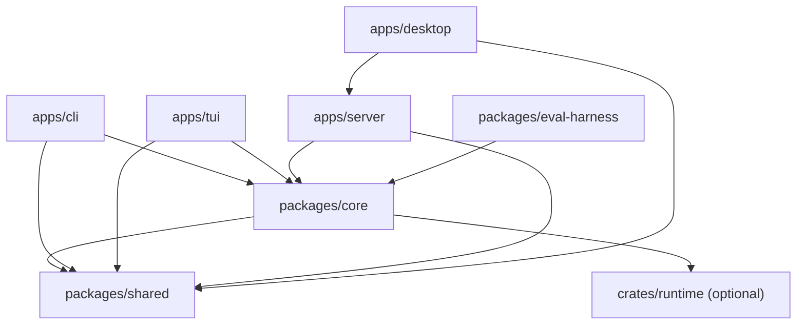

# Architecture

SeekForge is a local-first monorepo with one agent engine and several adapters.
The adapters own interaction and transport concerns; `packages/core` owns agent
behavior, policy, persistence, and tool execution.

`packages/shared` contains plain cross-package types and has no runtime
dependencies. Validation, provider integration, permission policy, session
JSONL, workspace tools, and the agent loop remain in `packages/core`. Surfaces
must not reimplement those rules.

## Package responsibilities

| Area | Responsibility | State owner |
| --- | --- | --- |
| `apps/cli` | Commander wiring, terminal prompts, command-specific presentation | Process-local CLI options |
| `apps/tui` | Ink rendering, keyboard routing, tabs, overlays, terminal lifecycle | TUI reducer and per-tab run reservations |
| `apps/server` | REST/WS validation and transport, workspace-scoped service facade | Server session and repository coordinators |
| `apps/desktop` | Tauri/web UI and workspace-bound request presentation | View state guarded by workspace/request identity |
| `packages/core` | Agent execution, providers, tools, permissions, sessions, memory, autonomous Loop | JSONL sessions and `.seekforge` stores |
| `packages/shared` | Dependency-free types and constants | None |
| `crates/runtime` | Optional native execution backend | Native child process/request state |

## Internal boundaries

Large entry points should compose smaller modules rather than accumulating
domain logic:

- CLI `index.ts` builds shared dependencies and registers command families;
  `commands/register-*.ts` owns each family's Commander definitions.
- Server `files.ts` is the public file-service facade. Path/symlink security,
  scan/search, and upload/raw behavior live in focused sibling modules and use
  the same workspace boundary checks.
- Core `agent/loop.ts` owns the effectful model/tool orchestration. Deterministic
  argument, usage, and gate classification belongs in `agent/loop-logic.ts`.
- Desktop views use `async-coordination.ts` and `use-workspace-async.ts` to bind
  asynchronous results to both request generation and workspace identity.
- TUI `app.tsx` owns interaction orchestration. Agent runners, run identity,
  terminal lifecycle, and status-line scheduling are separate modules.

These are ownership boundaries, not additional public APIs. Public behavior is
defined by the CLI reference, server API, configuration docs, and SDK notes.

## State and concurrency

Session traces are append-only JSONL and remain the source of truth for agent
runs. Autonomous Loop state is a separate orchestration checkpoint that points
to a session; see [Loop engineering](loop-engineering.md).

Workspace mutations from Agent, REST, Git, worktree, and desktop surfaces must
use the relevant shared session or repository coordination guard. UI requests
must also reject stale completion when the active workspace changes. A request
counter alone is insufficient because two workspaces can reuse the same local
generation number.

## Security boundaries

- Tool results are data and are never promoted to instructions.
- Permission prompts display the raw command or path.
- Command allowlists authorize one invocation only; shell control syntax never
  inherits approval from the first command.
- Filesystem access is resolved against the workspace with symlink-aware checks.
- Config and transport input is validated in Core or at the server boundary,
  not trusted because it came from a local UI.

For recurring implementation hazards, use the
[boundary checklist](boundary-checklist.md) before modifying parsers, paths,
async ownership, caches, command classification, or resource lifecycles.

## Change placement

Add policy or agent behavior to Core, transport validation to Server, and only
surface-specific rendering or interaction to clients. Cross-package types go in
Shared only when they can remain dependency-free. When behavior crosses a
package boundary, export it through every package entry point and verify a clean
checkout so an uncommitted local source file cannot mask a missing export.
