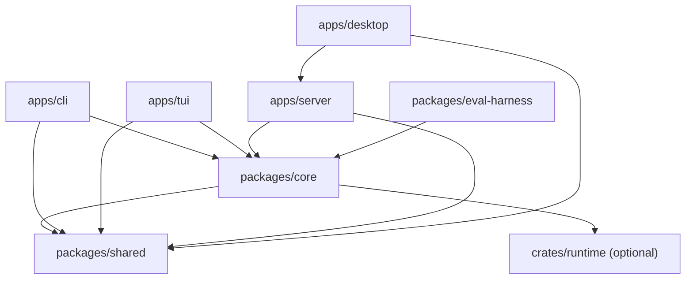

# Architecture

> **English** | [简体中文](architecture.zh-CN.md)

SeekForge is a local-first monorepo with one agent engine and several adapters.
The adapters own interaction and transport concerns; `packages/core` owns agent
behavior, policy, persistence, and tool execution.

`packages/shared` contains plain cross-package types and has no runtime
dependencies. Validation, provider integration, permission policy, session
JSONL, workspace tools, and the agent loop remain in `packages/core`. Surfaces
must not reimplement those rules.

## Package responsibilities

| Area | Responsibility | State owner |
| --- | --- | --- |
| `apps/cli` | Commander wiring, terminal prompts, command-specific presentation | Process-local CLI options |
| `apps/tui` | Ink rendering, keyboard routing, tabs, overlays, terminal lifecycle | TUI reducer and per-tab run reservations |
| `apps/server` | REST/WS validation and transport, workspace-scoped service facade | Server session and repository coordinators |
| `apps/desktop` | Tauri/web UI and workspace-bound request presentation | View state guarded by workspace/request identity |
| `packages/core` | Agent execution, providers, tools, permissions, sessions, memory, autonomous Loop, security scanning | JSONL sessions and `.seekforge` stores |
| `packages/shared` | Dependency-free types and constants | None |
| `crates/runtime` | Optional native execution backend | Native child process/request state |

## Internal boundaries

Large entry points should compose smaller modules rather than accumulating
domain logic:

- CLI `index.ts` builds shared dependencies and registers command families;
  `commands/register-*.ts` owns each family's Commander definitions.
- Server `files.ts` is the public file-service facade. Path/symlink security,
  scan/search, and upload/raw behavior live in focused sibling modules and use
  the same workspace boundary checks.
- Core `agent/loop.ts` owns the effectful model/tool orchestration. Deterministic
  argument, usage, and gate classification belongs in `agent/loop-logic.ts`.
- Desktop views use `async-coordination.ts` and `use-workspace-async.ts` to bind
  asynchronous results to both request generation and workspace identity.
- TUI `app.tsx` owns interaction orchestration. Agent runners, run identity,
  terminal lifecycle, and status-line scheduling are separate modules.

These are ownership boundaries, not additional public APIs. Public behavior is
defined by the CLI reference, server API, configuration docs, and SDK notes.

## State and concurrency

Session traces are append-only JSONL and remain the source of truth for agent
runs. Automatic context compaction writes a fingerprinted derivative snapshot;
resume uses it only while its source prefix still matches. Context admission
budgets the complete provider request, including advertised tool schemas.
Approved project-memory writes may trigger opt-in deterministic maintenance.
It shares the cross-process memory transaction lease, checks count/byte and
persisted interval gates, and stores only the last successful summary in
`.seekforge/memory/maintenance.json`; housekeeping failures never change the
foreground operation's result, and stale-fact archival requires explicit
user-owned configuration.
Autonomous Loop state is a separate orchestration checkpoint that points to a
session and owns the frozen requirement specification, acceptance evidence, and
optional approval gate. Requirement analysis and acceptance review run through
read-only Agent phases; only edit iterations mutate the workspace. See
[Loop engineering](loop-engineering.md).

Server-managed execution has a second append-only control plane:
`.seekforge/runs.jsonl` stores run state and `.seekforge/run-events/<id>.jsonl`
stores sequenced transport events. WS clients resume from `runId + afterSeq`;
headless REST runs continue without a subscriber, while interactive WS runs
retain an explicit disconnect-cancels policy. Terminal state transitions are
centralized so cancellation cannot be overwritten by a late completion. Ledger
append and compaction share a cross-process lease, REST replay streams bounded
pages of at most 500 events, and WS subscriptions continue from replay into
live delivery until a terminal frame or connection close. Process-local frames
use direct RunManager notifications; a low-frequency cross-process fallback
checks file identity and parses replay data only after the event file changes.

Security scans use a separate append-only event source at
`.seekforge/security/events.jsonl`. `packages/core/src/security` owns strict
Agent-output validation, Finding and verification lifecycles, threat models,
fix evidence, and JSON/Markdown/SARIF rendering. CLI code only wires Agent and
project-check execution into that domain. Scanner output is untrusted until its
source paths, line ranges, and exact excerpts resolve inside the repository.

Each parent Agent run owns one Core dispatch manager for subagents. It emits a
structured lifecycle (`started`, `step`, and one terminal event), isolates
cancellation to the selected child, and drains queued steering only at a model
turn boundary. Server WS frames expose those controls; TUI and Desktop render
the same shared event contract and retain completed cards when a later run
reuses a run-local dispatch id.

`dispatch_team` adds deterministic orchestration over the same manager. A team
is a validated acyclic graph of named members; ready members run up to the
declared concurrency limit, dependants wait, and the failure policy either stops
pending work or continues independent branches. Team members emit the ordinary
subagent lifecycle, so steering, cancellation, usage accounting, and traces do
not diverge from one-off dispatches.

The Desktop workbench exposes these domains through Server rather than
reimplementing them. Security Center uses Core's Finding, threat, fix, and
export lifecycle; MCP settings retain project/global ownership and mask
secrets; restored sessions rebuild subagent cards from persisted events. Team
plans are validated before being handed to the Core `dispatch_team` path.

Continuous eval scenarios choose an explicit runner (`agent`, `loop`, or
`session_scenario`). Loop, resume, and memory behavior therefore execute the
real lifecycle while deterministic checks remain the scoring authority.
Multi-sample A/B pairs by task and sample, alternates arm order, and publishes
confidence intervals, cost distributions, and restored CI trends.

Workspace mutations from Agent, REST, Git, worktree, and desktop surfaces must
use the relevant shared session or repository coordination guard. UI requests
must also reject stale completion when the active workspace changes. A request
counter alone is insufficient because two workspaces can reuse the same local
generation number. Within one Server, the repository coordinator serializes
mutating WS Agents, Loops, background runs, webhook runs, security fixes, Git,
and worktree operations by physical repository identity; read-only ask runs are
not serialized.

## Security boundaries

- Tool results are data and are never promoted to instructions.
- Permission prompts display the raw command or path.
- Command allowlists authorize one invocation only; shell control syntax never
  inherits approval from the first command.
- Filesystem access is resolved against the workspace with symlink-aware checks.
- Config and transport input is validated in Core or at the server boundary,
  not trusted because it came from a local UI.

For recurring implementation hazards, use the
[boundary checklist](boundary-checklist.md) before modifying parsers, paths,
async ownership, caches, command classification, or resource lifecycles.

## Change placement

Add policy or agent behavior to Core, transport validation to Server, and only
surface-specific rendering or interaction to clients. Cross-package types go in
Shared only when they can remain dependency-free. When behavior crosses a
package boundary, export it through every package entry point and verify a clean
checkout so an uncommitted local source file cannot mask a missing export.
