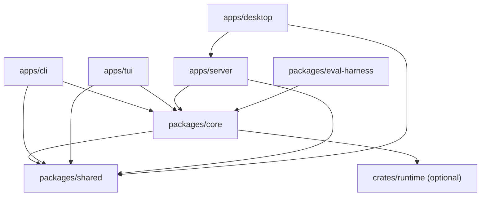

# Architecture

> **English** | [简体中文](architecture.zh-CN.md)

SeekForge is a local-first monorepo with one agent engine and several adapters.
The adapters own interaction and transport concerns; `packages/core` owns agent
behavior, policy, persistence, and tool execution.

Engineering Graphs are also Core-owned: `graph-contract.ts` owns pure bounded validation, `graph-engineering.ts` owns heterogeneous scheduling, and `graph-state.ts` owns atomic checkpoints. CLI, Server, and Desktop are adapters over those contracts; they must not recreate graph topology or resume rules. See [Graph Engineering](graph-engineering.md).

```mermaid
flowchart TD
  CLI["apps/cli"] --> Core["packages/core"]
  TUI["apps/tui"] --> Core
  Desktop["apps/desktop"] --> Server["apps/server"]
  Server --> Core
  Core --> Shared["packages/shared"]
  CLI --> Shared
  TUI --> Shared
  Server --> Shared
  Desktop --> Shared
  Core --> Runtime["crates/runtime (optional)"]
  Eval["packages/eval-harness"] --> Core
```

`packages/shared` contains plain cross-package types and has no runtime
dependencies. Validation, provider integration, permission policy, session
JSONL, workspace tools, and the agent loop remain in `packages/core`. Surfaces
must not reimplement those rules.

## Package responsibilities

| Area | Responsibility | State owner |
| --- | --- | --- |
| `apps/cli` | Commander wiring, terminal prompts, command-specific presentation | Process-local CLI options |
| `apps/tui` | Ink rendering, keyboard routing, tabs, overlays, terminal lifecycle | TUI reducer and per-tab run reservations |
| `apps/server` | REST/WS validation and transport, workspace-scoped service facade | Server session and repository coordinators |
| `apps/desktop` | Tauri/web UI and workspace-bound request presentation | View state guarded by workspace/request identity |
| `packages/core` | Agent execution, providers, tools, permissions, sessions, memory, autonomous Loop, security scanning | JSONL sessions and `.seekforge` stores |
| `packages/shared` | Dependency-free types and constants | None |
| `crates/runtime` | Optional native execution backend | Native child process/request state |

## Internal boundaries

Large entry points should compose smaller modules rather than accumulating
domain logic:

- CLI `index.ts` builds shared dependencies and registers command families;
  `commands/register-*.ts` owns each family's Commander definitions.
- Server `files.ts` is the public file-service facade. Path/symlink security,
  scan/search, and upload/raw behavior live in focused sibling modules and use
  the same workspace boundary checks.
- Core `agent/loop.ts` owns the effectful model/tool orchestration. Deterministic
  argument, usage, and gate classification belongs in `agent/loop-logic.ts`.
- Core `agent/graph-engineering.ts` owns only the effectful run: scheduling,
  attempts, checkpoints, and node execution. Its boundaries are separate:
  `graph-execution-contract.ts` (handler/executor contract and eligibility),
  `graph-execution-errors.ts` (failure vocabulary, timeout, retry wait),
  `graph-node-values.ts` (input bindings, schema assertions, output budgets),
  `graph-node-artifacts.ts` (verified artifact capture), and
  `graph-run-options.ts` (complete run validation before any side effect).
  Advisory surfaces import the contract, never the runtime. The remaining run
  function keeps its deep shared lifecycle state (leases, drain hooks,
  checkpoints) in one place deliberately, for the same reason `createAgentCore`
  is not split further; node execution stays with it because subgraph nodes
  re-enter the runner.
- Desktop views use `async-coordination.ts` and `use-workspace-async.ts` to bind
  asynchronous results to both request generation and workspace identity.
- TUI `app.tsx` owns interaction orchestration. Agent runners, run identity,
  terminal lifecycle, and status-line scheduling are separate modules.

These are ownership boundaries, not additional public APIs. Public behavior is
defined by the CLI reference, server API, configuration docs, and SDK notes.

## Reuse and invariant ownership

Every non-trivial invariant has one implementation owner. Before adding a
parser, validator, DTO, formatter, lifecycle helper, or identifier/path rule,
search the repository for the existing owner and extend it there.

| Concern | Canonical owner | Other layers may do |
| --- | --- | --- |
| Dependency-free event and transport shapes | `packages/shared` | Import, project, and render them |
| Runtime/domain validation and pure policy | `packages/core` | Decode transport shape, then call Core |
| Filesystem, process, lease, and persistence behavior | Focused Core/Server domain module | Compose it; never mirror its boundary rules |
| Surface interaction | The owning app | Adapt validated domain results for that UI/transport |

Equivalent boundary logic must be extracted rather than synchronized by hand.
Shape decoding at a transport boundary is allowed, but it must pass the decoded
value to the canonical semantic validator. Complete pure validation runs before
leases, provider/backend initialization, persisted writes, or derived workspace
creation. Shared symbols used across packages are re-exported through package
entry points; consumers do not reach into another package's private source tree.

## State and concurrency

Session traces are append-only JSONL and remain the source of truth for agent
runs. Automatic context compaction writes a fingerprinted derivative snapshot;
resume uses it only while its source prefix still matches. Each compacted summary
also carries the SHA-256 identity and turn count of its exact dropped segment so
later audit can correlate the derivative with source history. Context admission
budgets the complete provider request, including advertised tool schemas.
Interactive Server/Desktop chat treats `maxAgentTurns` as one bounded execution
slice rather than the lifetime of a user task. Desktop users select a bounded
2/4/8-slice policy; each slice stays in the same Core run, session lease, and
in-memory conversation. Consecutive stagnant tool cycles trip an independent
no-progress limit, so a larger turn budget does not merely prolong a loop. The
transient `session.continuing` event is observable, but its
harness nudge is not written as a synthetic user turn. Plan mode and direct
CLI/SDK runs retain single-slice semantics, and the existing tool, context,
cost, cancellation, and final continuation bounds still terminate the run.
Approved project-memory writes may trigger opt-in deterministic maintenance.
It shares the cross-process memory transaction lease, checks count/byte and
persisted interval gates, and stores only the last successful summary in
`.seekforge/memory/maintenance.json`; housekeeping failures never change the
foreground operation's result, and stale-fact archival requires explicit
user-owned configuration. Long-lived Server/Desktop, TUI, and REPL processes
own cancellable idle schedulers. Each tick non-blockingly claims the memory
lease, then acquires a workspace guard that excludes only that proven lease;
active sessions or memory writers skip the tick instead of being queued behind
housekeeping. One-shot CLI processes retain the write-triggered fallback. The
read-only memory governance report adds per-fact decay/quality/provenance,
retrieval effectiveness, bounded near-duplicate groups, and conservative
contradiction candidates; it never deletes facts automatically. A contradiction
is either a fact its replacement negates or the same claim carrying a different
value, judged over the whole set so that a numbered list is not mistaken for a
disagreement. The same check runs while the brief is built, so when two facts
about to be injected disagree the brief says so instead of presenting both as
equally true — which fact is stale stays a human decision.
Retrieval into the brief is lexical and therefore blind across a language
boundary: a question asked in Chinese cannot reach a fact written in English by
sharing words with it. Extraction now asks the model, in the call it was already
making, for a handful of retrieval keywords in both languages, stored beside the
fact in `fact-meta.json` and folded into what the ranker matches against —
never into what is injected or displayed. Measured on
`tests/memory/xlingual-retrieval.test.ts`: 3/12 cross-lingual queries reached
their fact without them, 12/12 with. Facts added by hand and facts remembered
before this existed carry none and score exactly as they did.
Autonomous Loop state is a separate orchestration checkpoint that points to a
session and owns the frozen requirement specification, acceptance evidence, and
optional approval gate. Requirement analysis and acceptance review run through
read-only Agent phases; only edit iterations mutate the workspace. See
[Loop engineering](loop-engineering.md). A persisted Loop's run, delivery, and
deletion paths share one lifecycle lease. Idle recovery retains its workspace
guard for the whole operation and passes an unforgeable in-process capability
to its own Agent and nested-agent session leases, preventing foreground overlap.

Server-managed execution has a second append-only control plane:
`.seekforge/runs.jsonl` stores run state and `.seekforge/run-events/<id>.jsonl`
stores sequenced transport events. WS clients resume from `runId + afterSeq`;
headless REST runs continue without a subscriber, while interactive WS runs
retain an explicit disconnect-cancels policy. Terminal state transitions are
centralized so cancellation cannot be overwritten by a late completion. Ledger
append and compaction share a cross-process lease, REST replay streams bounded
pages of at most 500 events, and WS subscriptions continue from replay into
live delivery until a terminal frame or connection close. Process-local frames
use direct RunManager notifications; a low-frequency cross-process fallback
checks file identity and parses replay data only after the event file changes.

Security scans use a separate append-only event source at
`.seekforge/security/events.jsonl`. `packages/core/src/security` owns strict
Agent-output validation, Finding and verification lifecycles, threat models,
fix evidence, and JSON/Markdown/SARIF rendering. CLI code only wires Agent and
project-check execution into that domain. Scanner output is untrusted until its
source paths, line ranges, and exact excerpts resolve inside the repository.

Each parent Agent run owns one Core dispatch manager for subagents. It emits a
structured lifecycle (`started`, `step`, and one terminal event), isolates
cancellation to the selected child, and drains queued steering only at a model
turn boundary. Server WS frames expose those controls; TUI and Desktop render
the same shared event contract and retain completed cards when a later run
reuses a run-local dispatch id.

`dispatch_team` adds deterministic orchestration over the same manager. A team
is a validated acyclic graph of named members; ready members run up to the
declared concurrency limit, dependants wait, and the failure policy either stops
pending work or continues independent branches. Team members emit the ordinary
subagent lifecycle, so steering, cancellation, usage accounting, and traces do
not diverge from one-off dispatches.

The Desktop workbench exposes these domains through Server rather than
reimplementing them. Security Center uses Core's Finding, threat, fix, and
export lifecycle; MCP settings retain project/global ownership and mask
secrets; restored sessions rebuild subagent cards from persisted events. Team
plans are validated before being handed to the Core `dispatch_team` path.
The unified diagnostics page projects the bounded run ledger with local
status/source/text filters and aggregate outcomes; memory governance expands
duplicate, contradiction, provenance, decay, and use evidence without mutating
facts. Optional newer endpoints degrade independently so older servers retain
their base pages.
Memory compaction binds an apply action to the exact dry-run pruning options and
workspace generation that produced its preview. Editing the threshold invalidates
that preview, and late preview/apply callbacks cannot repaint another workspace.
The preview is advisory rather than a state lock: apply recomputes compaction
against current server memory under the normal memory transaction.

Continuous eval scenarios choose an explicit runner (`agent`, `loop`, or
`session_scenario`). Loop, resume, and memory behavior therefore execute the
real lifecycle while deterministic checks remain the scoring authority.
Multi-sample A/B pairs by task and sample, alternates arm order, and publishes
confidence intervals, cost distributions, and restored CI trends.

Workspace mutations from Agent, REST, Git, worktree, and desktop surfaces must
use the relevant shared session or repository coordination guard. UI requests
must also reject stale completion when the active workspace changes. A request
counter alone is insufficient because two workspaces can reuse the same local
generation number. Within one Server, the repository coordinator serializes
mutating WS Agents, Loops, background runs, webhook runs, security fixes, Git,
and worktree operations by physical repository identity; read-only ask runs are
not serialized.

## Orchestration decision layer

`packages/core/src/agent/orchestration-report.ts` is the composition owner for
workspace-level Loop/Graph intelligence. Pure policy remains split into focused
owners: health forecasting, deterministic replay, strategy outcomes, SLO
evaluation, Pareto counterfactuals, placement checks, artifact reuse, and tree
migration/deployment transactions. CLI, Server, and Desktop consume the same
report instead of rejoining state independently.

Generated optimization proposals are durable, bounded records protected by a
cross-process lease. Review uses an optimistic `updatedAt` version and explicit
`approved`/`dismissed` transitions. Approval remains separate from execution; a
subsequent deployment revalidates the proposal version and exact source
generation, records intent before effects, serializes by target, and retains
rollback evidence. Hard-budget changes still require explicit human action.
Nested Graph recommendations cannot be independently deployed because their
definition is owned by the root tree transaction. Graph artifacts are reusable
only when the archived run fingerprint exactly matches the current
definition/workspace generation and the artifact retained verified SHA-256 and
size evidence in the physical owner's CAS. Multi-checkpoint tree migrations use
canonical participant leases, exact prepared-state hashes, child-first/root-last
activation, and deterministic roll-forward recovery.
Reviewed proposal decisions outrank unreviewed drafts during retention, and any
proposal mutation fails closed on malformed durable state. Workspace reports
keep all-checkpoint portfolio totals while bounding detailed Loop/Graph joins;
Graph-owned Loops and nested Graphs carry parent provenance so rollups count
their usage exactly once. Persisted SLO policy, deployment records, and the
materialized orchestration index have independent bounded owners.

## Security boundaries

- Tool results are data and are never promoted to instructions.
- Permission prompts display the raw command or path.
- Command allowlists authorize one invocation only; shell control syntax never
  inherits approval from the first command.
- Filesystem access is resolved against the workspace with symlink-aware checks.
- Config and transport input is validated in Core or at the server boundary,
  not trusted because it came from a local UI.

For recurring implementation hazards, use the
[boundary checklist](boundary-checklist.md) before modifying parsers, paths,
async ownership, caches, command classification, or resource lifecycles.

## Change placement

Add policy or agent behavior to Core, transport validation to Server, and only
surface-specific rendering or interaction to clients. Cross-package types go in
Shared only when they can remain dependency-free. When behavior crosses a
package boundary, export it through every package entry point and verify a clean
checkout so an uncommitted local source file cannot mask a missing export.
