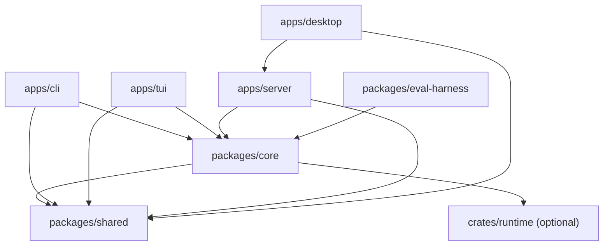

# 架构

> [English](architecture.md) | **简体中文**

SeekForge 是一个本地优先的 monorepo：一个智能体引擎，配多个适配层。适配层负责交互与传输相关的事务；`packages/core` 负责智能体行为、策略、持久化与工具执行。

`packages/shared` 只包含纯粹的跨包类型，没有任何运行时依赖。校验、provider 集成、权限策略、会话 JSONL、工作区工具与智能体循环都保留在 `packages/core` 中。各界面层不得重新实现这些规则。

## 各包职责

| 区域 | 职责 | 状态所有者 |
| --- | --- | --- |
| `apps/cli` | Commander 装配、终端提示、命令级展示 | 进程本地的 CLI 选项 |
| `apps/tui` | Ink 渲染、键盘路由、标签页、浮层、终端生命周期 | TUI reducer 与每标签页的运行预留 |
| `apps/server` | REST/WS 校验与传输、按工作区隔离的服务门面 | 服务器会话与仓库协调器 |
| `apps/desktop` | Tauri/网页 UI 与绑定工作区的请求展示 | 由工作区/请求身份守护的视图状态 |
| `packages/core` | 智能体执行、provider、工具、权限、会话、记忆、自主 Loop、安全扫描 | JSONL 会话与 `.seekforge` 存储 |
| `packages/shared` | 无依赖的类型与常量 | 无 |
| `crates/runtime` | 可选的原生执行后端 | 原生子进程/请求状态 |

## 内部边界

大的入口点应当组合更小的模块，而不是不断堆积领域逻辑：

- CLI `index.ts` 构建共享依赖并注册命令族；
  `commands/register-*.ts` 负责各命令族的 Commander 定义。
- Server `files.ts` 是文件服务的公开门面。路径/symlink 安全、
  扫描/搜索、上传/raw 行为放在职责聚焦的同级模块里，
  并使用同一套工作区边界检查。
- Core `agent/loop.ts` 负责带副作用的模型/工具编排。确定性的
  参数、用量与门禁分类逻辑属于 `agent/loop-logic.ts`。
- 桌面端视图使用 `async-coordination.ts` 与 `use-workspace-async.ts`，
  将异步结果同时绑定到请求代次与工作区身份。
- TUI `app.tsx` 负责交互编排。智能体 runner、运行身份、
  终端生命周期与状态栏调度是独立模块。

这些是所有权边界，不是新增的公开 API。公开行为由 CLI 参考、服务器 API、配置文档与 SDK 笔记定义。

## 状态与并发

会话 trace 是只追加（append-only）的 JSONL，始终是智能体运行的事实来源。自动上下文压缩会写出一份带指纹的派生快照；只有当其来源前缀仍然匹配时，恢复才会使用它。上下文准入以完整的 provider 请求为预算单位，包括对外声明的工具 schema。自主 Loop 状态是一个独立的编排检查点，指向某个会话；见 [Loop 工程](loop-engineering.zh-CN.md)。

服务器托管的执行有第二个只追加控制平面：`.seekforge/runs.jsonl` 存储运行状态，`.seekforge/run-events/<id>.jsonl` 存储带序号的传输事件。WS 客户端从 `runId + afterSeq` 恢复；headless REST 运行在没有订阅者的情况下继续，而交互式 WS 运行保留明确的「断连即取消」策略。终态转换被集中管理，因此取消不可能被迟到的完成事件覆盖。

安全扫描使用一个独立的只追加事件源，位于 `.seekforge/security/events.jsonl`。`packages/core/src/security` 负责严格的 Agent 输出校验、Finding 与验证生命周期、威胁模型、修复证据，以及 JSON/Markdown/SARIF 渲染。CLI 代码只负责将 Agent 与项目检查的执行接入该领域。扫描器输出在其来源路径、行号范围与精确摘录都能在仓库内解析之前，均视为不可信。

每个父 Agent 运行拥有一个用于子智能体的 Core dispatch 管理器。它发出结构化的生命周期事件（`started`、`step` 及一个终态事件），将取消隔离到被选中的子任务，并且只在模型轮次边界处消费排队的引导（steering）。服务器 WS 帧暴露这些控制；TUI 与桌面端渲染同一套共享事件契约，并在后续运行复用运行内 dispatch id 时保留已完成的卡片。

`dispatch_team` 在同一管理器之上增加了确定性编排。一个 team 是经过校验的、由命名成员构成的无环图；就绪的成员在声明的并发上限内运行，依赖者等待，失败策略要么停止待处理工作、要么继续独立分支。团队成员发出普通的子智能体生命周期事件，因此引导、取消、用量统计与 trace 不会偏离一次性 dispatch 的行为。

桌面工作台通过 Server 暴露这些领域，而不是重新实现它们。Security Center 使用 Core 的 Finding、威胁、修复与导出生命周期；MCP 设置保留项目/全局所有权并对 secret 打码；恢复的会话从持久化事件重建子智能体卡片。团队计划在交给 Core 的 `dispatch_team` 路径之前先经过校验。

持续 eval 场景选择一个显式的 runner（`agent`、`loop` 或 `session_scenario`）。因此 Loop、恢复与记忆行为执行的是真实生命周期，而确定性检查仍是评分的权威。多样本 A/B 按任务与样本配对、交替两臂顺序，并发布置信区间、成本分布与恢复后的 CI 趋势。

来自 Agent、REST、Git、worktree 与桌面端的工作区变更必须使用相应的共享会话或仓库协调守护。UI 请求还必须在活动工作区切换时拒绝过期的完成结果。仅靠一个请求计数器是不够的，因为两个工作区可能复用相同的本地代次编号。

## 安全边界

- 工具结果是数据，绝不会被提升为指令。
- 权限提示展示原始命令或路径。
- 命令 allowlist 只授权单次调用；shell 控制语法绝不继承首个命令的批准。
- 文件系统访问针对工作区解析，并做 symlink 感知的检查。
- 配置与传输输入在 Core 或服务器边界处校验，
  不会因为来自本地 UI 就被信任。

在修改解析器、路径、异步所有权、缓存、命令分类或资源生命周期之前，请对照[边界检查清单](boundary-checklist.zh-CN.md)排查反复出现的实现隐患。

## 变更落点

策略或智能体行为加到 Core，传输校验加到 Server，只有界面特定的渲染或交互才放到客户端。跨包类型只有在能保持零依赖时才放入 Shared。当行为跨越包边界时，要通过每个包的入口点导出它，并在干净的 checkout 上验证，以免未提交的本地源文件掩盖了缺失的导出。
