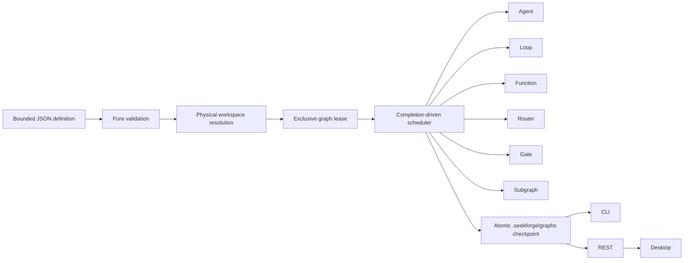

# Graph Engineering

> **English** | [简体中文](graph-engineering.zh-CN.md)

Graph Engineering is SeekForge's durable orchestration layer for workflows that combine Agents, autonomous Loops, deterministic functions, routers, approval gates, and nested graphs. It complements `loop-dag`: Loop DAG is optimized for homogeneous run→verify nodes and managed worktrees, while an Engineering Graph coordinates heterogeneous work.

## Execution model



Validation completes before provider, lease, or node effects. Definitions are capped at 256 KiB, 128 total nodes, four nested graph levels, eight concurrent nodes, 32 routes per router, and bounded task/command/condition sizes. Dependencies must be acyclic. Conditions may only reference declared dependencies; route bindings must point to a dependency router and a declared branch.

## Definition

```json
{
  "graphId": "release",
  "failurePolicy": "continue",
  "costBudgetUsd": 5,
  "tokenBudget": 200000,
  "nodes": [
    { "id": "implement", "kind": "agent", "task": "Implement the accepted change" },
    { "id": "verify", "kind": "loop", "task": "Repair until tests pass", "verifyCommand": "pnpm test", "dependsOn": ["implement"] },
    { "id": "review", "kind": "gate", "dependsOn": ["verify"] },
    { "id": "summary", "kind": "function", "handler": "collect", "dependsOn": ["review"] }
  ]
}
```

Node kinds:

- `agent`: one Agent task; `mode` and `approvalMode` use normal permission policy.
- `loop`: a full autonomous Loop with its own verifier and a share of remaining graph budgets.
- `function`: an embedding-supplied named handler. Every handler is resolved before effects. The CLI exposes only safe `noop` and `collect` handlers; it does not turn handler names into shell commands. Retried handlers must be idempotent. Handler ids are part of the resume fingerprint, so change the id when its behavior changes.
- `router`: selects the first matching conditional route, then the optional default route. Downstream nodes bind through `route.routerId` and `route.branch`.
- `gate`: pauses the graph until the embedding surface explicitly approves the node.
- `subgraph`: runs another validated graph with bounded nesting. Its usage rolls into the parent and is constrained by the parent share. Nested approval gates and subgraph retries are rejected until durable child checkpoints can make them safely resumable.

`failurePolicy: "stop"` skips outstanding work after the first failed node. `"continue"` allows independent branches to finish; ordinary dependents of a failed node are skipped unless an explicit condition accepts that status. `maxRetries` is per node. `timeoutMs` is per attempt.

For `maxConcurrency > 1`, effectful nodes must resolve to non-overlapping physical directories under the graph workspace; an ancestor and its descendant cannot run as separate branches. Use explicit retained worktrees when parallel branches edit code. Router and gate nodes do not require separate workspaces.

## Persistence and recovery

Every persistent run owns `engineering-graph-<graphId>` and atomically checkpoints to `.seekforge/graphs/<graphId>.json`. A new run refuses to replace an existing id unless `restart`/`--restart` is explicit. The checkpoint contains the normalized definition, a definition-plus-physical-workspace fingerprint, node results, cumulative usage, and the last 128 lifecycle events. One node output is capped at 16 KiB and retained output across the graph is bounded; the full checkpoint is capped at 1 MiB.

Ready work receives shares of the unspent, unreserved graph budgets. Failed retry usage is charged before another attempt. Loop and subgraph nodes enforce their shares directly; Agent calls and embedding functions are atomic, so one in-flight call can report an overrun, which makes the graph fail instead of allowing further nodes to start.

Resume refuses a changed definition or changed physical workspace mapping. `--rerun <node>` invalidates that node and all descendants. Waiting gates are re-evaluated on resume; `--approve <node>` crosses a gate for that run. Observer failures become bounded warning events and never change node outcomes.

## CLI and API

```sh
seekforge graph validate release.graph.json
seekforge graph run release.graph.json -y
seekforge graph run release.graph.json --restart -y
seekforge graph resume release.graph.json --approve review -y
seekforge graph resume release.graph.json --rerun verify -y
seekforge graph list
seekforge graph show release
seekforge graph history release
seekforge graph delete release
```

The server exposes `GET /api/graphs`, `GET /api/graphs/:id`, `GET /api/graphs/:id/history`, and `DELETE /api/graphs/:id`. The list endpoint omits definitions and node outputs and keeps only recent events; the detail endpoint returns the full bounded checkpoint. The Desktop Loop manager renders graph/node status, cost, tokens, and recent lifecycle events. It polls the same REST contract, so graphs executed by another local process become visible without a second source of truth.

Embedders use `parseEngineeringGraphDefinition`, `runEngineeringGraph`, `loadEngineeringGraphState`, and `listEngineeringGraphStates` from `@seekforge/core`; function handlers are passed through `RunEngineeringGraphOptions.handlers`.
