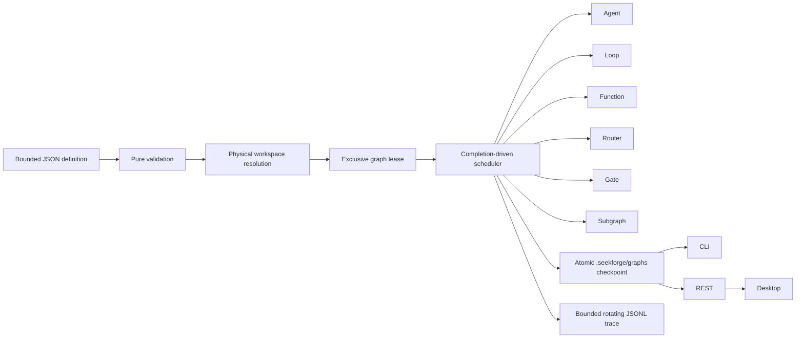

# Graph Engineering

> **English** | [简体中文](graph-engineering.zh-CN.md)

Graph Engineering is SeekForge's durable orchestration layer for workflows that combine Agents, autonomous Loops, deterministic functions, bounded maps, quorum joins, routers, approval gates, and nested graphs. It complements `loop-dag`: Loop DAG is optimized for homogeneous run→verify nodes and managed worktrees, while an Engineering Graph coordinates heterogeneous work.

## Execution model



Validation completes before provider, lease, or node effects. Definitions are capped at 256 KiB, 128 total nodes, four nested graph levels, eight concurrent nodes, 32 routes per router, and bounded task/command/condition sizes. Dependencies must be acyclic. Conditions may only reference declared dependencies; route bindings must point to a dependency router and a declared branch.

## Definition

```json
{
  "graphId": "release",
  "failurePolicy": "continue",
  "costBudgetUsd": 5,
  "tokenBudget": 200000,
  "managedWorktrees": { "integrateDependencies": true, "limit": 64 },
  "fanIn": { "verifyCommand": "pnpm test", "maxIterations": 2 },
  "nodes": [
    { "id": "implement", "kind": "agent", "task": "Implement the accepted change" },
    { "id": "verify", "kind": "loop", "task": "Repair until tests pass", "verifyCommand": "pnpm test", "dependsOn": ["implement"] },
    { "id": "review", "kind": "gate", "dependsOn": ["verify"] },
    { "id": "summary", "kind": "function", "handler": "collect", "dependsOn": ["review"] }
  ]
}
```

Reusable files may use the versioned template envelope below. Placeholders use `${{name}}`; an exact placeholder preserves the declared string/number/boolean type, while interpolation inside a larger string is textual. All declared parameters require a supplied value or a typed default; unknown, duplicated, mistyped, unresolved, sparse, oversized, or future-version inputs fail before workspace or Git effects. CLI commands accept repeatable `--param name=value`; REST accepts `{definition:<template>,parameters:{...}}`.

```json
{
  "schemaVersion": 2,
  "kind": "engineering-graph-template",
  "templateId": "package-release",
  "version": "1.0.0",
  "interface": { "outputSchema": { "type": "object" } },
  "parameters": {
    "package": { "type": "string", "description": "pnpm workspace package" },
    "retries": { "type": "number", "default": 2 }
  },
  "definition": {
    "graphId": "release-${{package}}",
    "nodes": [
      { "id": "verify", "kind": "loop", "task": "Repair ${{package}}", "verifyCommand": "pnpm --filter ${{package}} test", "maxRetries": "${{retries}}" }
    ]
  }
}
```

Node kinds:

- `agent`: one Agent task; `mode` and `approvalMode` use normal permission policy.
- `loop`: a full autonomous Loop with its own verifier and a share of remaining graph budgets.
- `function`: an embedding-supplied named handler. Every handler is resolved before effects. The CLI exposes only safe `noop` and `collect` handlers; it does not turn handler names into shell commands. Retried handlers must be idempotent. Handler ids are part of the resume fingerprint, so change the id when its behavior changes.
- `map`: resolves a declared dependency output through a bounded JSON Pointer and invokes a registered handler for at most `maxItems` values (default 32, hard limit 64). Items run in bounded batches, receive stable per-item idempotency keys and shares of the remaining node budget, and every started peer settles before a failed batch is published.
- `join`: succeeds after its dependencies settle when at least `quorum` dependencies passed. This supports bounded quorum/reduce workflows without dynamically rewriting the durable definition.
- `router`: selects the first matching conditional route, then the optional default route. Downstream nodes bind through `route.routerId` and `route.branch`.
- `gate`: pauses the graph until the embedding surface explicitly approves the node.
- `subgraph`: runs another validated graph with bounded nesting. Every child receives a deterministic, collision-resistant checkpoint id and records its parent Graph/node provenance. Its usage rolls into the parent and is constrained by the parent share. Subgraph retries resume the child checkpoint and invalidate only failed nodes plus descendants.
- `wait`: pauses durably until a declared external signal is received or an absolute `notBefore` time is reached. An optional `expiresAt` turns an unresolved wait into a bounded failure and rejects signals created after the deadline.
- `compensation`: names one or more successful `compensates` dependencies. After main-work failure, eligible compensation nodes run serially in reverse completion/topology order and share the graph's remaining hard budget; after success they are recorded as skipped.
- `remote`: delegates through an embedding-registered `GraphExecutionAdapter`. Preflight accepts only adapters explicitly marked `trusted` and `locality: "remote"`; a graph or plugin cannot create trust by naming an executor.

Nodes may declare `inputs` that bind names to direct dependency outputs using bounded JSON Pointers and optional schemas. Recursive schemas support bounded object `properties`/`required`/`additionalProperties`, array `items` and item bounds, and primitive enums. Function, map, compensation, and remote handlers may return up to 32 repository-relative artifact references. `verifyArtifacts: true` physically revalidates each file without following a symlink, streams its SHA-256, verifies a supplied digest, and records size plus producer lineage.

`priority` orders simultaneously ready nodes. Within a priority tier, work on the longest remaining dependency path starts first. `resources` declares logical locks; dot-separated ids form a hierarchy, so `provider.deepseek` conflicts with `provider.deepseek.chat`. `resourceCapacities` may allow multiple exact-name reservations while parent/child overlap remains exclusive. `adaptiveScheduling: true` uses bounded historical duration/failure observations as a tie-breaker within the static critical tier. Only persisted passed/failed outcomes from the exact definition-and-workspace fingerprint participate; waits and `persist: false` runs neither consume nor produce advice. The output-free history expires after 30 days and is bounded to 512 observations and 128 KiB under a cross-process mutation lease. Auto Loop verification, Loop DAG, and Graph use the same deterministic resource-aware ready-queue owner.

`priorityAgingMs` prevents starvation by adding one bounded priority point for each interval that a dependency-ready node waits. A node may declare an absolute `deadlineAt`; if it has not started by then, Graph records a zero-attempt failure instead of launching stale work. Nodes with retries may declare an exact `retryPolicy` (`initialDelayMs`, `maxDelayMs`, `multiplier`, `jitterRatio`). Retry jitter is deterministic, and the next-attempt timestamp plus last error are checkpointed before the cancellable wait, so a restarted owner preserves the delay.

`failurePolicy: "stop"` skips outstanding work after the first failed node. `"continue"` allows independent branches to finish; ordinary dependents of a failed node are skipped unless an explicit condition accepts that status. `maxRetries` is per node. `timeoutMs` is per attempt.

For `maxConcurrency > 1`, effectful nodes that can actually overlap must resolve to non-overlapping physical directories under the graph workspace; dependency-ordered nodes may safely reuse one workspace. An ancestor and its descendant cannot run as separate parallel branches. Router and gate nodes do not require separate workspaces.

`managedWorktrees` provisions a deterministic retained Git worktree for every effectful node under one repository-wide resource lock, including nested Graphs. Explicit node workspaces are forbidden within that managed scope. With `integrateDependencies: true`, passed dependency branches are merged into a node before its first attempt. `limit` accounts for all existing `seekforge/` worktrees before provisioning. An optional `fanIn` merges all passed node branches in definition order into a dedicated integration branch, runs a bounded autonomous Loop against `verifyCommand`, checkpoints repairs, and charges every attempt to the graph budget. Parent resource inspection, archival, and pruning include recursively derived child branches.

## Persistence and recovery

Every persistent run owns `engineering-graph-<graphId>` and atomically checkpoints to `.seekforge/graphs/<graphId>.json`. State schema v2 reads and normalizes v1 checkpoints. It records active node attempts, stable handler idempotency keys, successful map-item checkpoints, control sequence/run identity, cumulative active `elapsedMs`, and whether a pause came from approval, external wait, or operator control. A definition-level `maxDurationMs` applies across durable resumes; time spent stopped or paused between invocations is excluded. Run snapshots and comparisons use the same active-time measure. Each successful map item is committed before a failed batch is published; rerunning a failed map invokes only unfinished items. External signals are durably claimed, then acknowledged and removed only after the passed wait result is checkpointed. A signal in the durable mailbox makes its wait-paused graph eligible for idle recovery, and resume/restart reconciles claims left behind by a crash after the workflow checkpoint but before acknowledgement. An attempt-start checkpoint precedes handler effects; the successful or terminal result and active-journal removal publish in the same checkpoint. A recovered interrupted attempt is reported explicitly and retries with the same logical key, while an explicit rerun receives a new key.

A new run refuses to replace an existing id unless `restart`/`--restart` is explicit. The checkpoint contains the normalized definition, a definition-plus-physical-workspace fingerprint, node results, cumulative usage, and the last 128 lifecycle events. One node output is capped at 16 KiB and retained output across the graph is bounded; the full checkpoint is capped at 1 MiB.

The complete lifecycle trace is also appended to `.seekforge/graphs/<graphId>.jsonl`, with an independent monotonic sequence, 1 MiB segments, three bounded segments, torn-tail repair, and physical-path checks. Checkpoint writes remain authoritative if observational history I/O fails. Evidence exports summarize status, usage, active duration, and node outcomes without node outputs, and carry a SHA-256 integrity digest.

Ready work receives shares of the unspent, unreserved graph budgets. Failed retry usage is charged before another attempt. Loop and subgraph nodes enforce their shares directly; Agent calls and embedding functions are atomic, so one in-flight call can report an overrun, which makes the graph fail instead of allowing further nodes to start.

Resume refuses a changed definition, physical workspace mapping, managed branch placement, or parent provenance. `--rerun <node>` invalidates that node and all descendants plus stale fan-in evidence. Scoped paths such as `child/verify` rerun only that nested node and its nested descendants while preserving already-passed siblings. Waiting gates are re-evaluated on resume; `--approve child/review` crosses exactly that nested gate for that run. A paused subgraph is represented as a waiting parent node, so its already-completed effects and usage remain recoverable after a process crash. Observer failures become bounded warning events and never change node outcomes.

Managed branches remain after completion for inspection or promotion. The resource API reports physically rebound paths and bounded disk measurements. Archive a terminal graph before pruning; pruning skips dirty worktrees, supports dry-run, and runs under the graph lease plus the shared managed-worktree lease. A passed node branch or the passed `fan-in` branch can be promoted to the repository worktree. A managed Graph must be pruned before `restart`, preventing an old retained branch from being silently rebound to a new definition.

## CLI and API

```sh
seekforge graph validate release.graph.json --json
seekforge graph validate release.template.json --param package=core --param retries=2 --json
seekforge graph run release.graph.json -y
seekforge graph run release.graph.json --restart -y
seekforge graph resume release.graph.json --approve review -y
seekforge graph resume release.graph.json --rerun verify -y
seekforge graph list
seekforge graph intelligence release
seekforge graph priority release 5
seekforge graph show release
seekforge graph history release
seekforge graph diagnose release
seekforge graph migration-plan release-v2.graph.json
seekforge graph migrate release-v2.graph.json
seekforge graph simulate release-v2.graph.json --worst-case
seekforge graph explain release verify
seekforge graph resources release inspect
seekforge graph resources release archive
seekforge graph resources release prune --dry-run
seekforge graph resources release promote --target fan-in
seekforge graph delete release
```

The server exposes validation/dry-run planning (`POST /api/graphs/validate`), side-effect-free resource and budget simulation (`POST /api/graphs/simulate`), scheduling intelligence (`GET /api/graph-scheduling-intelligence`), a fingerprint-bound health forecast (`GET /api/graphs/:id/health`), background start (`POST /api/graphs`), explicit resume/approve/rerun/restart/cancel controls, durable graph pause plus pending-node pause, steer, cancel, and reprioritize control (`POST /api/graphs/:id/control`), external signals (`POST /api/graphs/:id/signals`), automatic-recovery priority (`POST /api/graphs/:id/priority`), node eligibility explanation (`GET /api/graphs/:id/explain/:nodeId`), run comparison (`GET /api/graphs/:id/compare`), bounded history, evidence export, list/detail, and deletion.

Idle recovery considers ownerless `running` graphs and wait-paused graphs whose timer or signal is ready; explicit control and approval pauses remain sticky. Candidates are ordered by mutable priority from -10 to 10, and failures use persisted exponential backoff from 30 seconds to one hour. Loop and Graph decode that recovery subrecord through the same exact-key, timestamp-ordered persisted contract. Recovery bookkeeping is bound to the pre-attempt or newly checkpointed run identity, so a delayed failure cannot modify a later run. Schema-v2 templates can be registered and resolved exactly through `/api/graphs/templates`; versions are never silently floated. Compatibility comparison classifies removed or newly-required parameters, removed defaults, type changes, and output-interface changes as breaking, while deprecation remains explicit metadata and never rewrites existing references. Their optional `interface.outputSchema` uses the same bounded recursive schema parser as nodes. The shared dry-run planner returns normal execution waves separately from compensation order, plus the critical path, resource capacities, maximum parallel width/attempts/dynamic items, recursive node paths, input bindings, runtime requirements, and deterministic managed/fan-in branches without creating resources. Graph runs are represented in the normal Run Ledger and are drained on server shutdown. Server-started graphs containing Agent or Loop nodes must declare `costBudgetUsd`.

`graph diagnose` and `GET /api/graphs/:id/diagnose` independently compare the
checkpoint with the newest retained lifecycle window without mutating it.

`mapKind: "agent" | "loop"` lets a bounded map run each item through a sequential Agent or autonomous Loop; the item is wrapped as untrusted data and each completed item retains its own durable usage checkpoint. These dynamic maps count as Agent runtime use, so server-started definitions require `costBudgetUsd` just like direct Agent and Loop nodes. Direct and mapped child Loops derive stable ids from the Graph attempt idempotency key, so an interrupted Graph resumes the same child Loop instead of duplicating its edit history. Gates may return `approve`, `reject`, or `request_changes` with bounded structured context. Remote nodes can require executor protocol version 1 and cooperative cancellation during preflight. Trusted adapters may additionally recover by idempotency key, emit bounded heartbeats, receive cooperative cancellation, and verify result provenance before commit. `GET /api/graphs/:id/artifacts` returns a deterministic content-addressed lineage catalog, while `POST /api/graphs/:id/migration-plan` validates a proposed definition and previews added, removed, changed, preserved, and transitively invalidated nodes without mutating the run. `POST /api/graphs/:id/migration-apply` applies that policy to a paused or terminal checkpoint under the authoritative lease, recomputes the plan after reload, preserves only unaffected results and usage, archives a prior terminal run, and leaves the new generation control-paused for an explicit resume. A bounded migration journal makes checkpoint replacement restart-safe. Managed-worktree migrations are accepted only when policy and effectful-resource topology are unchanged. Their physical worktrees remain in place, but a fresh resource generation invalidates prior archive authorization; migrations that would invalidate an effectful managed-worktree node are rejected so completed side effects cannot be replayed implicitly. Changes to managed topology, direct child-checkpoint migration, changes that invalidate an existing subgraph checkpoint, and an added subgraph whose deterministic child id already exists remain rejected. Its `graphPolicyChanged` flag covers graph-level policy changes; when true, every retained node is invalidated because scheduling, budgets, worktrees, or fan-in behavior may have changed. Scheduling intelligence reports P50/P95 duration, deviation, recency-weighted failure rate, confidence, resource wait, and forecast error. Health reports feed those exact-fingerprint estimates into the side-effect-free simulator and expose critical path, bottlenecks, actual drift, and child-session lineage; forecasts remain advisory and never decide eligibility. Simulation models concurrency, hierarchical resources, retry mode, estimates, budgets, deadlines, gates, external waits, and compensation contingency without creating state. Unresolved durable timers are modeled as scheduler barriers, matching the runtime's pause-and-drain behavior. The report separates wall-clock `makespanMs` from active runtime charged to `maxDurationMs`. Explanation reports the current dependency, route, approval, timer/signal mailbox, resource, concurrency, deadline, and budget blockers. Graph metrics include active/paused counts, recovery backoff, pending nodes, retry waits, usage, attempts, retries, and scheduling anomaly counts; run comparison includes per-node attempt and duration deltas.

`seekforge serve --graph-auto-resume` opts into sequential idle-workspace recovery of ownerless running Graphs or wait-paused Graphs with a ready timer or signal. One failed recovery is isolated so later eligible Graphs and retention still run. `--graph-auto-prune` applies the terminal age/count policy during the same idle window, archives and cleans safe managed resources, retains dirty worktrees, preserves child checkpoints while a parent remains resumable, and then removes eligible state. Durable control works for any live Graph owner, including another process or an idle-recovery run. Desktop subscribes to Graph Run Ledger frames over WebSocket, retains a slower polling fallback, displays run deltas plus health forecasts and anomaly heat, and exposes graph/node control, signals, approval, rerun, restart, promotion, archival, pruning, and deletion.

The Server and CLI share the deterministic `noop` and `collect` handler registry. Enabled plugins may publish namespaced `graphHandlers` aliases to those built-ins. A plugin may also alias a `graphExecutor` already registered as trusted by its host; plugin manifests cannot supply executable code, promote an untrusted adapter, or turn handler names into shell commands.

`GET /api/graphs/:id/history` preserves the original event-array response by default. Add `?format=entries&afterSeq=<n>&limit=<n>` for cursor-bearing JSONL records. `GET /api/graphs/:id/evidence` returns the tamper-evident summary, including managed-branch and fan-in provenance but not absolute fan-in workspace paths. `GET`/`POST /api/graphs/:id/resources` inspect or perform `archive`, `prune`, and `promote` operations. Deletion refuses retained managed resources. The list endpoint omits definitions and node outputs and keeps only recent events; the detail endpoint returns the full bounded checkpoint. Desktop inspection renders dependency arrows from the normalized detail and exposes the same archive/promote/prune lifecycle.

Embedders use `parseEngineeringGraphDefinition`, `runEngineeringGraph`, `loadEngineeringGraphState`, `listEngineeringGraphStates`, `readGraphSchedulingObservations`, `summarizeGraphSchedulingIntelligence`, `analyzeGraphSchedulingIntelligence`, `simulateEngineeringGraph`, `explainEngineeringGraphNode`, and `applyEngineeringGraphMigration` from `@seekforge/core`; function handlers are passed through `RunEngineeringGraphOptions.handlers`, while trusted remote adapters use `executors`. Server embedders may register the same adapters through `StartServerOptions.graphExecutors`; REST validation, execution, idle recovery, and approved plugin aliases share that host registry. Terminal runs are archived in a bounded snapshot registry before rerun/restart so `compareEngineeringGraphRuns` can power API and Desktop deltas.
