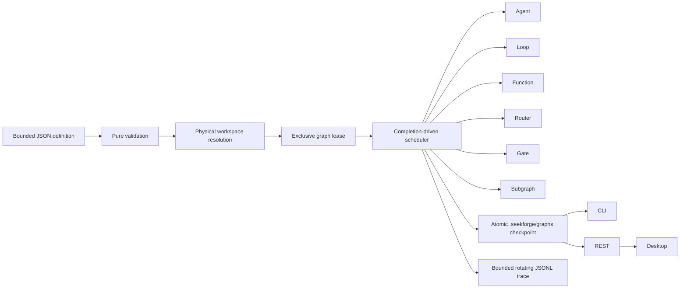

# Graph Engineering

> **English** | [简体中文](graph-engineering.zh-CN.md)

Graph Engineering is SeekForge's durable orchestration layer for workflows that combine Agents, autonomous Loops, deterministic functions, bounded maps, quorum joins, routers, approval gates, and nested graphs. It complements `loop-dag`: Loop DAG is optimized for homogeneous run→verify nodes and managed worktrees, while an Engineering Graph coordinates heterogeneous work.

## Execution model



Validation completes before provider, lease, or node effects. Definitions are capped at 256 KiB, 128 total nodes, four nested graph levels, eight concurrent nodes, 32 routes per router, and bounded task/command/condition sizes. Dependencies must be acyclic. Conditions may only reference declared dependencies; route bindings must point to a dependency router and a declared branch.

## Definition

```json
{
  "graphId": "release",
  "failurePolicy": "continue",
  "costBudgetUsd": 5,
  "tokenBudget": 200000,
  "managedWorktrees": { "integrateDependencies": true, "limit": 64 },
  "fanIn": { "verifyCommand": "pnpm test", "maxIterations": 2 },
  "nodes": [
    { "id": "implement", "kind": "agent", "task": "Implement the accepted change" },
    { "id": "verify", "kind": "loop", "task": "Repair until tests pass", "verifyCommand": "pnpm test", "dependsOn": ["implement"] },
    { "id": "review", "kind": "gate", "dependsOn": ["verify"] },
    { "id": "summary", "kind": "function", "handler": "collect", "dependsOn": ["review"] }
  ]
}
```

Reusable files may use the versioned template envelope below. Placeholders use `${{name}}`; an exact placeholder preserves the declared string/number/boolean type, while interpolation inside a larger string is textual. All declared parameters require a supplied value or a typed default; unknown, duplicated, mistyped, unresolved, sparse, oversized, or future-version inputs fail before workspace or Git effects. CLI commands accept repeatable `--param name=value`; REST accepts `{definition:<template>,parameters:{...}}`.

```json
{
  "schemaVersion": 1,
  "kind": "engineering-graph-template",
  "templateId": "package-release",
  "parameters": {
    "package": { "type": "string", "description": "pnpm workspace package" },
    "retries": { "type": "number", "default": 2 }
  },
  "definition": {
    "graphId": "release-${{package}}",
    "nodes": [
      { "id": "verify", "kind": "loop", "task": "Repair ${{package}}", "verifyCommand": "pnpm --filter ${{package}} test", "maxRetries": "${{retries}}" }
    ]
  }
}
```

Node kinds:

- `agent`: one Agent task; `mode` and `approvalMode` use normal permission policy.
- `loop`: a full autonomous Loop with its own verifier and a share of remaining graph budgets.
- `function`: an embedding-supplied named handler. Every handler is resolved before effects. The CLI exposes only safe `noop` and `collect` handlers; it does not turn handler names into shell commands. Retried handlers must be idempotent. Handler ids are part of the resume fingerprint, so change the id when its behavior changes.
- `map`: resolves a declared dependency output through a bounded JSON Pointer and invokes a registered handler for at most `maxItems` values (default 32, hard limit 64). Items run in bounded batches, receive stable per-item idempotency keys, and every started peer settles before a failed batch is published.
- `join`: succeeds after its dependencies settle when at least `quorum` dependencies passed. This supports bounded quorum/reduce workflows without dynamically rewriting the durable definition.
- `router`: selects the first matching conditional route, then the optional default route. Downstream nodes bind through `route.routerId` and `route.branch`.
- `gate`: pauses the graph until the embedding surface explicitly approves the node.
- `subgraph`: runs another validated graph with bounded nesting. Every child receives a deterministic, collision-resistant checkpoint id and records its parent Graph/node provenance. Its usage rolls into the parent and is constrained by the parent share. Subgraph retries resume the child checkpoint and invalidate only failed nodes plus descendants.

Nodes may declare `inputs` that bind names to direct dependency outputs using bounded JSON Pointers, plus a shallow `outputSchema` (`string`, `number`, `boolean`, `object`, `array`, or `null`, with required object fields). Function and map handlers may return up to 32 repository-relative artifact references per node with optional SHA-256 digests. `priority` orders simultaneously ready nodes. Compensation remains an explicit ordinary node whose condition accepts a dependency's `failed` status, so recovery topology stays visible and resumable.

`failurePolicy: "stop"` skips outstanding work after the first failed node. `"continue"` allows independent branches to finish; ordinary dependents of a failed node are skipped unless an explicit condition accepts that status. `maxRetries` is per node. `timeoutMs` is per attempt.

For `maxConcurrency > 1`, effectful nodes that can actually overlap must resolve to non-overlapping physical directories under the graph workspace; dependency-ordered nodes may safely reuse one workspace. An ancestor and its descendant cannot run as separate parallel branches. Router and gate nodes do not require separate workspaces.

`managedWorktrees` provisions a deterministic retained Git worktree for every effectful node under one repository-wide resource lock, including nested Graphs. Explicit node workspaces are forbidden within that managed scope. With `integrateDependencies: true`, passed dependency branches are merged into a node before its first attempt. `limit` accounts for all existing `seekforge/` worktrees before provisioning. An optional `fanIn` merges all passed node branches in definition order into a dedicated integration branch, runs a bounded autonomous Loop against `verifyCommand`, checkpoints repairs, and charges every attempt to the graph budget. Parent resource inspection, archival, and pruning include recursively derived child branches.

## Persistence and recovery

Every persistent run owns `engineering-graph-<graphId>` and atomically checkpoints to `.seekforge/graphs/<graphId>.json`. State schema v2 reads and normalizes v1 checkpoints. It records active node attempts, stable handler idempotency keys, control sequence/run identity, and whether a pause came from approval or operator control. An attempt-start checkpoint precedes handler effects; the successful or terminal result and active-journal removal publish in the same checkpoint. A recovered interrupted attempt is reported explicitly and retries with the same logical key, while an explicit rerun receives a new key.

A new run refuses to replace an existing id unless `restart`/`--restart` is explicit. The checkpoint contains the normalized definition, a definition-plus-physical-workspace fingerprint, node results, cumulative usage, and the last 128 lifecycle events. One node output is capped at 16 KiB and retained output across the graph is bounded; the full checkpoint is capped at 1 MiB.

The complete lifecycle trace is also appended to `.seekforge/graphs/<graphId>.jsonl`, with an independent monotonic sequence, 1 MiB segments, three bounded segments, torn-tail repair, and physical-path checks. Checkpoint writes remain authoritative if observational history I/O fails. Evidence exports summarize status, usage, and node outcomes without node outputs, and carry a SHA-256 integrity digest.

Ready work receives shares of the unspent, unreserved graph budgets. Failed retry usage is charged before another attempt. Loop and subgraph nodes enforce their shares directly; Agent calls and embedding functions are atomic, so one in-flight call can report an overrun, which makes the graph fail instead of allowing further nodes to start.

Resume refuses a changed definition, physical workspace mapping, managed branch placement, or parent provenance. `--rerun <node>` invalidates that node and all descendants plus stale fan-in evidence. Scoped paths such as `child/verify` rerun only that nested node and its nested descendants while preserving already-passed siblings. Waiting gates are re-evaluated on resume; `--approve child/review` crosses exactly that nested gate for that run. A paused subgraph is represented as a waiting parent node, so its already-completed effects and usage remain recoverable after a process crash. Observer failures become bounded warning events and never change node outcomes.

Managed branches remain after completion for inspection or promotion. The resource API reports physically rebound paths and bounded disk measurements. Archive a terminal graph before pruning; pruning skips dirty worktrees, supports dry-run, and runs under the graph lease plus the shared managed-worktree lease. A passed node branch or the passed `fan-in` branch can be promoted to the repository worktree. A managed Graph must be pruned before `restart`, preventing an old retained branch from being silently rebound to a new definition.

## CLI and API

```sh
seekforge graph validate release.graph.json --json
seekforge graph validate release.template.json --param package=core --param retries=2 --json
seekforge graph run release.graph.json -y
seekforge graph run release.graph.json --restart -y
seekforge graph resume release.graph.json --approve review -y
seekforge graph resume release.graph.json --rerun verify -y
seekforge graph list
seekforge graph show release
seekforge graph history release
seekforge graph resources release inspect
seekforge graph resources release archive
seekforge graph resources release prune --dry-run
seekforge graph resources release promote --target fan-in
seekforge graph delete release
```

The server exposes validation/dry-run planning (`POST /api/graphs/validate`), background start (`POST /api/graphs`), explicit resume/approve/rerun/restart/cancel controls, durable pause/steer control (`POST /api/graphs/:id/control`), bounded history, evidence export, list/detail, and deletion. The shared dry-run planner returns execution waves, critical path, maximum parallel width/attempts/dynamic items, recursive node paths, input bindings, runtime requirements, and deterministic managed/fan-in branches without creating resources. Graph runs are represented in the normal Run Ledger and are drained on server shutdown. Server-started graphs containing Agent or Loop nodes must declare `costBudgetUsd`.

`seekforge serve --graph-auto-resume` opts into sequential idle-workspace recovery of ownerless running or operator-paused Graphs. One failed recovery is isolated so later eligible Graphs and retention still run. `--graph-auto-prune` applies the terminal age/count policy during the same idle window, archives and cleans safe managed resources, retains dirty worktrees, preserves child checkpoints while a parent remains resumable, and then removes eligible state. Durable pause/steer works for any live Graph owner, including another process or an idle-recovery run. Desktop polling follows active Graphs and exposes pause, steer, cancel, approval, resume, failed-node rerun, restart, promotion, archival, pruning, and deletion.

The Server and CLI share the deterministic `noop` and `collect` handler registry. Enabled plugins may publish namespaced `graphHandlers` aliases to those built-ins; plugin manifests cannot supply executable code or turn handler names into shell commands.

`GET /api/graphs/:id/history` preserves the original event-array response by default. Add `?format=entries&afterSeq=<n>&limit=<n>` for cursor-bearing JSONL records. `GET /api/graphs/:id/evidence` returns the tamper-evident summary, including managed-branch and fan-in provenance but not absolute fan-in workspace paths. `GET`/`POST /api/graphs/:id/resources` inspect or perform `archive`, `prune`, and `promote` operations. Deletion refuses retained managed resources. The list endpoint omits definitions and node outputs and keeps only recent events; the detail endpoint returns the full bounded checkpoint. Desktop inspection renders dependency arrows from the normalized detail and exposes the same archive/promote/prune lifecycle.

Embedders use `parseEngineeringGraphDefinition`, `runEngineeringGraph`, `loadEngineeringGraphState`, and `listEngineeringGraphStates` from `@seekforge/core`; function handlers are passed through `RunEngineeringGraphOptions.handlers`.
