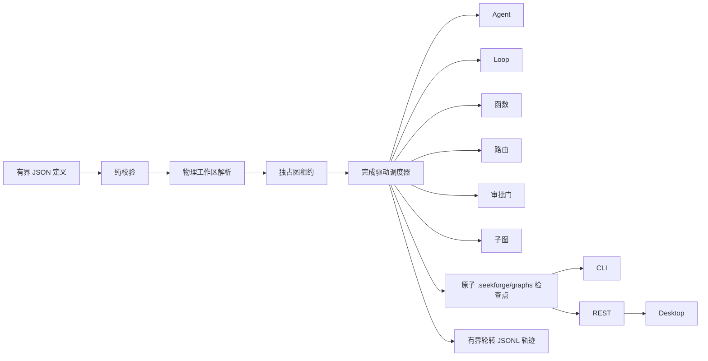

# 图工程（Graph Engineering）

> [English](graph-engineering.md) | **简体中文**

图工程是 SeekForge 的持久化编排层，用于组合 Agent、自主 Loop、确定性函数、有界 map、quorum join、路由器、审批门和嵌套子图。它与 `loop-dag` 互补：Loop DAG 针对同构的「运行→验证」节点和托管 worktree 优化，工程图则负责协调异构工作。

桌面端创建工作台会从同一份 JSON 定义绘制确定性的依赖画布，并支持结构化添加节点与依赖；只有服务端校验和模拟成功后才可启动。
带版本的注册项会按 `{template, registeredAt}` 解码；选择注册项只建立精确比较基线，不会修改当前草稿。只有显式确认载入后才会把其中的语义模板复制进编辑器，保留参数信封并预填声明的默认值，同时支持依赖编辑与引用安全的叶节点删除，随后必须重新通过校验/模拟。
工作台还会把声明的 string/number/boolean 参数呈现为类型化控件，同时保留原始 JSON 编辑器。定义与参数草稿会在短暂去抖后按精确工作区身份自动保存在本地；有界且带版本的缓存会拒绝畸形、重复、超限或未来时间记录，在生命周期边界刷新待保存编辑，并可在不修改服务端状态的情况下重置。浏览器存储不可用或写入、删除失败时，工作台会明确提示，不会误报持久化成功。
对于 schema-v2 模板，同一面板会完成本地注册表生命周期：注册当前精确版本、把当前草稿与选中的已注册版本比较、查看完全相同/兼容/破坏性原因，以及显式弃用选中版本。替换已存在的精确版本和弃用操作都需要确认；兼容性响应在渲染前会按有界且精确的传输记录解码，并且必须匹配请求中的模板/from/to 身份。编辑候选草稿时会保留所选比较基线，另有独立的载入操作用于显式用该注册载荷及其参数默认值替换编辑器；改变或清空基线会使在途比较失效。

## 执行模型



在 provider、租约或节点产生任何副作用之前，校验必须全部完成。定义最多 256 KiB，包含 128 个总节点、四层嵌套图、八个并发节点和每个路由器 32 条路由；任务、命令和条件也都有上限。依赖必须无环。条件只能引用已声明依赖；路由绑定必须指向依赖中的路由器及其已声明分支。

## 定义

```json
{
  "graphId": "release",
  "failurePolicy": "continue",
  "costBudgetUsd": 5,
  "tokenBudget": 200000,
  "managedWorktrees": { "integrateDependencies": true, "limit": 64 },
  "fanIn": { "verifyCommand": "pnpm test", "maxIterations": 2 },
  "nodes": [
    { "id": "implement", "kind": "agent", "task": "实现已接受的变更" },
    { "id": "verify", "kind": "loop", "task": "修复直到测试通过", "verifyCommand": "pnpm test", "dependsOn": ["implement"] },
    { "id": "review", "kind": "gate", "dependsOn": ["verify"] },
    { "id": "summary", "kind": "function", "handler": "collect", "dependsOn": ["review"] }
  ]
}
```

可复用文件可以使用下面的版本化模板封装。占位符格式为 `${{name}}`；当整个值只有一个占位符时，会保留声明的 string/number/boolean 类型，嵌入更大字符串时则按文本替换。每个声明参数都必须有传入值或类型正确的默认值；未知、重复、类型错误、未解析、稀疏、超限或未来版本输入都会在工作区或 Git 副作用前失败。CLI 命令支持重复的 `--param name=value`；REST 接受 `{definition:<template>,parameters:{...}}`。

```json
{
  "schemaVersion": 2,
  "kind": "engineering-graph-template",
  "templateId": "package-release",
  "version": "1.0.0",
  "interface": { "outputSchema": { "type": "object" } },
  "parameters": {
    "package": { "type": "string", "description": "pnpm 工作区包" },
    "retries": { "type": "number", "default": 2 }
  },
  "definition": {
    "graphId": "release-${{package}}",
    "nodes": [
      { "id": "verify", "kind": "loop", "task": "修复 ${{package}}", "verifyCommand": "pnpm --filter ${{package}} test", "maxRetries": "${{retries}}" }
    ]
  }
}
```

节点类型：

- `agent`：单次 Agent 任务；`mode` 与 `approvalMode` 继续使用常规权限策略。
- `loop`：完整的自主 Loop，拥有验证器，并获得剩余图预算的一部分。
- `function`：由嵌入方提供的命名处理器。所有处理器会在副作用前解析完成。CLI 只提供安全的 `noop` 与 `collect`；不会把处理器名称转换成 shell 命令。可重试处理器必须具备幂等性。处理器 id 会进入恢复指纹，因此行为变化时也必须更换 id。
- `map`：通过有界 JSON Pointer 读取已声明依赖的输出，最多对 `maxItems` 个值调用注册处理器（默认 32，硬上限 64）；每个元素都有稳定幂等键并获得节点剩余预算的份额，失败批次发布前会等待同批所有已启动元素结算。
- `join`：依赖全部结算后，只要至少 `quorum` 个依赖通过就成功，用于有界 quorum/reduce 流程。
- `router`：先选择首个匹配的条件路由，再选择可选默认路由。下游通过 `route.routerId` 和 `route.branch` 绑定。
- `gate`：暂停整张图，直到调用方明确批准该节点。
- `subgraph`：在有界嵌套层数内运行另一张已校验图。每个子图都会获得确定性、抗碰撞的检查点 id，并记录父 Graph/节点来源；其用量计入父图并受父级份额约束。子图重试会恢复子检查点，并只让失败节点及其下游失效。
- `wait`：持久暂停，直到收到声明的外部信号或到达绝对 `notBefore` 时间；可选 `expiresAt` 会把未解决等待转为有界失败，并拒绝截止时间之后创建的信号。
- `compensation`：声明一个或多个已成功的 `compensates` 依赖。主流程失败后，符合条件的补偿节点按完成/拓扑逆序串行执行，并共享 Graph 剩余的硬预算；主流程成功时记录为跳过。
- `remote`：通过嵌入方注册的 `GraphExecutionAdapter` 委托执行。预检只接受显式标记为 `trusted` 且 `locality: "remote"` 的适配器；Graph 或插件不能仅凭名称创建信任。

节点可以通过 `inputs` 把名称绑定到直接依赖输出并附可选 schema。递归 schema 支持有界对象 `properties`/`required`/`additionalProperties`、数组 `items` 与数量边界，以及基础类型 enum。函数、map、补偿和远程处理器每个节点最多返回 32 个工作区相对 artifact。`verifyArtifacts: true` 会在不跟随符号链接的前提下重新验证物理文件，流式计算/核验 SHA-256，并记录大小与生产节点来源。

`priority` 决定同时就绪节点的顺序；同一优先级内，剩余依赖路径最长的工作先启动。`resources` 声明逻辑锁；点号分隔的 id 构成层级，因此 `provider.deepseek` 与 `provider.deepseek.chat` 冲突。`resourceCapacities` 可放宽同名资源的并发数，但父子资源仍互斥。`adaptiveScheduling: true` 使用有界历史耗时/失败观测作为静态关键层级内的次序。只有与定义及物理工作区精确指纹相同的已持久化通过/失败结果会参与；等待态与 `persist: false` 运行既不读取也不产生建议。不含输出的历史保留 30 天，并在跨进程变更租约下限制为 512 条、128 KiB。Auto Loop 验证、Loop DAG 与 Graph 共享同一个确定性、资源感知 ready queue 实现。

`priorityAgingMs` 会按依赖就绪后的等待时长增加有界优先级，避免饥饿。节点可声明绝对 `deadlineAt`；到期仍未启动时，Graph 会记录零次尝试失败，而不是启动已过期工作。有重试的节点可声明精确 `retryPolicy`（`initialDelayMs`、`maxDelayMs`、`multiplier`、`jitterRatio`）。抖动是确定性的，下一次尝试时间和最近错误会在可取消等待前写入检查点，因此 owner 重启后仍保持原退避。

`failurePolicy: "stop"` 会在首个节点失败后跳过未开始工作；`"continue"` 允许独立分支完成。失败节点的普通下游会被跳过，除非显式条件接受该状态。`maxRetries` 针对单个节点，`timeoutMs` 针对单次尝试。

当 `maxConcurrency > 1` 时，实际可能重叠执行的有副作用节点必须解析到图工作区之内互不重叠的物理目录；由依赖关系确定先后顺序的节点可以安全复用同一工作区。祖先目录与其子目录不能作为两个独立并行分支运行。路由器与审批门不需要独立工作区。

`managedWorktrees` 会在仓库级共享资源锁下，为每个有副作用节点创建确定性、可保留的 Git worktree，并支持嵌套 Graph；托管作用域内禁止显式节点工作区。启用 `integrateDependencies: true` 后，节点首次尝试前会合并已通过的依赖分支。`limit` 在创建前统计仓库内全部现有 `seekforge/` worktree。父图的资源检查、归档和清理会递归包含子图分支。可选 `fanIn` 继续执行有界集成验证。

## 持久化与恢复

每次持久运行持有 `engineering-graph-<graphId>` 租约，并原子写入 `.seekforge/graphs/<graphId>.json`。状态 schema v2 会读取并规范化 v1 检查点，记录进行中 attempt、稳定处理器幂等键、已成功 map 元素检查点、控制序号/运行身份、累计活跃 `elapsedMs` 以及审批、外部等待或操作控制暂停来源。定义级 `maxDurationMs` 会跨持久恢复累计，两次调用之间停止或暂停的时间不计入；运行快照和对比使用同一活跃时间口径。成功 map 元素会在失败批次发布前提交；重跑失败 map 时只调用未完成元素。外部信号先持久 claim，只有等待节点通过结果写入检查点后才确认并移除。持久邮箱中出现匹配信号后，等待中的 Graph 会进入空闲恢复候选；恢复或重启还会回收“工作流检查点已写入、但确认前崩溃”留下的 claim。attempt 开始记录先于处理器副作用；成功或终态结果会与活动日志移除在同一检查点发布。恢复中断 attempt 时会显式告警，并用相同逻辑键重试；显式重跑则获得新键。新运行默认拒绝替换已有 id，只有显式 `restart` / `--restart` 才会覆盖。

完整生命周期轨迹同时追加到 `.seekforge/graphs/<graphId>.jsonl`，使用独立单调序号、1 MiB 分段、最多三个有界分段、断尾修复和物理路径检查。观察性历史写入失败时，检查点仍是权威状态。证据导出汇总状态、用量、活跃时长和节点结果但不包含节点输出，并携带 SHA-256 完整性摘要。

就绪工作从尚未消费、也未被在途节点预留的图预算中获得份额。失败尝试的用量会在下一次重试前扣除。Loop 与子图会直接执行份额约束；Agent 调用和嵌入函数是原子调用，因此单个在途调用仍可能报告超额，此时整张图会失败，且不会再启动后续节点。

若定义、物理工作区映射、托管分支位置或父级来源发生变化，恢复会拒绝执行。`--rerun <node>` 会让该节点、全部下游和过期 fan-in 证据失效；`child/verify` 这类作用域路径只重跑对应嵌套节点及其嵌套下游，并保留已通过的兄弟节点。等待审批的门会在恢复时重新判断；`--approve child/review` 只批准该作用域内的门且只作用于本次运行。暂停的子图在父图中表现为等待节点，因此进程崩溃后仍可恢复其已完成副作用与用量。观察器异常会转成有界 warning 事件，不会改变节点结果。

托管分支会在完成后保留，用于检查或提升。资源 API 会返回重新绑定后的物理路径与有界磁盘占用。终态 Graph 必须先归档再清理；清理会跳过脏 worktree、支持 dry-run，并同时持有 Graph 租约和共享托管 worktree 租约。已通过节点分支或已通过的 `fan-in` 分支都可以提升到仓库工作树。托管 Graph 必须先清理资源才能 `restart`，避免旧保留分支被静默绑定到新定义。

## 自适应控制面

编排报告只重新评估未完成节点，并提供带依赖、截止时间和执行器负载原因的运行时重规划排序。启用 `adaptiveScheduling` 后，该排序会在每个安全调度边界真正参与决策，运行中和已完成节点不会被改写。每次持久运行还会记录包含策略版本、输入指纹、理由与关键路径的预运行预测决策。远程适配器可以把 `workspaceCapacity` 显式设置为 1 到 512；跨进程持久 reservation 存储会用 attempt 幂等键、可续租 lease、孤儿清理与 fencing token 强制执行工作区级上限。丢失当前 lease 代次会取消远程 attempt，并禁止提交其结果。

每个复制进 CAS 的已验证产物都会记录有界、去重的证明，包含摘要、大小、精确 Graph fingerprint、生产节点、源路径与 SHA-256 校验方式。证明属于历史血缘，可能比已被垃圾回收的 blob 保留更久。嵌入方可以注册并轮换 Ed25519 信任密钥，把 builder、环境、工具链、输入和可选 SBOM 摘要一起签入证明，随后验证或撤销密钥；来自已撤销密钥的有效签名也会被视为不可信。可通过 `GET /api/graphs/artifact-store/attestations` 检查，并按 `sha256` 过滤。

已批准提案会走显式的 `shadow → 5% → 25% → 100%` 灰度流程。每个 cohort 都有可配置的 1–32 条样本门禁和独立证据窗口。回归会暂停灰度等待复核，自动回滚仍需显式开启；恢复会在不改变精确提案代次的前提下开启新证据窗口。持久控制历史会计算 1/6/24 小时 SLO 消耗率，以及 Graph 预测校准（P50 绝对误差、P95 覆盖率和 Brier 分数）。持续的 critical burn 会冻结学习路由与自适应调度，而显式人工策略仍保持权威；恢复健康后维护任务会自动解冻。

`seekforge orchestration maintain` 执行一次安全控制 tick：刷新提案、记录终态观测与校准、协调已有灰度、重建物化索引并协调自适应控制器；它不会批准提案或启动部署。添加 `--dry-run` 可在不写入的情况下预览影响。`seekforge serve --orchestration-auto-maintain` 只在各工作区空闲时运行该 tick；额外添加 `--orchestration-auto-rollback` 才会对观测到的回归执行回滚。

### 桌面端使用流程

由聊天 Agent 或 REST/CLI 启动 Graph 后，桌面端 Loop 管理器会自动发现它。桌面端 Graph 区域是观测与控制面，而不是定义编写表单：展开 Graph 可检查节点，并使用执行控制、审批、信号、重跑、对比和保留 worktree 操作。打开「编排决策智能」并刷新，会执行一次空闲安全的维护 tick，同时加载共享工作区报告。面板会展示 SLO burn 与控制器冻结状态、上下文路由、执行器容量、运行时重规划顺序、预测不确定性、产物证明数量、精确提案动作和灰度阶段/时间线。先批准提案，再启动 shadow，显式进入 5% cohort，观察证据，并逐阶段推进证据已达标的 cohort；只有暂停的 cohort 才需要恢复。两个区域共享同一份持久检查点和租约。

## CLI 与 API

```sh
seekforge graph validate release.graph.json --json
seekforge graph validate release.template.json --param package=core --param retries=2 --json
seekforge graph run release.graph.json -y
seekforge graph run release.graph.json --restart -y
seekforge graph resume release.graph.json --approve review -y
seekforge graph resume release.graph.json --rerun verify -y
seekforge graph list
seekforge graph intelligence release
seekforge graph priority release 5
seekforge graph show release
seekforge graph history release
seekforge graph diagnose release
seekforge graph migration-plan release-v2.graph.json
seekforge graph migrate release-v2.graph.json
seekforge graph simulate release-v2.graph.json --worst-case
seekforge graph explain release verify
seekforge graph resources release inspect
seekforge graph resources release archive
seekforge graph resources release prune --dry-run
seekforge graph resources release promote --target fan-in
seekforge graph delete release
```

服务器提供校验/空跑计划（`POST /api/graphs/validate`）、无副作用的资源与预算仿真（`POST /api/graphs/simulate`）、调度智能（`GET /api/graph-scheduling-intelligence`）、绑定精确指纹的健康预测（`GET /api/graphs/:id/health`）、后台启动（`POST /api/graphs`）、显式恢复/审批/重跑/重启/取消、Graph 级暂停，以及待执行节点的暂停、指导、取消与重排优先级（`POST /api/graphs/:id/control`）、外部信号（`POST /api/graphs/:id/signals`）、自动恢复优先级（`POST /api/graphs/:id/priority`）、节点资格解释（`GET /api/graphs/:id/explain/:nodeId`）、运行对比（`GET /api/graphs/:id/compare`）、有界历史、证据导出、列表/详情与删除。

空闲恢复只选择失去 owner 的 `running` Graph，以及定时器到期或信号就绪的 wait 暂停 Graph；显式控制暂停与审批暂停保持粘性。候选按 -10 到 10 的可变优先级排序，失败后持久执行 30 秒到 1 小时的指数退避。Loop 与 Graph 通过同一个精确字段、时间戳有序的持久契约解析恢复子记录。恢复记账同时绑定尝试前和新写入检查点的运行身份，因此迟到失败不会修改后续运行。schema-v2 模板可通过 `/api/graphs/templates` 精确版本注册和解析，版本不会静默漂移；兼容性比较会把参数删除、必填参数新增、默认值删除、参数类型变化和输出接口变化归为破坏性变更，弃用仅记录显式元数据，不会重写已有引用。可选的 `interface.outputSchema` 与节点使用同一套有界递归 schema 解析器。空跑计划把正常执行波次与补偿顺序分开返回，并包含关键路径、资源容量、最大并行宽度、最大尝试/动态元素数和输入绑定。Graph 运行会进入统一 Run Ledger，并在服务器关闭时排空。由服务器启动且包含 Agent 或 Loop 节点的 Graph 必须声明 `costBudgetUsd`。

`graph diagnose` 与 `GET /api/graphs/:id/diagnose` 会独立比较检查点和最新保留生命周期窗口，且不会修改检查点。

`mapKind: "agent" | "loop"` 允许有界 map 逐项顺序运行 Agent 或自主 Loop；item 会被封装为不可信数据，每个完成项都保留独立的持久用量检查点。这类动态 map 也属于 Agent runtime 使用，因此服务端启动的定义必须像直接 Agent/Loop 节点一样声明 `costBudgetUsd`。直接及 map 子 Loop 会从 Graph attempt 幂等键派生稳定 id，因此 Graph 中断后会恢复同一个子 Loop，而不会复制其编辑历史。Gate 可返回 `approve`、`reject` 或 `request_changes`，并附带有界结构化上下文。Remote 节点可在预检阶段要求执行器协议版本 1 与协作取消能力；可信适配器还可公开有界健康度、负载与数据局部性，使用 attempt 级 fencing token 预留容量，按幂等键恢复结果、发送有界心跳、接收协作取消，并在提交前验证结果来源。成功、失败、取消及畸形预留返回都会释放容量。`GET /api/graphs/:id/artifacts` 返回确定性血缘。已验证产物只有从 owner 工作区内物理路径经过 no-follow 复核后，才会复制到不可变 SHA-256 CAS；Graph 级物化只接受当前精确 generation 的复用候选，重新哈希后原子发布到安全的工作区相对目标，并默认禁止覆盖。引用感知 GC 不会删除权威检查点或保留运行快照仍引用的 blob。

Graph 健康报告还会给出 P50/P95 总耗时、测量覆盖率、仿真风险，以及有界的单步 `maxConcurrency` 或资源容量建议。超出配置上限，或无法从保留定义证明工作区隔离的候选会被抑制。建议按预测节省排序，只用于参考，绝不会修改容量或授权执行。

`seekforge orchestration report` 与 `GET /api/orchestration/report` 在这些原语之上增加 workspace 级决策层。报告包含确定性历史重放、置信度与证据数、带乐观并发控制的持久 SLO 策略、当前分页的错误预算评估、帕累托多维反事实、执行器健康度/容量/局部性备选、根/子预算汇总、分别统计活跃时长与节点 deadline 越界概率的 Monte Carlo P50/P95/P99、CAS 复用候选、部署状态，以及独立 Loop/Graph 分页；组合总计仍覆盖全部检查点。有界物化编排索引提供精确 generation 总计与近期摘要，且不暴露节点输出。

`graph expansion-plan <file>` 只接受追加式演化：既有节点与 Graph 策略必须保持结构不变；`graph expand <file>` 通过同一事务 owner 应用。`graph migration-plan` 会沿源与目标物理工作区树解析确定性子检查点身份。`graph migrate <file>` 协调持久树事务：按规范顺序获取参与者 lease，持久化 prepared 状态和恢复 journal，先提交子级、最后提交根，并在崩溃后前滚。以根为激活点可防止不可独立恢复的子 generation 形成可运行的部分迁移树。

优化草案可通过 `seekforge orchestration proposals refresh` 或 `POST /api/orchestration/proposals/refresh` 持久化，再显式批准或忽略。批准仍只是意图，不是执行；重新生成的完整草案只要有任一变化，就会推进版本并重置为 `proposed`。独立的 `apply` 转换会重新校验精确提案版本和源 generation，先记录 `applying`，按修改目标串行化，再应用受支持的根 Graph 并发、资源、执行器或 Loop 路由变化并保留精确回滚证据。嵌套 Graph 仍可观测，但不会生成可独立部署的草案，因为其定义归根树事务所有。apply 与 rollback 重试会识别已经提交的目标，Loop 前序路由恢复则由路由存储一次原子写入完成。观测会比较归一化失败、成本与耗时，也可显式自动回滚退化。预算复核提案保持人工处理，因为自动应用会扩展硬授权边界。

`seekforge serve --graph-auto-resume` 会在工作区空闲时顺序恢复失去 owner 的运行中 Graph，或定时器/信号已就绪的 wait 暂停 Graph；单个恢复失败会被隔离，后续 Graph 与保留清理仍会继续。`--graph-auto-prune` 在同一空闲窗口执行终态年龄/数量保留策略，安全归档并清理托管资源，保留脏 worktree，并在父 Graph 仍可恢复时保留子检查点。持久化控制可作用于任何存活的 Graph owner，包括其他进程或空闲恢复运行。Desktop 通过 WebSocket 订阅 Graph Run Ledger，同时保留低频轮询兜底，显示运行差异、健康预测和异常热区，并提供 Graph/节点控制、信号、审批、重跑、重启及完整资源生命周期操作。

Desktop 的 Loop 管理器现在形成从创建到运维的闭环。**创建工程编排图**可载入带版本模板，或编辑有界 JSON 定义及参数；它并行执行校验和模拟，展示执行波次、关键路径、成本/令牌估算与风险，且只有当前文本与成功预览完全一致时才能启动。**编排决策智能**是灰度控制中心，可配置 1–32 个样本门禁、推进 shadow/金丝雀、手工暂停/恢复、选择性自动回滚、恢复控制器，并查看近期持久化时间线。**产物可信链**支持注册/吊销 Ed25519 公钥、显示每项证明的即时验证结果，并签入 builder、环境、工具链、输入和可选 SBOM 来源；提交的私钥只用于当次请求，不会持久化。**运维诊断**聚合有界 Loop/Graph 检查点问题、控制器决策、灰度、活跃执行器预留与 CAS 统计，可校准过期容量并导出精确 JSON 快照。所有面板都把异步结果绑定到选中工作区代次，并复用服务端的持久化租约与校验。

Server 与 CLI 共享确定性的 `noop`、`collect` 注册表。已启用插件可以通过命名空间化 `graphHandlers` 声明这些内建处理器的安全别名，也可以为宿主已经注册为可信的 `graphExecutor` 建立别名；插件清单不能提供可执行代码、提升不可信适配器，也不能把处理器名转换成 shell 命令。

`GET /api/graphs/:id/history` 默认保留原有事件数组响应；添加 `?format=entries&afterSeq=<n>&limit=<n>` 可获得带游标的 JSONL 记录。`GET /api/graphs/:id/evidence` 返回防篡改摘要，其中包含托管分支和 fan-in 来源，但不暴露 fan-in 的绝对工作区路径。`GET`/`POST /api/graphs/:id/resources` 用于检查或执行 `archive`、`prune`、`promote` 操作；仍有托管资源时删除会被拒绝。列表接口省略定义与节点输出，并只保留近期事件；详情接口返回完整的有界检查点。Desktop 检查视图会从标准化详情渲染依赖箭头，并提供同一套归档、提升、清理生命周期操作。

嵌入方可从 `@seekforge/core` 使用 `parseEngineeringGraphDefinition`、`runEngineeringGraph`、`loadEngineeringGraphState`、`listEngineeringGraphStates`、`readGraphSchedulingObservations`、`summarizeGraphSchedulingIntelligence`、`analyzeGraphSchedulingIntelligence`、`simulateEngineeringGraph`、`explainEngineeringGraphNode` 与 `applyEngineeringGraphMigration`；函数处理器通过 `RunEngineeringGraphOptions.handlers` 传入，可信远程适配器通过 `executors` 传入。Server 嵌入方也可通过 `StartServerOptions.graphExecutors` 注册同一批适配器；REST 校验、执行、空闲恢复和已批准插件别名共享该宿主注册表。终态运行在重跑/重启前进入有界快照注册表，供 `compareEngineeringGraphRuns`、API 与 Desktop 展示差异。
