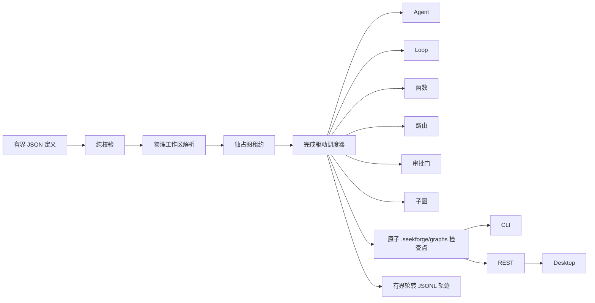

# 图工程（Graph Engineering）

> [English](graph-engineering.md) | **简体中文**

图工程是 SeekForge 的持久化编排层，用于组合 Agent、自主 Loop、确定性函数、路由器、审批门和嵌套子图。它与 `loop-dag` 互补：Loop DAG 针对同构的「运行→验证」节点和托管 worktree 优化，工程图则负责协调异构工作。

## 执行模型



在 provider、租约或节点产生任何副作用之前，校验必须全部完成。定义最多 256 KiB，包含 128 个总节点、四层嵌套图、八个并发节点和每个路由器 32 条路由；任务、命令和条件也都有上限。依赖必须无环。条件只能引用已声明依赖；路由绑定必须指向依赖中的路由器及其已声明分支。

## 定义

```json
{
  "graphId": "release",
  "failurePolicy": "continue",
  "costBudgetUsd": 5,
  "tokenBudget": 200000,
  "managedWorktrees": { "integrateDependencies": true, "limit": 64 },
  "fanIn": { "verifyCommand": "pnpm test", "maxIterations": 2 },
  "nodes": [
    { "id": "implement", "kind": "agent", "task": "实现已接受的变更" },
    { "id": "verify", "kind": "loop", "task": "修复直到测试通过", "verifyCommand": "pnpm test", "dependsOn": ["implement"] },
    { "id": "review", "kind": "gate", "dependsOn": ["verify"] },
    { "id": "summary", "kind": "function", "handler": "collect", "dependsOn": ["review"] }
  ]
}
```

可复用文件可以使用下面的版本化模板封装。占位符格式为 `${{name}}`；当整个值只有一个占位符时，会保留声明的 string/number/boolean 类型，嵌入更大字符串时则按文本替换。每个声明参数都必须有传入值或类型正确的默认值；未知、重复、类型错误、未解析、稀疏、超限或未来版本输入都会在工作区或 Git 副作用前失败。CLI 命令支持重复的 `--param name=value`；REST 接受 `{definition:<template>,parameters:{...}}`。

```json
{
  "schemaVersion": 1,
  "kind": "engineering-graph-template",
  "templateId": "package-release",
  "parameters": {
    "package": { "type": "string", "description": "pnpm 工作区包" },
    "retries": { "type": "number", "default": 2 }
  },
  "definition": {
    "graphId": "release-${{package}}",
    "nodes": [
      { "id": "verify", "kind": "loop", "task": "修复 ${{package}}", "verifyCommand": "pnpm --filter ${{package}} test", "maxRetries": "${{retries}}" }
    ]
  }
}
```

节点类型：

- `agent`：单次 Agent 任务；`mode` 与 `approvalMode` 继续使用常规权限策略。
- `loop`：完整的自主 Loop，拥有验证器，并获得剩余图预算的一部分。
- `function`：由嵌入方提供的命名处理器。所有处理器会在副作用前解析完成。CLI 只提供安全的 `noop` 与 `collect`；不会把处理器名称转换成 shell 命令。可重试处理器必须具备幂等性。处理器 id 会进入恢复指纹，因此行为变化时也必须更换 id。
- `router`：先选择首个匹配的条件路由，再选择可选默认路由。下游通过 `route.routerId` 和 `route.branch` 绑定。
- `gate`：暂停整张图，直到调用方明确批准该节点。
- `subgraph`：在有界嵌套层数内运行另一张已校验图。每个子图都会获得确定性、抗碰撞的检查点 id，并记录父 Graph/节点来源；其用量计入父图并受父级份额约束。子图重试会恢复子检查点，并只让失败节点及其下游失效。

`failurePolicy: "stop"` 会在首个节点失败后跳过未开始工作；`"continue"` 允许独立分支完成。失败节点的普通下游会被跳过，除非显式条件接受该状态。`maxRetries` 针对单个节点，`timeoutMs` 针对单次尝试。

当 `maxConcurrency > 1` 时，实际可能重叠执行的有副作用节点必须解析到图工作区之内互不重叠的物理目录；由依赖关系确定先后顺序的节点可以安全复用同一工作区。祖先目录与其子目录不能作为两个独立并行分支运行。路由器与审批门不需要独立工作区。

顶层 `managedWorktrees` 会在仓库级共享资源锁下，为每个有副作用节点创建确定性、可保留的 Git worktree；此时禁止显式节点工作区。启用 `integrateDependencies: true` 后，节点首次尝试前会合并已通过的依赖分支。`limit` 在创建前统计仓库内全部现有 `seekforge/` worktree。可选 `fanIn` 按定义顺序把所有通过节点合并到专用集成分支，针对 `verifyCommand` 运行有界自主 Loop，提交修复，并把每次尝试计入图预算。冲突或验证失败会让 Graph 失败，不会弱化验证门。

## 持久化与恢复

每次持久运行持有 `engineering-graph-<graphId>` 租约，并原子写入 `.seekforge/graphs/<graphId>.json`。新运行默认拒绝替换已有 id，只有显式 `restart` / `--restart` 才会覆盖。检查点包含标准化定义、定义加物理工作区映射的指纹、节点结果、累计用量和最近 128 个生命周期事件。单节点输出不超过 16 KiB，整张图的保留输出也有总量上限；完整检查点不超过 1 MiB。

完整生命周期轨迹同时追加到 `.seekforge/graphs/<graphId>.jsonl`，使用独立单调序号、1 MiB 分段、最多三个有界分段、断尾修复和物理路径检查。观察性历史写入失败时，检查点仍是权威状态。证据导出汇总状态、用量和节点结果但不包含节点输出，并携带 SHA-256 完整性摘要。

就绪工作从尚未消费、也未被在途节点预留的图预算中获得份额。失败尝试的用量会在下一次重试前扣除。Loop 与子图会直接执行份额约束；Agent 调用和嵌入函数是原子调用，因此单个在途调用仍可能报告超额，此时整张图会失败，且不会再启动后续节点。

若定义、物理工作区映射、托管分支位置或父级来源发生变化，恢复会拒绝执行。`--rerun <node>` 会让该节点、全部下游和过期 fan-in 证据失效；`child/verify` 这类作用域路径只重跑对应嵌套节点及其嵌套下游，并保留已通过的兄弟节点。等待审批的门会在恢复时重新判断；`--approve child/review` 只批准该作用域内的门且只作用于本次运行。暂停的子图在父图中表现为等待节点，因此进程崩溃后仍可恢复其已完成副作用与用量。观察器异常会转成有界 warning 事件，不会改变节点结果。

托管分支会在完成后保留，用于检查或提升。资源 API 会返回重新绑定后的物理路径与有界磁盘占用。终态 Graph 必须先归档再清理；清理会跳过脏 worktree、支持 dry-run，并同时持有 Graph 租约和共享托管 worktree 租约。已通过节点分支或已通过的 `fan-in` 分支都可以提升到仓库工作树。托管 Graph 必须先清理资源才能 `restart`，避免旧保留分支被静默绑定到新定义。

## CLI 与 API

```sh
seekforge graph validate release.graph.json --json
seekforge graph validate release.template.json --param package=core --param retries=2 --json
seekforge graph run release.graph.json -y
seekforge graph run release.graph.json --restart -y
seekforge graph resume release.graph.json --approve review -y
seekforge graph resume release.graph.json --rerun verify -y
seekforge graph list
seekforge graph show release
seekforge graph history release
seekforge graph resources release inspect
seekforge graph resources release archive
seekforge graph resources release prune --dry-run
seekforge graph resources release promote --target fan-in
seekforge graph delete release
```

服务器提供校验/空跑计划（`POST /api/graphs/validate`）、后台启动（`POST /api/graphs`）、显式恢复/审批/重跑/重启/取消、有界历史、证据导出、列表/详情与删除。共享空跑计划器会返回执行波次、递归节点路径、运行时需求以及确定性的托管/fan-in 分支，但不会创建资源。Graph 运行会进入统一 Run Ledger，并在服务器关闭时排空。由服务器启动且包含 Agent 或 Loop 节点的 Graph 必须声明 `costBudgetUsd`。Server 与 CLI 共享确定性的 `noop`、`collect` 处理器注册表；处理器名永远不会转换成 shell 命令。

`GET /api/graphs/:id/history` 默认保留原有事件数组响应；添加 `?format=entries&afterSeq=<n>&limit=<n>` 可获得带游标的 JSONL 记录。`GET /api/graphs/:id/evidence` 返回防篡改摘要，其中包含托管分支和 fan-in 来源，但不暴露 fan-in 的绝对工作区路径。`GET`/`POST /api/graphs/:id/resources` 用于检查或执行 `archive`、`prune`、`promote` 操作；仍有托管资源时删除会被拒绝。列表接口省略定义与节点输出，并只保留近期事件；详情接口返回完整的有界检查点。Desktop 检查视图会从标准化详情渲染依赖箭头，并提供同一套归档、提升、清理生命周期操作。

嵌入方可从 `@seekforge/core` 使用 `parseEngineeringGraphDefinition`、`runEngineeringGraph`、`loadEngineeringGraphState` 与 `listEngineeringGraphStates`；函数处理器通过 `RunEngineeringGraphOptions.handlers` 传入。
