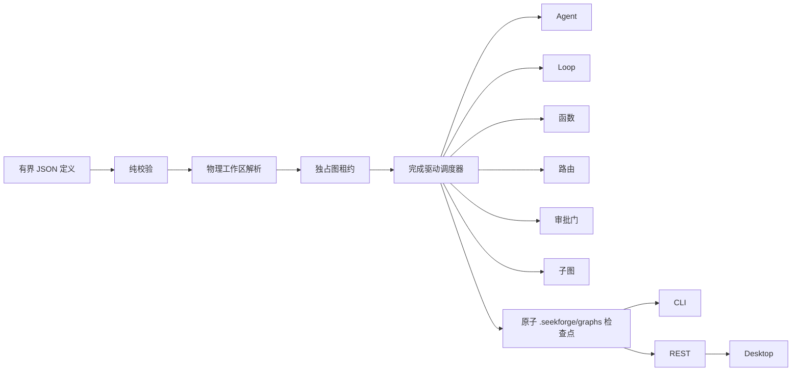

# 图工程（Graph Engineering）

> [English](graph-engineering.md) | **简体中文**

图工程是 SeekForge 的持久化编排层，用于组合 Agent、自主 Loop、确定性函数、路由器、审批门和嵌套子图。它与 `loop-dag` 互补：Loop DAG 针对同构的「运行→验证」节点和托管 worktree 优化，工程图则负责协调异构工作。

## 执行模型



在 provider、租约或节点产生任何副作用之前，校验必须全部完成。定义最多 256 KiB，包含 128 个总节点、四层嵌套图、八个并发节点和每个路由器 32 条路由；任务、命令和条件也都有上限。依赖必须无环。条件只能引用已声明依赖；路由绑定必须指向依赖中的路由器及其已声明分支。

## 定义

```json
{
  "graphId": "release",
  "failurePolicy": "continue",
  "costBudgetUsd": 5,
  "tokenBudget": 200000,
  "nodes": [
    { "id": "implement", "kind": "agent", "task": "实现已接受的变更" },
    { "id": "verify", "kind": "loop", "task": "修复直到测试通过", "verifyCommand": "pnpm test", "dependsOn": ["implement"] },
    { "id": "review", "kind": "gate", "dependsOn": ["verify"] },
    { "id": "summary", "kind": "function", "handler": "collect", "dependsOn": ["review"] }
  ]
}
```

节点类型：

- `agent`：单次 Agent 任务；`mode` 与 `approvalMode` 继续使用常规权限策略。
- `loop`：完整的自主 Loop，拥有验证器，并获得剩余图预算的一部分。
- `function`：由嵌入方提供的命名处理器。所有处理器会在副作用前解析完成。CLI 只提供安全的 `noop` 与 `collect`；不会把处理器名称转换成 shell 命令。可重试处理器必须具备幂等性。处理器 id 会进入恢复指纹，因此行为变化时也必须更换 id。
- `router`：先选择首个匹配的条件路由，再选择可选默认路由。下游通过 `route.routerId` 和 `route.branch` 绑定。
- `gate`：暂停整张图，直到调用方明确批准该节点。
- `subgraph`：在有界嵌套层数内运行另一张已校验图，其用量计入父图并受父级份额约束。在具备可安全恢复的持久子检查点之前，嵌套审批门与子图重试会被明确拒绝。

`failurePolicy: "stop"` 会在首个节点失败后跳过未开始工作；`"continue"` 允许独立分支完成。失败节点的普通下游会被跳过，除非显式条件接受该状态。`maxRetries` 针对单个节点，`timeoutMs` 针对单次尝试。

当 `maxConcurrency > 1` 时，有副作用节点必须解析到图工作区之内互不重叠的物理目录；祖先目录与其子目录不能作为两个独立分支并发运行。并行编辑分支应使用显式保留的 worktree。路由器与审批门不需要独立工作区。

## 持久化与恢复

每次持久运行持有 `engineering-graph-<graphId>` 租约，并原子写入 `.seekforge/graphs/<graphId>.json`。新运行默认拒绝替换已有 id，只有显式 `restart` / `--restart` 才会覆盖。检查点包含标准化定义、定义加物理工作区映射的指纹、节点结果、累计用量和最近 128 个生命周期事件。单节点输出不超过 16 KiB，整张图的保留输出也有总量上限；完整检查点不超过 1 MiB。

就绪工作从尚未消费、也未被在途节点预留的图预算中获得份额。失败尝试的用量会在下一次重试前扣除。Loop 与子图会直接执行份额约束；Agent 调用和嵌入函数是原子调用，因此单个在途调用仍可能报告超额，此时整张图会失败，且不会再启动后续节点。

若定义或物理工作区映射发生变化，恢复会拒绝执行。`--rerun <node>` 会让该节点及全部下游失效。等待审批的门会在恢复时重新判断；`--approve <node>` 只批准本次运行。观察器异常会转成有界 warning 事件，不会改变节点结果。

## CLI 与 API

```sh
seekforge graph validate release.graph.json
seekforge graph run release.graph.json -y
seekforge graph run release.graph.json --restart -y
seekforge graph resume release.graph.json --approve review -y
seekforge graph resume release.graph.json --rerun verify -y
seekforge graph list
seekforge graph show release
seekforge graph history release
seekforge graph delete release
```

服务器提供 `GET /api/graphs`、`GET /api/graphs/:id`、`GET /api/graphs/:id/history` 与 `DELETE /api/graphs/:id`。列表接口省略定义与节点输出，并只保留近期事件；详情接口返回完整的有界检查点。Desktop 的 Loop 管理器会显示图/节点状态、成本、令牌与最近生命周期事件。它轮询同一 REST 契约，因此其他本地进程执行的图也能显示，不产生第二份事实来源。

嵌入方可从 `@seekforge/core` 使用 `parseEngineeringGraphDefinition`、`runEngineeringGraph`、`loadEngineeringGraphState` 与 `listEngineeringGraphStates`；函数处理器通过 `RunEngineeringGraphOptions.handlers` 传入。
