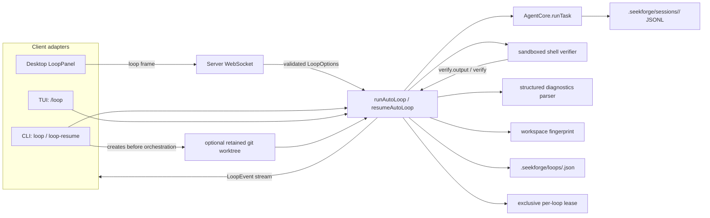
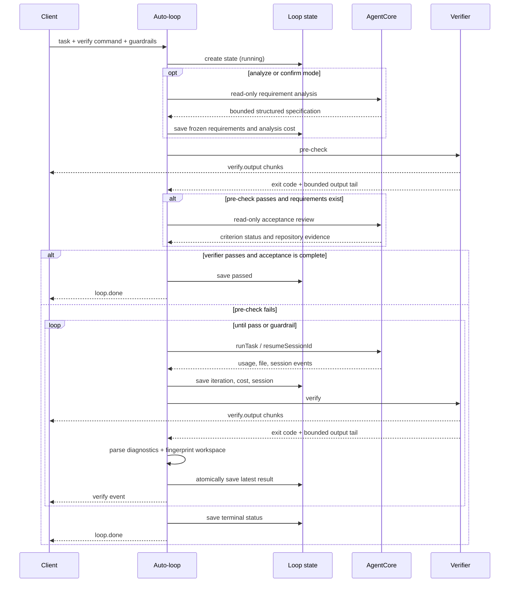
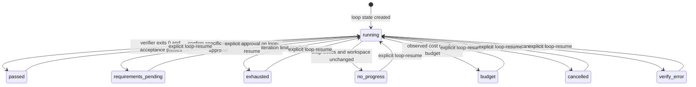

# Loop engineering (auto-loop)

> **English** | [简体中文](loop-engineering.zh-CN.md)

Drive **one** task to completion across multiple agent runs:
`analyze → run → verify → accept → continue`, stopping when the fixed verifier
passes and required acceptance criteria are met, or a guardrail trips. The
default `quick` mode preserves verifier-only completion. This is a layer *above* a single run — the in-run
tool loop (`packages/core/src/agent/loop.ts`) is unchanged.

## Architecture

Loop is an orchestration layer around the existing agent core. Clients collect
options and render events; they do not implement iteration, verification,
budget, or convergence policy.



The two persisted stores have different ownership:

- Loop JSON stores orchestration state: task, verifier, frozen requirements,
  acceptance review, approval, limits, iteration, cumulative cost, session id,
  last verification, and terminal status.
- Session JSONL remains the source of truth for the agent conversation and tool
  trace. Loop state points to that session; it does not duplicate the trace.

### Run sequence



State is written atomically after observable progress. Live output is bounded
per verification; the final verification event still carries the normal output
tail used for diagnostics and continuation prompts.

The session id and cumulative provider usage are checkpointed as their events
arrive. The iteration counter advances only after the agent run completes, so a
crash resumes an interrupted iteration without consuming an iteration slot while
still reusing the session and accounting for already observed spend.

Every iteration reconstructs task-scoped prompt state, including automatic
skill selection, even when it resumes the same session. The provider may call
only tools advertised in that exact request after context-budget trimming;
fabricated calls to known-but-omitted tools fail before dispatch. Successful
write/dangerous tools, executable commands, mutating MCP calls, and editing
subagents all invalidate prior verify/lint evidence even when no single changed
path is available.

Convergence fingerprints run asynchronously with a five-second, 20,000-file,
64-MiB budget. Git repositories hash HEAD, status, and dirty/untracked content;
non-Git workspaces use an ignore-aware traversal. If a safe fingerprint cannot
be produced within the limits, that sample is `null` and Loop skips the
unchanged-workspace conclusion instead of blocking the event loop or declaring
false `no_progress`.

Only one process may own a persisted Loop at a time. A token-protected lock next
to the state file records the owner's process identity as well as its PID, rejects
concurrent runs, and recovers locks after process exit or PID reuse. Fresh
malformed locks fail closed for a short grace period so a partially written lock
cannot be stolen. A persistence write failure is reported once as `loop.warning`
and does not replace the verification result.

### Resume and worktree lifecycle



`resumeAutoLoop` loads state only from the supplied workspace and preserves the
original task, verifier, maximum iterations, cumulative cost, and session id. It
runs a fresh pre-check before spending another agent iteration. A terminal loop
whose iteration or cost limit is already exhausted can only pass that pre-check;
otherwise the same guardrail stops it without additional agent work.

Resume may add `additionalIterations` and `additionalCostBudgetUsd`. Iterations
are added to the saved maximum and capped at 100. Added budget extends the saved
total; without a prior budget it starts from cost already incurred, so historical
spend is never reset. The resulting budget must remain finite; numeric overflow
is rejected rather than interpreted as an absent limit.

`--worktree` is a CLI adapter concern: the CLI creates a branch and worktree,
then passes that directory as the Loop workspace. State and session traces are
therefore stored inside the worktree. Worktrees are retained for inspection and
are never automatically removed; resume from that directory and clean it up
with `seekforge loop-cleanup <name>` when finished. Loop-owned branches use the
`seekforge/loop-*` prefix; cleanup refuses dirty worktrees unless `--force` is
explicit.

Loop management invoked from the base checkout discovers state in retained Loop
worktrees. A duplicate Loop id across workspaces is rejected as ambiguous rather
than selecting one implicitly. Cleanup is blocked while any live lease exists,
including with `--force`.

Loop management also works outside Git repositories. Existing workspace paths,
including values stored by older versions, are canonicalized to their physical
path so symlink aliases and platform path aliases resolve to the same persisted
state.

## CLI

```
seekforge loop "<task>" --verify "<cmd>" [--requirements quick|analyze|confirm] [--max-iters <n>] [--budget <usd>] [--worktree [name]] [-y] [-m <model>]
```

- `--verify <cmd>` (required): success = the command exits 0.
- `--requirements quick|analyze|confirm`: `quick` keeps verifier-only behavior;
  `analyze` performs read-only repository analysis and acceptance review;
  `confirm` persists the specification and stops with `requirements_pending`
  until it is explicitly approved. Approval applies only to a specification
  loaded from persisted state; a specification generated in the current call
  is always returned for inspection first.
- `--max-iters <n>`: cap on run iterations (default 8, hard maximum 100).
- `--worktree [name]`: create and run in an isolated retained git worktree.
  An optional name selects the branch suffix; without one a unique name is used.
- `--budget <usd>`: observed cumulative-cost stopping line across iterations.
  Usage is checked after each provider usage update and prevents further work,
  but an already in-flight request can make the final billed amount slightly
  exceed the configured value.
- The loop is inherently autonomous — every run uses `approvalMode: "acceptEdits"`
  (file edits auto-approved; dangerous commands still refused by the denylist).
  `-y` just silences the "auto-approves edits" note.
- `Ctrl-C` stops cooperatively (status `cancelled`). Loop orchestration state is
  saved under `.seekforge/loops/<loop-id>.json`; continue it with
  `seekforge loop-resume <loop-id>`. Session-level `resume` and `rewind` remain
  available for manual intervention.
- Exit code 0 only when the verifier passed and, in analyzed modes, every
  required acceptance criterion was evidenced as met. File evidence must include
  a verified content anchor such as `path:src/feature.ts#symbol` or `#L10-L20`;
  path existence alone is not accepted.

```bash
seekforge loop-resume <loop-id> [--approve-requirements] [--add-iters <n>] [--add-budget <usd>]
seekforge loop-list
seekforge loop-show <loop-id>
seekforge loop-pause <loop-id>
seekforge loop-continue <loop-id>
seekforge loop-steer <loop-id> "<guidance>"
seekforge loop-delete <loop-id>
seekforge loop-cleanup <worktree-name> [--force]
```

### Loop v2 controls

- Repeat `--verify-stage <id=command>` for an ordered verification pipeline.
  Required stages stop the pipeline; Core API stages may set `required: false`.
- `--flaky-retries 0..5` reruns a failed stage before editing and records a
  `verify.flaky` event when it later passes. `--stable-passes 1..5` requires
  consecutive full-pipeline passes.
- `--stuck-recoveries 0..5` performs bounded re-diagnosis with a different
  strategy before returning `no_progress`. `--rollback-regressions` rewinds a
  regression only inside a retained Loop worktree, then reruns verification and
  replaces the convergence baseline with the restored result.
- `loop-history <id> [--after N] [--limit N]` replays the rotated JSONL event
  history. `loop-recover` marks orphaned `running` or `paused` records as `interrupted`;
  embedders can call `autoResumeInterruptedLoops` to continue them.
- `loop-dag <file>` runs a JSON dependency graph sequentially with shared
  budgets. Core `runLoopDag` also supports bounded parallel batches when every
  node resolves to a distinct physical workspace.
- `--deliver checkpoint|merge|patch|pr` performs an explicit post-pass delivery
  from a retained Loop worktree. `pr` pushes the Loop branch and creates a draft
  pull request through `gh`.
- WebSocket clients can send `loop.pause`, `loop.control.resume`, and
  `loop.steer`; controls take effect only at safe iteration boundaries.
- The top-level `loop-pause`, `loop-continue`, and `loop-steer` CLI commands can
  control a Loop owned by another live SeekForge process. Commands use a bounded,
  serialized mailbox under `.seekforge/loops/` and are scoped to the current run,
  so a command racing with completion cannot leak into a later resume.
- TUI users have the equivalent `/loop-pause`, `/loop-continue`, and
  `/loop-steer <guidance>` commands scoped to the active tab's Loop.

Iteration snapshots persist compact stage outcomes, normalized diagnostic/workspace
fingerprints, parsed failure counts, recovery attempts, and pass streaks. Repeated
commands and output remain only in the latest result/history log so the state stays
inside its reader's 1 MiB limit; oversized replacements fail before the last readable
state is touched. Loop
success performs memory extraction once and records selected-skill effectiveness
once for the whole Loop rather than once per internal agent iteration.

Edit iterations reuse **one worker session**. Requirement analysis and acceptance
review reuse a separate reviewer session recorded in Loop state, keeping evaluator
context out of the worker conversation while preserving both auditable traces.

Worktrees are deliberately retained for inspection. Run `loop-resume` from the
worktree directory when the original loop used `--worktree`.

## Core API

`runAutoLoop(deps, opts)` from `@seekforge/core`:

```ts
type LoopOptions = {
  task: string;
  workspace: string;
  verifyCommand: string;        // fixed verifier; analyzed modes also require acceptance
  verificationPlan?: Array<{ id: string; command: string; required?: boolean; timeoutMs?: number }>;
  stablePasses?: number; flakyRetries?: number;
  maxNoProgressRecoveries?: number; rollbackOnRegression?: boolean;
  requirementMode?: "quick" | "analyze" | "confirm"; // default quick
  approveRequirements?: boolean; // resume a confirm-mode loop
  maxIterations?: number;       // default 8
  costBudgetUsd?: number;       // stop after observed cumulative usage reaches it
  tokenBudget?: number;         // cumulative prompt + completion tokens
  maxDurationMs?: number;       // cumulative wall-clock budget, resume-aware
  maxVerifyRuns?: number;       // includes the initial pre-check
  verifyTimeoutMs?: number;     // default 120 seconds per verifier
  agentTimeoutMs?: number;      // default 30 minutes per attempt
  maxAgentRetries?: number;     // transient failures; default 1
  approvalMode?: ApprovalMode;  // default "acceptEdits"
  model?: string; planModel?: string; escalateOnFailure?: boolean;
  signal?: AbortSignal;         // cooperative stop
  control?: LoopControl;        // safe-boundary pause/resume/steer
  onEvent?: (e: LoopEvent) => void;
  loopId?: string; persist?: boolean; // persistence defaults on
  verify?: (workspace, command, signal, onOutput) => Promise<{ code; output }>;
};
type LoopResult = {
  status: "passed" | "exhausted" | "no_progress" | "budget" | "cancelled" | "verify_error" | "agent_error" | "interrupted" | "requirements_pending";
  iterations: number; costUsd: number; sessionId: string;
  finalVerify: { code: number; output: string };
  loopId?: string; requirements?: LoopRequirementSpec;
  acceptanceReview?: LoopAcceptanceReview; budgetReason?: "cost" | "tokens" | "duration" | "verify_runs";
  agentError?: AgentError;
  stageResults?: LoopStageResult[]; flaky?: boolean; passStreak?: number;
  recoveryAttempts?: number;
};
```

`resumeAutoLoop` also accepts additive cost, token, duration, verifier-run, and
iteration capacity. It restores cumulative elapsed time, tokens, verifier count,
worker/reviewer sessions, command, and frozen requirements.

## Guardrails (all on by default)

Checked before spending another iteration, in order:

1. `signal.aborted` → `cancelled`
2. any configured cost, token, duration, or verifier-run limit is reached →
   cancel active work and return `budget` with `budgetReason`
3. normalized structured diagnostics unchanged **and** the workspace content
   fingerprint unchanged → `no_progress` (stuck)
4. reached `maxIterations` → `exhausted`

A `verify_error` is returned when the verify command cannot start, reaches its
per-stage timeout, or otherwise fails at the executor boundary. Only an independently
configured total duration deadline produces `budget: duration`. Final output includes bounded
stdout/stderr diagnostics when available.

An edit-agent failure is never sent blindly into the verifier. Network, timeout,
and rate-limit failures retry up to `maxAgentRetries`; an unrecovered failure
returns `agent_error` with the original `AgentError`.

## Verification

`opts.verify` is injectable (used by tests). The default executes the command in
the workspace through the shared shell executor and configured OS sandbox, with
a 120 s timeout and a cooperative abort signal, and captures a ~4 KB tail of
stdout+stderr. Cancelling during verification stops the command and returns
`cancelled`. On failure the output tail is fed back into the next run's prompt
("`<verifyCommand>` still fails: …, fix the root cause").

Vitest/Jest, Pytest, and Cargo failures are parsed into bounded test names and
source locations. Timing and formatting noise is removed from the convergence
fingerprint. Parsing scans a bounded aggregate while retaining all parsed failure
identities within that bound. The workspace fingerprint hashes the full content
of changed, staged, and untracked files in Git repositories, and all files in a
non-Git workspace, while excluding SeekForge runtime state. Symbolic links are
hashed as links and are never followed outside the workspace. Verification
stdout/stderr is streamed through `verify.output` events while the command runs;
each verification caps event count and chunk size, while the final `verify` event
retains the normal output tail.

## Desktop

A collapsible **Loop panel** at the top of the chat window (`LoopPanel`):
explanation line, task + verify-command inputs, max-iterations + budget, and a
Run/Stop button. Progress streams live (one row per iteration: run cost + live
verification output + pass/fail; a status summary and loop id on `loop.done`).

Wire: a `loop` WS client frame `{type:"loop", task, verifyCommand, maxIterations?,
budget?, ws?, model?, thinking?, reasoningEffort?}` — the model/thinking
overrides from the run-toolbar ride along, same as a normal run. The server runs
`runAutoLoop` (acceptEdits) and streams `{type:"loop.event", event}` back, ending
with `idle`. `cancel` stops it. Permission/question prompts during the loop's
runs use the existing modals.

Resume uses `{type:"loop.resume", loopId, addedIterations?, addedBudget?, ws?,
...overrides}` and returns the same event stream. Invalid numeric fields and Loop
IDs are rejected at the protocol boundary.

If the Desktop connection drops during a run, the operation is marked
interrupted, prompts are cleared, and requests queued for the failed connection
are discarded rather than replayed after reconnect.

Server errors that prove no operation exists (such as `not_running`) also clear
the running state and stale prompts. Errors for a concurrent operation or stale
prompt response remain non-terminal because the active server run may continue.

## TUI

`/loop` uses a multi-line command: the first line contains loop options and the
verification command; following lines are the task.

```text
/loop --requirements analyze --max-iterations 12 --budget 1.50 pnpm test
Fix the failing parser tests without weakening assertions.
```

All options are optional. `--requirements` accepts `quick|analyze|confirm`;
`--max-iterations` accepts `1-100`; `--budget` must
be a finite positive USD value and overrides `costBudgetUsd` from config. Without
an explicit budget, the TUI inherits the configured value. The default iteration
limit is 8.

Resume from the TUI with `/loop-resume [--approve-requirements] [--add-iterations N] [--add-budget USD]
<loop-id>`. Desktop exposes the same additive controls beside a completed Loop.

## Relation to existing features

Reuses `runTask` + session resume and the agent permission model; verification
uses the same shell executor and OS sandbox as `run_command`. It also reuses
`escalateOnFailure` (hand failing runs to `planModel`). Distinct from **Evolution**
(which proposes rule/skill changes for a human to accept) — auto-loop just drives
one task to green. Surfaced in CLI, desktop, and TUI (`/loop`).
