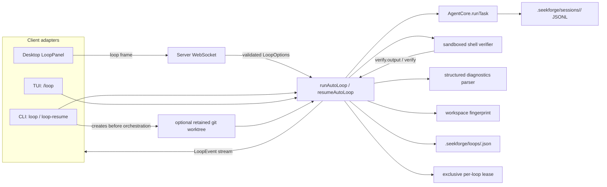
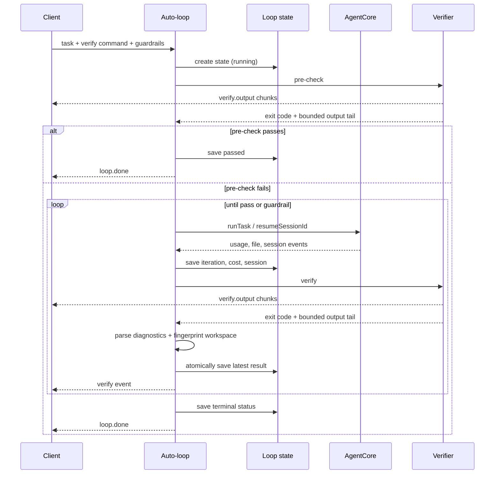
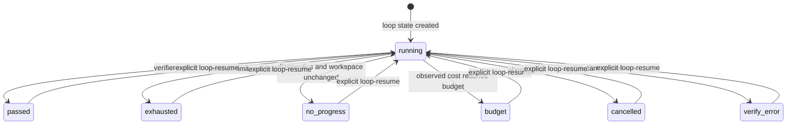

# Loop engineering (auto-loop)

Drive **one** task to "green" across multiple agent runs, fully autonomously:
`run → verify → continue`, stopping when a verification command passes or a
budget guardrail trips. This is a layer *above* a single run — the in-run
tool loop (`packages/core/src/agent/loop.ts`) is unchanged.

## Architecture

Loop is an orchestration layer around the existing agent core. Clients collect
options and render events; they do not implement iteration, verification,
budget, or convergence policy.



The two persisted stores have different ownership:

- Loop JSON stores orchestration state: task, verifier, limits, iteration,
  cumulative cost, session id, last verification, and terminal status.
- Session JSONL remains the source of truth for the agent conversation and tool
  trace. Loop state points to that session; it does not duplicate the trace.

### Run sequence



State is written atomically after observable progress. Live output is bounded
per verification; the final verification event still carries the normal output
tail used for diagnostics and continuation prompts.

The session id and cumulative provider usage are checkpointed as their events
arrive. The iteration counter advances only after the agent run completes, so a
crash resumes an interrupted iteration without consuming an iteration slot while
still reusing the session and accounting for already observed spend.

Only one process may own a persisted Loop at a time. A token-protected lock next
to the state file records the owner's process identity as well as its PID, rejects
concurrent runs, and recovers locks after process exit or PID reuse. Fresh
malformed locks fail closed for a short grace period so a partially written lock
cannot be stolen. A persistence write failure is reported once as `loop.warning`
and does not replace the verification result.

### Resume and worktree lifecycle



`resumeAutoLoop` loads state only from the supplied workspace and preserves the
original task, verifier, maximum iterations, cumulative cost, and session id. It
runs a fresh pre-check before spending another agent iteration. A terminal loop
whose iteration or cost limit is already exhausted can only pass that pre-check;
otherwise the same guardrail stops it without additional agent work.

Resume may add `additionalIterations` and `additionalCostBudgetUsd`. Iterations
are added to the saved maximum and capped at 100. Added budget extends the saved
total; without a prior budget it starts from cost already incurred, so historical
spend is never reset.

`--worktree` is a CLI adapter concern: the CLI creates a branch and worktree,
then passes that directory as the Loop workspace. State and session traces are
therefore stored inside the worktree. Worktrees are retained for inspection and
are never automatically removed; resume from that directory and clean it up
with `seekforge loop-cleanup <name>` when finished. Loop-owned branches use the
`seekforge/loop-*` prefix; cleanup refuses dirty worktrees unless `--force` is
explicit.

Loop management invoked from the base checkout discovers state in retained Loop
worktrees. A duplicate Loop id across workspaces is rejected as ambiguous rather
than selecting one implicitly. Cleanup is blocked while any live lease exists,
including with `--force`.

Loop management also works outside Git repositories. Existing workspace paths
are canonicalized to their physical path so symlink aliases and platform path
aliases resolve to the same persisted state.

## CLI

```
seekforge loop "<task>" --verify "<cmd>" [--max-iters <n>] [--budget <usd>] [--worktree [name]] [-y] [-m <model>]
```

- `--verify <cmd>` (required): success = the command exits 0.
- `--max-iters <n>`: cap on run iterations (default 8, hard maximum 100).
- `--worktree [name]`: create and run in an isolated retained git worktree.
  An optional name selects the branch suffix; without one a unique name is used.
- `--budget <usd>`: observed cumulative-cost stopping line across iterations.
  Usage is checked after each provider usage update and prevents further work,
  but an already in-flight request can make the final billed amount slightly
  exceed the configured value.
- The loop is inherently autonomous — every run uses `approvalMode: "acceptEdits"`
  (file edits auto-approved; dangerous commands still refused by the denylist).
  `-y` just silences the "auto-approves edits" note.
- `Ctrl-C` stops cooperatively (status `cancelled`). Loop orchestration state is
  saved under `.seekforge/loops/<loop-id>.json`; continue it with
  `seekforge loop-resume <loop-id>`. Session-level `resume` and `rewind` remain
  available for manual intervention.
- Exit code 0 only when the verify command passed.

```bash
seekforge loop-resume <loop-id> [--add-iters <n>] [--add-budget <usd>]
seekforge loop-list
seekforge loop-show <loop-id>
seekforge loop-delete <loop-id>
seekforge loop-cleanup <worktree-name> [--force]
```

The whole loop is **one session** (each iteration resumes it), so it is a single
auditable trace.

Worktrees are deliberately retained for inspection. Run `loop-resume` from the
worktree directory when the original loop used `--worktree`.

## Core API

`runAutoLoop(deps, opts)` from `@seekforge/core`:

```ts
type LoopOptions = {
  task: string;
  workspace: string;
  verifyCommand: string;        // exit 0 = done
  maxIterations?: number;       // default 8
  costBudgetUsd?: number;       // stop after observed cumulative usage reaches it
  approvalMode?: ApprovalMode;  // default "acceptEdits"
  model?: string; planModel?: string; escalateOnFailure?: boolean;
  signal?: AbortSignal;         // cooperative stop
  onEvent?: (e: LoopEvent) => void;
  loopId?: string; persist?: boolean; // persistence defaults on
  verify?: (workspace, command, signal, onOutput) => Promise<{ code; output }>;
};
type LoopResult = {
  status: "passed" | "exhausted" | "no_progress" | "budget" | "cancelled" | "verify_error";
  iterations: number; costUsd: number; sessionId: string;
  finalVerify: { code: number; output: string };
  loopId?: string;
};
```

`resumeAutoLoop(deps, loopId, { workspace, additionalIterations?,
additionalCostBudgetUsd? })` restores the iteration count, cost, session,
command, and guardrails, then applies optional additive limits.

## Guardrails (all on by default)

Checked before spending another iteration, in order:

1. `signal.aborted` → `cancelled`
2. observed cumulative cost ≥ `costBudgetUsd` → cancel the active run and return
   `budget` after verification
3. normalized structured diagnostics unchanged **and** the workspace content
   fingerprint unchanged → `no_progress` (stuck)
4. reached `maxIterations` → `exhausted`

A `verify_error` is returned when the verify command cannot start, times out, or
otherwise fails at the executor boundary. Its final output includes bounded
stdout/stderr diagnostics when available.

## Verification

`opts.verify` is injectable (used by tests). The default executes the command in
the workspace through the shared shell executor and configured OS sandbox, with
a 120 s timeout and a cooperative abort signal, and captures a ~4 KB tail of
stdout+stderr. Cancelling during verification stops the command and returns
`cancelled`. On failure the output tail is fed back into the next run's prompt
("`<verifyCommand>` still fails: …, fix the root cause").

Vitest/Jest, Pytest, and Cargo failures are parsed into bounded test names and
source locations. Timing and formatting noise is removed from the convergence
fingerprint. Parsing scans a bounded aggregate while retaining all parsed failure
identities within that bound. The workspace fingerprint hashes the full content
of changed, staged, and untracked files in Git repositories, and all files in a
non-Git workspace, while excluding SeekForge runtime state. Verification
stdout/stderr is streamed through `verify.output` events while the command runs;
each verification caps event count and chunk size, while the final `verify` event
retains the normal output tail.

## Desktop

A collapsible **Loop panel** at the top of the chat window (`LoopPanel`):
explanation line, task + verify-command inputs, max-iterations + budget, and a
Run/Stop button. Progress streams live (one row per iteration: run cost + live
verification output + pass/fail; a status summary and loop id on `loop.done`).

Wire: a `loop` WS client frame `{type:"loop", task, verifyCommand, maxIterations?,
budget?, ws?, model?, thinking?, reasoningEffort?}` — the model/thinking
overrides from the run-toolbar ride along, same as a normal run. The server runs
`runAutoLoop` (acceptEdits) and streams `{type:"loop.event", event}` back, ending
with `idle`. `cancel` stops it. Permission/question prompts during the loop's
runs use the existing modals.

Resume uses `{type:"loop.resume", loopId, addedIterations?, addedBudget?, ws?,
...overrides}` and returns the same event stream. Invalid numeric fields and Loop
IDs are rejected at the protocol boundary.

If the Desktop connection drops during a run, the operation is marked
interrupted, prompts are cleared, and requests queued for the failed connection
are discarded rather than replayed after reconnect.

## TUI

`/loop` uses a multi-line command: the first line contains loop options and the
verification command; following lines are the task.

```text
/loop --max-iterations 12 --budget 1.50 pnpm test
Fix the failing parser tests without weakening assertions.
```

Both options are optional. `--max-iterations` accepts `1-100`; `--budget` must
be a finite positive USD value and overrides `costBudgetUsd` from config. Without
an explicit budget, the TUI inherits the configured value. The default iteration
limit is 8.

Resume from the TUI with `/loop-resume [--add-iterations N] [--add-budget USD]
<loop-id>`. Desktop exposes the same additive controls beside a completed Loop.

## Relation to existing features

Reuses `runTask` + session resume and the agent permission model; verification
uses the same shell executor and OS sandbox as `run_command`. It also reuses
`escalateOnFailure` (hand failing runs to `planModel`). Distinct from **Evolution**
(which proposes rule/skill changes for a human to accept) — auto-loop just drives
one task to green. Surfaced in CLI, desktop, and TUI (`/loop`).
