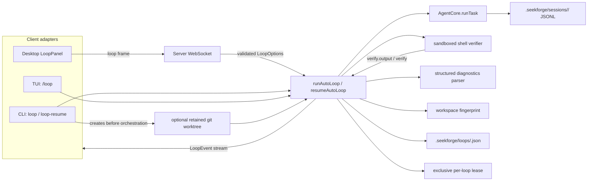
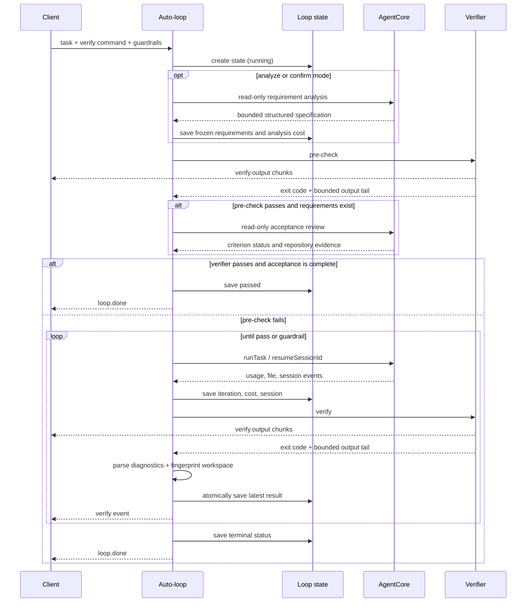
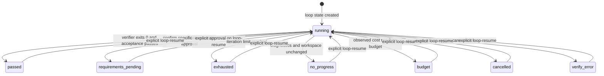

# Loop engineering (auto-loop)

> **English** | [简体中文](loop-engineering.zh-CN.md)

Drive **one** task to completion across multiple agent runs:
`analyze → run → verify → accept → continue`, stopping when the fixed verifier
passes and required acceptance criteria are met, or a guardrail trips. The
default `quick` mode preserves verifier-only completion. This is a layer *above* a single run — the in-run
tool loop (`packages/core/src/agent/loop.ts`) is unchanged.

## Architecture

Loop is an orchestration layer around the existing agent core. Clients collect
options and render events; they do not implement iteration, verification,
budget, or convergence policy.


```mermaid
flowchart LR
  subgraph Clients["Client adapters"]
    CLI["CLI: loop / loop-resume"]
    TUI["TUI: /loop"]
    Desktop["Desktop LoopPanel"]
  end

  Desktop -->|"loop frame"| WS["Server WebSocket"]
  WS -->|"validated LoopOptions"| Orchestrator
  CLI --> Orchestrator["runAutoLoop / resumeAutoLoop"]
  TUI --> Orchestrator

  Orchestrator --> Agent["AgentCore.runTask"]
  Orchestrator --> Verify["sandboxed shell verifier"]
  Orchestrator --> Diagnostics["structured diagnostics parser"]
  Orchestrator --> Fingerprint["workspace fingerprint"]
  Orchestrator --> State[".seekforge/loops/<id>.json"]
  Orchestrator --> Lease["exclusive per-loop lease"]
  Agent --> Trace[".seekforge/sessions/<id>/ JSONL"]
  Verify -->|"verify.output / verify"| Orchestrator
  Orchestrator -->|"LoopEvent stream"| Clients

  Worktree["optional retained git worktree"] --> Orchestrator
  CLI -->|"creates before orchestration"| Worktree
```

The two persisted stores have different ownership:

- Loop JSON stores orchestration state: task, verifier, frozen requirements,
  acceptance review, approval, limits, iteration, cumulative cost, session id,
  last verification, and terminal status.
- Session JSONL remains the source of truth for the agent conversation and tool
  trace. Loop state points to that session; it does not duplicate the trace.

The implementation keeps these boundaries explicit:

- `loop-state` owns the validated state codec and atomic store, while
  `loop-history`, `loop-lease`, and `loop-state-paths` own JSONL replay,
  lifecycle coordination, and path identity respectively.
- `loop-managed-worktree` is the single branch/path binding layer shared by DAG
  and speculative execution. Budget forecasts, verification selection, and
  model-facing tool-result shaping are pure policy modules. Verification
  manifest detectors are separate from plan composition.
- `loop-dag-validation` is the single pure contract for DAG ids, relative
  artifact paths, conditions, dependencies, and acyclic topology. CLI JSON
  decoding preserves transport shape, then calls that validator before Loop
  leases, checkpoints, providers, or worktrees exist.
- CLI JSON decoding and process lifecycle setup live outside command handlers;
  REST DAG/speculation routes and Desktop list/detail/resource views are split by
  domain. Server/Desktop Loop response types come from `@seekforge/shared`
  instead of client-side mirrors.
- Evidence construction, integrity comparison, and JSON/SARIF/JUnit formatting
  are separate so adding an export format cannot change the signed report.
  Persisted status, phase, delivery, and evidence DTOs are defined once in
  `@seekforge/shared`; Core aliases those types instead of maintaining parallel
  mirrors. `phase` had in fact drifted — Core knew `"review"` and the shared DTO
  did not, so the contract could not describe a state the REST list returns
  verbatim — which is why the alias now runs one way only.

### Run sequence


```mermaid
sequenceDiagram
  participant C as Client
  participant L as Auto-loop
  participant S as Loop state
  participant A as AgentCore
  participant V as Verifier

  C->>L: task + verify command + guardrails
  L->>S: create state (running)
  opt analyze or confirm mode
    L->>A: read-only requirement analysis
    A-->>L: bounded structured specification
    L->>S: save frozen requirements and analysis cost
  end
  L->>V: pre-check
  V-->>C: verify.output chunks
  V-->>L: exit code + bounded output tail
  alt pre-check passes and requirements exist
    L->>A: read-only acceptance review
    A-->>L: criterion status and repository evidence
  end
  alt verifier passes and acceptance is complete
    L->>S: save passed
    L-->>C: loop.done
  else pre-check fails
    loop until pass or guardrail
      L->>A: runTask / resumeSessionId
      A-->>L: usage, file, session events
      L->>S: save iteration, cost, session
      L->>V: verify
      V-->>C: verify.output chunks
      V-->>L: exit code + bounded output tail
      L->>L: parse diagnostics + fingerprint workspace
      L->>S: atomically save latest result
      L-->>C: verify event
    end
    L->>S: save terminal status
    L-->>C: loop.done
  end
```

State is written atomically after observable progress. Live output is bounded
per verification; the final verification event still carries the normal output
tail used for diagnostics and continuation prompts.

Each verification emits a bounded `verify.impact` decision set showing whether every stage ran because of a direct path, a transitive workspace dependency, a full gate, or was skipped as unaffected. Incremental success still triggers the authoritative full pipeline before completion, and cache reuse remains bound to an unchanged whole-workspace fingerprint.

Verification stages may form an acyclic DAG with `dependsOn`. Execution remains ordered by default. A stage must explicitly set `parallel: true` and declare one or more logical `resources`; only simultaneously ready stages with disjoint resources run together. Dot-separated resources are hierarchical, so a parent reservation conflicts with its children. Auto Loop, Loop DAG, and Graph share the same deterministic ready-queue implementation. Required failure stops new waves while already-started peers settle. Resume history ranks explicitly parallel peers by prior failure and duration, but it never skips a required gate or changes the authoritative final full pass.

Each completed iteration also records bounded observability fields: elapsed
milliseconds, cost and token deltas, changed relative paths, rollback state, and
a normalized failure category. Stuck/cycle recovery selects only from the
category-safe strategy set (test isolation, compiler/lint repair, SARIF/code-review repair, environment
validation, scope reduction, or replanning). A bounded workspace history records
whether each strategy produced diagnostic progress; two or more observations may
change the preference, but never permissions, approval, verification, or budgets. Recovery turns receive a bounded, explicitly untrusted capsule of failed tests, anchored diagnostics, the failed stage, and changed paths; SARIF repair instructions forbid suppressing or downgrading the rule.

The session id and cumulative provider usage are checkpointed as their events
arrive. The iteration counter advances only after the agent run completes, so a
crash resumes an interrupted iteration without consuming an iteration slot while
still reusing the session and accounting for already observed spend.

Every iteration reconstructs task-scoped prompt state, including automatic
skill selection, even when it resumes the same session. The provider may call
only tools advertised in that exact request after context-budget trimming;
fabricated calls to known-but-omitted tools fail before dispatch. Successful
write/dangerous tools, executable commands, mutating MCP calls, and editing
subagents all invalidate prior verify/lint evidence even when no single changed
path is available.

Convergence fingerprints run asynchronously with a five-second, 20,000-file,
64-MiB budget. Git repositories hash HEAD, status, and dirty/untracked content;
non-Git workspaces use an ignore-aware traversal. If a safe fingerprint cannot
be produced within the limits, that sample is `null` and Loop skips the
unchanged-workspace conclusion instead of blocking the event loop or declaring
false `no_progress`.

Only one process may own a persisted Loop at a time. A token-protected lock next
to the state file records the owner's process identity as well as its PID, rejects
concurrent runs, and recovers locks after process exit or PID reuse. Fresh
malformed locks fail closed for a short grace period so a partially written lock
cannot be stolen. A persistence write failure is reported once as `loop.warning`
and does not replace the verification result.

### Resume and worktree lifecycle


```mermaid
stateDiagram-v2
  [*] --> running: loop state created
  running --> passed: verifier exits 0 and acceptance passes
  running --> requirements_pending: confirm specification awaits approval
  requirements_pending --> running: explicit approval on loop-resume
  running --> exhausted: iteration limit reached
  running --> no_progress: diagnostics and workspace unchanged
  running --> budget: observed cost reaches budget
  running --> cancelled: abort signal
  running --> verify_error: verifier cannot start
  passed --> running: explicit loop-resume
  exhausted --> running: explicit loop-resume
  no_progress --> running: explicit loop-resume
  budget --> running: explicit loop-resume
  cancelled --> running: explicit loop-resume
  verify_error --> running: explicit loop-resume
```

`resumeAutoLoop` loads state only from the supplied workspace and preserves the
original task, verifier, maximum iterations, cumulative cost, and session id. It
runs a fresh pre-check before spending another agent iteration. A terminal loop
whose iteration or cost limit is already exhausted can only pass that pre-check;
otherwise the same guardrail stops it without additional agent work.

Resume may add `additionalIterations` and `additionalCostBudgetUsd`. Iterations
are added to the saved maximum and capped at 100. Added budget extends the saved
total; without a prior budget it starts from cost already incurred, so historical
spend is never reset. The resulting budget must remain finite; numeric overflow
is rejected rather than interpreted as an absent limit.

`--worktree` is a CLI adapter concern: the CLI creates a branch and worktree,
then passes that directory as the Loop workspace. State and session traces are
therefore stored inside the worktree. Worktrees are retained for inspection and
are never automatically removed; resume from that directory and clean it up
with `seekforge loop-cleanup <name>` when finished. Loop-owned branches use the
`seekforge/loop-*` prefix; cleanup refuses dirty worktrees unless `--force` is
explicit.

Loop management invoked from the base checkout discovers state in retained Loop
worktrees. A duplicate Loop id across workspaces is rejected as ambiguous rather
than selecting one implicitly. Cleanup is blocked while any live lease exists,
including with `--force`.

Loop management also works outside Git repositories. Existing workspace paths,
including values stored by older versions, are canonicalized to their physical
path so symlink aliases and platform path aliases resolve to the same persisted
state.

## CLI

```
seekforge loop "<task>" (--verify "<cmd>" | --auto-verify) [--requirements quick|analyze|confirm] [--code-review] [--max-iters <n>] [--budget <usd>] [--worktree [name]] [-y] [-m <model>]
```

- `--verify <cmd>`: success = the command exits 0.
- `--auto-verify`: discovers recognized root stages from `package.json`,
  `Cargo.toml`, `go.mod`, or pytest configuration. It freezes fixed commands or
  named scripts in Loop state and never interpolates manifest script bodies
  into a generated shell command. For `apps/*` and `packages/*` workspaces it
  also adds path-scoped package test stages even when the root package has no
  recognized script. The combined plan is capped at 16 while retaining root and
  ecosystem gates. A successful incremental stage may be reused only by the
  same immediate full fallback while a complete workspace fingerprint is unchanged.
- `--requirements quick|analyze|confirm`: `quick` keeps verifier-only behavior;
  `analyze` performs read-only repository analysis and acceptance review;
  `confirm` persists the specification and stops with `requirements_pending`
  until it is explicitly approved. Approval applies only to a specification
  loaded from persisted state; a specification generated in the current call
  is always returned for inspection first.
- `--code-review`: after verification and acceptance pass, starts a fresh
  read-only reviewer session against the final diff. Actionable findings are
  persisted and fed into another edit iteration; success requires a later fresh
  review with no findings. Reviewer context is never reused from implementation.
- `--max-iters <n>`: cap on run iterations (default 8, hard maximum 100).
- `--worktree [name]`: create and run in an isolated retained git worktree.
  An optional name selects the branch suffix; without one a unique name is used.
- `--budget <usd>`: observed cumulative-cost stopping line across iterations.
  Usage is checked after each provider usage update and prevents further work,
  but an already in-flight request can make the final billed amount slightly
  exceed the configured value.
- `--adaptive-budget`: uses the largest recent iteration sample to stop before
  starting work that is predicted not to fit inside a configured cost, token,
  or duration hard cap. It never raises a cap.
- `seekforge orchestration report` aggregates Loop and Graph usage without
  double-counting Graph-owned child Loops or child Graph checkpoints. For Loop
  it attributes each edit-model outcome to the preceding failure category,
  reports evidence-weighted confidence, evaluates optional SLOs from measured
  P95 duration and partial verification coverage, and deterministically replays
  retained lifecycle events. Strategy learning uses recency-weighted pass,
  regression, flake, cost, and duration evidence and ranks routes by a bounded
  lower-confidence utility score. `orchestration proposals
  refresh|list|approve|dismiss|apply|rollback|observe` separates review from a
  crash-recoverable deployment lifecycle. Wilson lower bounds avoid treating a
  tiny perfect sample as certain. Any changed regenerated draft returns to
  `proposed`; applying an approved exact-generation Loop route serializes by
  target and persists it by failure category. Observation can explicitly
  auto-roll back a regression. Hard-budget changes remain manual.
  Graph-owned child Loops resume only through their parent Graph. Their usage is
  excluded from totals only while that parent checkpoint is present; an orphaned
  child remains visible and countable until normal retention removes it.
- The loop is inherently autonomous — every run uses `approvalMode: "acceptEdits"`
  (file edits auto-approved). `acceptEdits` deliberately does not auto-allow
  execution, and CLI/TUI Loops answer every remaining prompt with no, so in those
  two surfaces **every non-allowlisted command and every env change is denied** —
  not just denylisted ones. Widen `commandAllowlist` if a Loop needs to run
  something. Desktop and server Loops differ: they prompt through the normal
  modals, so a human can approve mid-Loop.
  `-y` just silences the "auto-approves edits" note.
- `Ctrl-C` stops cooperatively (status `cancelled`). Loop orchestration state is
  saved under `.seekforge/loops/<loop-id>.json`; continue it with
  `seekforge loop-resume <loop-id>`. Session-level `resume` and `rewind` remain
  available for manual intervention.
- Exit code 0 only when the verifier passed and, in analyzed modes, every
  required acceptance criterion was evidenced as met. File evidence must include
  a verified content anchor such as `path:src/feature.ts#symbol` or `#L10-L20`;
  path existence alone is not accepted.

```bash
seekforge loop-resume <loop-id> [--approve-requirements] [--add-iters <n>] [--add-budget <usd>]
seekforge loop-list
seekforge loop-show <loop-id>
seekforge loop-diagnose <loop-id>
seekforge loop-health <loop-id>
seekforge loop-pause <loop-id>
seekforge loop-continue <loop-id>
seekforge loop-steer <loop-id> "<guidance>"
seekforge loop-priority <loop-id> <-10..10>
seekforge loop-deliver <loop-id> [--mode checkpoint|merge|patch|pr] [--wait-ci] [--ci-repairs N]
seekforge loop-prune [--older-than-days N] [--keep-last N] [--worktrees] [--dry-run]
seekforge loop-delete <loop-id>
seekforge loop-cleanup <worktree-name> [--force]
```

### Loop v2 controls

- Repeat `--verify-stage <id[@path,...]=command>` for an ordered verification
  pipeline. Path-scoped stages are selected by changed relative path prefixes
  during edit iterations. Auto-discovery computes the transitive internal package
  dependency closure, so a library edit also selects tests for its dependents.
  Stage results identify full, direct, dependency, or cache selection and retain
  the bounded matching paths. Any incremental pass is followed by a full pipeline
  before success, so selection can reduce work but cannot weaken the final gate.
  Cached incremental evidence is scoped to that immediate transition and
  invalidated by any observed workspace change.
  Required stages stop the pipeline; Core API stages may set `required: false`.
- `--flaky-retries 0..5` reruns a failed stage before editing and records a
  `verify.flaky` event when it later passes. `--stable-passes 1..5` requires
  consecutive full-pipeline passes.
- `--stuck-recoveries 0..5` performs bounded re-diagnosis with a different
  strategy before returning `no_progress`. `--rollback-regressions` rewinds a
  regression only inside a retained Loop worktree, then reruns verification and
  replaces the convergence baseline with the restored result.
- `loop-history <id> [--after N] [--limit N]` replays the rotated JSONL event
  history. `loop-recover` marks orphaned `running` records as `interrupted`;
  embedders can call `autoResumeInterruptedLoops` to continue them. Existing
  `interrupted` records remain resumable so a transient recovery failure can be
  retried; a record whose Loop lease is still live is never offered for recovery.
  A durable user-paused record remains paused until an explicit continue/resume.
  `loop-diagnose <id>` checks the checkpoint against the newest retained history
  window. Missing observational history is reported as a warning rather than
  checkpoint corruption.
- Automatic recovery uses `--priority -10..10`/`loop-priority`, processes at
  most three candidates per workspace tick, and isolates each failure with
  exponential retry backoff (30 seconds to one hour). A foreground run requests
  preemption of idle recovery and waits for its guard to yield. Each automatic
  attempt has a separate identity: failure backoff is written only while the
  checkpoint still matches the pre-attempt or newly published generation.
  Successful cleanup uses that same identity, so a late completion cannot clear
  a newer generation. Foreground resume overrides stale backoff, and a normally
  completed automatic resume clears its attempt metadata. Desktop lists the bounded attempt count,
  next eligible time, and last error beside the persisted Loop.
- `seekforge serve --loop-auto-resume` opts into lifecycle-owned background
  recovery. It reserves the physical repository queue, takes a cross-process
  idle guard, skips rather than waits when work is active, and keeps that guard
  for the complete recovery while explicitly authorizing only the recovery's
  own Agent sessions. Workspaces are processed sequentially, ticks cannot
  overlap, and shutdown aborts the current recovery. Idle memory maintenance and Loop recovery share one recurring-timer kernel for delay validation, non-overlap, rescheduling, cancellation, and observer isolation, while retaining their separate cross-process leases. A lifecycle abort is
  persisted as `interrupted`, not user `cancelled`, so the next server can
  resume it. `--loop-auto-prune` uses the same idle guard to remove only old
  terminal records; resumable states and unfinished delivery transactions are
  retained. Both schedulers are disabled by default. `loop-prune` exposes the
  same retention rules and can optionally remove clean, finalized-merge Loop
  worktrees. Whole-worktree cleanup is revalidated while holding the workspace
  guard and removes the checkout before its tracked state, so cleanup is atomic.
- `loop-evidence <id>` and `GET /api/loops/:id/evidence` produce one bounded
  requirement → acceptance evidence → verifier → iteration → delivery report.
  It includes a SHA-256 integrity digest and immutable delivery revision/hash/URL.
  CLI export supports JSON, SARIF, and JUnit, `--compare` reports changes
  between two persisted runs, and `loop-evidence --verify <file>` recomputes the
  digest of an exported report and exits non-zero when it no longer matches —
  editing a report after export is the thing the digest exists to catch.
- `loop-health <id>` and `GET /api/loops/:id/health` combine the current
  checkpoint with only exact stage-and-command verification intelligence. The
  output reports remaining hard budgets, a conservative next-iteration forecast
  from up to three completed snapshots, affordable iterations, the limiting
  budget, recovery backoff, and reliability findings. It is advisory and never
  changes runtime eligibility or raises a budget.
- `loop-dag <file>` durably checkpoints a JSON dependency graph. `--resume` and
  `--dag-id` restore completed nodes; ready nodes receive weighted shares of the
  remaining cost/token budgets and support priorities, bounded retries, and
  `skip_dependents`/`continue`/`stop` failure policies. Nodes may branch on a
  dependency outcome with nested `all`/`any`/`not` conditions, require explicit
  approval with durable actor/reason audit, lock named exclusive resources, and
  consume bounded structured dependency outputs. Declared `outputPaths` must be
  regular files inside the node workspace and are published as artifact metadata.
  An approval is checkpointed as `approved` before node execution begins, so a
  crash resumes the authorized node without asking again or losing the audit.
  Completion-driven scheduling immediately fills a free slot instead of waiting
  for an unrelated slow batch peer. `--rerun` invalidates a
  selected node and all descendants; `--approve` crosses a declared gate.
  Parallel graphs require distinct physical workspaces. `--managed-worktrees`
  creates and retains one Git worktree/branch per node, checkpoints passing
  changes, and merges passed dependency branches into downstream node worktrees.
  A top-level `fanIn` object (`verifyCommand`, optional `maxIterations`) merges
  successful sink branches (or every node when dependency integration is disabled)
  into a retained integration worktree and runs a final bounded Loop gate over the
  combined tree. Managed paths are physically rebound and all resolved workspace identities are part of
  the durable graph fingerprint, so `--resume` rejects a remapped node instead
  of reusing work completed in another checkout. A DAG-level `maxDurationMs`
  is cumulative across resumes; checkpoints store active elapsed time and do not
  charge time spent paused or stopped between invocations. Legacy schema-v1 DAG
  checkpoints normalize to schema v2 with zero previously measured active time.
  `--predictive-budget` learns bounded historical resource demand, while
  `--worktree-limit` caps retained managed worktrees. `loop-dag-resources`
  inspects disk use and explicitly archives, promotes, or prunes completed graphs;
  pruning always retains worktrees with uncommitted changes.
  A node may declare `options` carrying the bounded Loop configuration a Graph
  `loop` node can also declare (iteration, verification-plan, budget,
  model-routing, review and requirement keys). The file parser used to ignore the
  whole object; it now applies it and `export-graph` preserves it, while any other
  key is rejected by name. Adding `options` to a DAG file changes that DAG's
  fingerprint, so finish an in-flight checkpoint before adding one.
- `loop-speculate` and the Core `runSpeculativeLoop` helper run exactly two or
  three repair strategies under one mandatory cost cap in isolated workspaces and
  select the lowest-cost passing result. **They run on the Engineering Graph**:
  the candidates become a fan-out of `loop` nodes with no dependencies between
  them, launched in one wave under one shared `costBudgetUsd`, so each candidate
  reserves an equal weighted share of the cap rather than the whole cap. Isolation
  is one managed worktree per candidate with dependency integration off, so a
  losing candidate's tree never reaches the winner's. Runs and winners are
  resumable; `loop-speculation-promote` is the separate explicit merge step. REST
  and Desktop expose persisted runs and resource operations. The persisted
  `.seekforge/loop-speculations/` document is unchanged, so a speculation recorded
  by the Loop DAG engine still lists and still promotes — but one that was mid-run
  on that engine cannot be resumed, and says so by name.
- `--deliver checkpoint|merge|patch|pr` performs an explicit post-pass delivery
  from a retained Loop worktree. `pr` pushes the Loop branch and creates a draft
  pull request through `gh`. Delivery records its mode, status, attempt count,
  error, and final artifact in Loop state. If delivery fails after verification
  passed, retry it without rerunning the agent via `loop-deliver <id>`; the prior
  mode is reused unless this is the first attempt. Run, delivery, and deletion
  share one lifecycle lease, so resume cannot enter while delivery is acting.
  Delivery persists `prepared → action_completed → finalized` with branch,
  revision, patch hash, or PR URL evidence. The primary side effect and final
  publication are independently retryable; retries validate evidence and repair
  legacy premature-success records before returning success. Delivery reruns
  the complete persisted verification pipeline against the checkpointed tree,
  rejects changes left by verification or finalization hooks, and publishes
  merge/PR delivery through an immutable checked revision. A branch or its
  working tree may advance past the evidenced revision only through the exact
  Loop state file; any other committed, staged, modified, or untracked path is
  treated as unverified and blocks delivery. Worktree cleanup takes the same
  workspace guard, so it cannot remove an active delivery, and non-force cleanup
  preserves branches with commits not reachable from the base checkout.
- `--deliver pr --wait-ci` keeps delivery in `action_completed` while required
  PR checks run. `--ci-repairs 0..3` (default 0) may feed one bounded failed-step log to a
  non-persisted, two-iteration repair Loop with its own cost cap, rerun the frozen
  local pipeline, checkpoint and push the immutable revision, and wait again.
  The CI policy, repair count, checked revision, and failure are durable; a later
  `loop-deliver --wait-ci` resumes the same policy, while retrying without CI
  closure is rejected. Check waits and repair pushes are cooperatively cancellable.
  Check waiting and failed-log retrieval use a provider-neutral CI adapter; the
  CLI ships GitHub `gh` and GitLab `glab` adapters and selects between them with
  `--ci-provider github|gitlab` (default `github`). The adapter shipped and was
  tested for a while before it had a selector, so CI closure only ever ran
  against GitHub. Agent credentials, workspace authorization, and MCP repair tools are initialized
  only after a failed check actually requires a repair; green checks need none of them.
- REST Loop listing supports `status`, `q`, `limit`, and `after`; active Loops
  accept `POST /api/loops/:id/control`, and `/api/loop-dags` exposes durable graph
  state. Prometheus output includes aggregate Loop count, activity, cost, tokens,
  verifier runs, and verification-intelligence anomaly/critical-anomaly counts. Desktop adds filtering, polling, history paging, CI state,
  verifier selection/duration, acceptance evidence, iteration timelines, fan-in
  and DAG node status, plus safe-boundary controls; late filter or history responses are
  discarded when their query or selected Loop is no longer current.
- Verification discovery preserves authoritative root gates while adding safe
  path-scoped pnpm workspace, nested Cargo, Go, and Python stages. Recovery ranking
  applies recency, framework/stage context, diagnostic improvement, cost, and duration.
  Verification reliability adds age-decayed confidence, bounded retry advice, and
  flaky quarantine candidates, but never skips an authoritative stage.
  Eval fault injection supports event occurrence boundaries and reports Loop lifecycle,
  verify, recovery, resume, and p95 duration metrics.
- WebSocket clients can send `loop.pause`, `loop.control.resume`, and
  `loop.steer`; controls take effect only at safe iteration boundaries.
- The top-level `loop-pause`, `loop-continue`, and `loop-steer` CLI commands can
  control a Loop owned by another live SeekForge process. Commands use a bounded,
  serialized mailbox under `.seekforge/loops/` and are scoped to the current run,
  so a command racing with completion cannot leak into a later resume.
- TUI users have the equivalent `/loop-pause`, `/loop-continue`, and
  `/loop-steer <guidance>` commands scoped to the active tab's Loop.

Iteration snapshots persist compact stage outcomes, normalized diagnostic/workspace
fingerprints, parsed failure counts, per-iteration time/cost/tokens/changed paths,
failure categories, rollback flags, recovery attempts, and pass streaks. Repeated
commands and output remain only in the latest result/history log so the state stays
inside its reader's 1 MiB limit; oversized replacements fail before the last readable
state is touched. Loop
success performs memory extraction once and records selected-skill effectiveness
once for the whole Loop rather than once per internal agent iteration.

The state also checkpoints the last entered `requirements`, `precheck`, `editing`, `verification`, `acceptance`, `review`, or `settled` phase for crash diagnosis and resume presentation. Cacheable verification stages publish a bounded seven-day cross-run hint keyed by the exact command, authoritative workspace fingerprint, and Node platform/runtime identity. A persistent hint may skip incremental work, but it always forces and can never authorize the mandatory full pipeline.

Real verifier executions also update a bounded 30-day reliability record keyed by
the exact stage id, command, and runtime identity. It stores counts, failure
streaks, flake frequency, and average duration—but never verifier output. The
scheduler may use it only to prioritize stages already eligible in the same safe
wave, and `loop-intelligence` or `GET /api/loops/verification-intelligence`
reports sustained anomalies. This history cannot skip a stage, satisfy a gate,
or change dependencies and resource conflicts.

Embedders may route edit iterations by the previous failure category through
`modelByFailureCategory`, or provide an explicit ordered escalation chain through
`modelRoutesByFailureCategory`. `modelEscalationThreshold` controls how many
consecutive same-category failures each model receives. The exact route wins over
a chain, every candidate is resolved during preflight through `providerForModel`,
and each decision is retained in `loop.model.routed` plus the iteration snapshot.
Routing never changes verification, permissions, or budgets.
An applied orchestration route is loaded before provider preflight for that exact
Loop. A caller-supplied `modelByFailureCategory` or explicit escalation chain has
higher precedence, so a durable recommendation cannot override an invocation's
explicit routing contract. Rollback restores the previously persisted route when
one existed.

Edit iterations reuse **one worker session**. Requirement analysis and acceptance
review reuse a separate reviewer session recorded in Loop state, keeping evaluator
context out of the worker conversation while preserving both auditable traces.
Independent code review uses a new reviewer session on every attempt. A bounded
working-memory snapshot stores fingerprint-bound failure category, changed paths,
acceptance gaps, and finding ids; resume discards it after a workspace change.

Worktrees are deliberately retained for inspection. Run `loop-resume` from the
worktree directory when the original loop used `--worktree`.

### Loop DAG deprecation window

**The Loop DAG is a shortcut, not a second engine.** A Loop DAG is one isomorphic
shape of an Engineering Graph — every node is a full run→verify Loop. Reach for
`seekforge graph` when a workflow mixes node kinds or needs typed data flow,
external signals, compensation, or remote execution.

**The subset gap is closed, so the Loop DAG is now deprecated.** Retiring it had
one stated precondition: a Graph `loop` node must stop being a strictly weaker
Loop. That precondition is met — `loopOptions`, `verifierId`, dependency-output
injection, declared `outputPaths`, `budgetWeight`, `predictiveBudget` and a
per-node `failurePolicy` all exist there now, see
[Loop node configuration](graph-engineering.md#loop-node-configuration). The
engine has therefore entered a **deprecation window**:

- **It gains no new capabilities.** Correctness and security fixes only; it will
  not grow new fields. All new orchestration work lands in the Engineering Graph.
- **In-flight DAGs keep running.** No command is removed and no checkpoint is
  rejected: existing `.seekforge/loop-dags/` state stays resumable — `--resume`,
  `--rerun`, `--approve`, and `loop-dag-resources` all behave exactly as before —
  for the whole window.
- **`loop-speculate` no longer runs on it.** The last non-DAG caller of
  `runLoopDag` is gone. The engine now has one runtime caller — the `loop-dag`
  command — plus `loop-dag-resources` and `GET /api/loop-dags` reading its
  checkpoints.
- **The next major release removes the engine.** There is no dated cut-off yet.
  Finish what is in flight, but start new work on the Graph.
- `loop-dag` and `loop-dag-resources` print that notice on **stderr** when they
  start. Their stdout — the per-node status table and the resources JSON
  document — and their exit codes are unchanged, so existing pipelines keep
  parsing them byte for byte.

**Migrating, in three steps:**

```sh
# 1. convert: deterministic, one kind:"loop" Graph node per DAG node
seekforge loop-dag export-graph dag.json -o graph.json

# 2. check the converted definition before spending a run on it
seekforge graph validate graph.json

# 3. run it
seekforge graph run graph.json
```

Step 1 refuses to emit a graph it cannot make behave identically, and names the
reason instead of dropping the field: a per-node `options` key the Graph cannot
declare, more than 32 `outputPaths`, more than 32 consumed dependency outputs, a
dependency id that cannot become a Graph input name, a `budgetWeight` above
1000, a `maxDurationMs` above 24 hours, a dependency policy needing more than 32
condition terms, managed worktrees combined with explicit node workspaces,
concurrency without isolation, `fanIn` without managed worktrees, and an
approval gate id that is invalid or already taken. Everything else —
`verifierId`, declared `outputPaths`, `consumeDependencyOutputs`, per-node
`failurePolicy`, `predictiveBudget`, and the declarable half of `options` —
converts, with the surviving differences reported as advisories on stderr.

**Differences you still have to know.** These are behavior differences, not
gaps; the ones the conversion can detect are reported on stderr by step 1:

- Approval becomes a separate `<node>-approval` gate node, so it is that node's
  id an operator approves, not the loop node's.
- Retries wait a pinned minimum delay and record a durable `waiting_retry`
  phase; the DAG retried immediately.
- Equal-priority ties break by dependency criticality rather than by id.
- Dependency outputs arrive as a JSON object keyed by dependency id, not as an
  `[{id, output}]` array.
- Declared outputs are additionally hashed and size-capped, so a file the DAG
  would have accepted can fail the node.

A converted Graph starts from a fresh Graph checkpoint. Migration does not carry
a Loop DAG checkpoint over, which is why an in-flight DAG is best finished on the
Loop DAG engine rather than switched mid-run.

## Core API

`runAutoLoop(deps, opts)` from `@seekforge/core`:

```ts
type LoopOptions = {
  task: string;
  workspace: string;
  verifyCommand: string;        // fixed verifier; analyzed modes also require acceptance
  autoVerificationPlan?: boolean; // discover and freeze a root plan on a new Loop
  // One owner: @seekforge/shared parseLoopVerificationPlan. Every surface that
  // accepts a plan (engine, graph node, WS loop frame, POST /api/runs, eval
  // task) runs the same rules.
  verificationPlan?: Array<{
    id: string;                  // unique, /^[A-Za-z0-9][A-Za-z0-9_-]{0,127}$/
    command: string;             // non-blank, <= 8192 chars
    required?: boolean;
    timeoutMs?: number;          // 1 .. 2147483647 (the largest delay a timer can hold)
    paths?: string[];            // 1..64 unique relative prefixes
    dependencyPaths?: string[];  // subset of paths
    cacheable?: boolean;
    dependsOn?: string[];        // unique known stage ids; the plan must be acyclic
    parallel?: boolean;          // requires a non-empty resources list
    resources?: string[];        // 1..16 unique names, /^[A-Za-z0-9][A-Za-z0-9_.-]{0,127}$/
  }>;
  stablePasses?: number; flakyRetries?: number;
  maxNoProgressRecoveries?: number; rollbackOnRegression?: boolean;
  requirementMode?: "quick" | "analyze" | "confirm"; // default quick
  approveRequirements?: boolean; // resume a confirm-mode loop
  maxIterations?: number;       // default 8
  costBudgetUsd?: number;       // stop after observed cumulative usage reaches it
  tokenBudget?: number;         // cumulative prompt + completion tokens
  maxDurationMs?: number;       // cumulative wall-clock budget, resume-aware
  maxVerifyRuns?: number;       // includes the initial pre-check
  verifyTimeoutMs?: number;     // default 120 seconds per verifier
  agentTimeoutMs?: number;      // default 30 minutes per attempt
  maxAgentRetries?: number;     // transient failures; default 1
  approvalMode?: ApprovalMode;  // default "acceptEdits"
  model?: string; planModel?: string; escalateOnFailure?: boolean;
  modelRoutesByFailureCategory?: Partial<Record<LoopFailureCategory, string[]>>;
  modelEscalationThreshold?: number; // 1-8, default 2
  signal?: AbortSignal;         // cooperative stop
  control?: LoopControl;        // safe-boundary pause/resume/steer
  onEvent?: (e: LoopEvent) => void;
  loopId?: string; persist?: boolean; // persistence defaults on
  verify?: (workspace, command, signal, onOutput) => Promise<{ code; output }>;
};
type LoopResult = {
  status: "passed" | "exhausted" | "no_progress" | "budget" | "cancelled" | "verify_error" | "agent_error" | "interrupted" | "requirements_pending";
  iterations: number; costUsd: number; sessionId: string;
  finalVerify: { code: number; output: string };
  loopId?: string; requirements?: LoopRequirementSpec;
  acceptanceReview?: LoopAcceptanceReview; budgetReason?: "cost" | "tokens" | "duration" | "verify_runs";
  agentError?: AgentError;
  stageResults?: LoopStageResult[]; flaky?: boolean; passStreak?: number;
  recoveryAttempts?: number;
  failureCategory?: LoopFailureCategory;
};
```

**Timeout ceiling.** `timeoutMs`, `verifyTimeoutMs`, `agentTimeoutMs` and
`maxDurationMs` are capped at `MAX_LOOP_TIMEOUT_MS` (2 147 483 647 ms, ~24.8
days). `setTimeout` keeps its delay in a signed 32-bit field, so a larger delay
fires immediately instead of never — the longest wait you could ask for behaved
as the shortest. A value above the cap is a `RangeError`; a value read back from
a checkpoint written before the cap existed is clamped to it, so the Loop still
resumes.

`resumeAutoLoop` also accepts additive cost, token, duration, verifier-run, and
iteration capacity. It restores cumulative elapsed time, tokens, verifier count,
worker/reviewer sessions, command, and frozen requirements.

## Guardrails (all on by default)

Checked before spending another iteration, in order:

1. `signal.aborted` → `cancelled`
2. any configured cost, token, duration, or verifier-run limit is reached →
   cancel active work and return `budget` with `budgetReason`
3. normalized structured diagnostics unchanged **and** the workspace content
   fingerprint unchanged → `no_progress` (stuck)
4. reached `maxIterations` → `exhausted`

A `verify_error` is returned when the verify command cannot start, reaches its
per-stage timeout, or otherwise fails at the executor boundary. Only an independently
configured total duration deadline produces `budget: duration`. Final output includes bounded
stdout/stderr diagnostics when available.

An edit-agent failure is never sent blindly into the verifier. Network, timeout,
and rate-limit failures retry up to `maxAgentRetries`; an unrecovered failure
returns `agent_error` with the original `AgentError`.

## Verification

`opts.verify` is injectable (used by tests). The default executes the command in
the workspace through the shared shell executor and configured OS sandbox, with
a 120 s timeout and a cooperative abort signal, and captures a ~4 KB tail of
stdout+stderr. Cancelling during verification stops the command and returns
`cancelled`. On failure the output tail is fed back into the next run's prompt
("`<verifyCommand>` still fails: …, fix the root cause").

Vitest/Jest, Pytest, and Cargo failures are parsed into bounded test names and
source locations. Timing and formatting noise is removed from the convergence
fingerprint. Parsing scans a bounded aggregate while retaining all parsed failure
identities within that bound. The workspace fingerprint hashes the full content
of changed, staged, and untracked files in Git repositories, and all files in a
non-Git workspace, while excluding SeekForge runtime state. Symbolic links are
hashed as links and are never followed outside the workspace. Verification
stdout/stderr is streamed through `verify.output` events while the command runs;
each verification caps event count and chunk size, while the final `verify` event
retains the normal output tail.

## Contextual route learning

Workspace orchestration aggregates durable post-edit outcomes by toolchain context (`node`, `rust`, `python`, `go`, `mixed`, or `generic`), failure category, and model. It reports mean utility plus a bounded UCB-style exploration score and can deterministically select an explore/exploit arm from available models. Explicit caller routes remain authoritative; learned routes are evidence and do not grant model or execution permissions.

## Desktop

A collapsible **Loop panel** at the top of the chat window (`LoopPanel`):
explanation line, task + verify-command inputs, max-iterations + budget, and a
Run/Stop button. Progress streams live (one row per iteration: run cost + live
verification output + pass/fail; a status summary and loop id on `loop.done`).

Wire: a `loop` WS client frame `{type:"loop", task, verifyCommand, maxIterations?,
budget?, ws?, model?, thinking?, reasoningEffort?}` — the model/thinking
overrides from the run-toolbar ride along, same as a normal run. The server runs
`runAutoLoop` (acceptEdits) and streams `{type:"loop.event", event}` back, ending
with `idle`. `cancel` stops it. Permission/question prompts during the loop's
runs use the existing modals.

Resume uses `{type:"loop.resume", loopId, addedIterations?, addedBudget?, ws?,
...overrides}` and returns the same event stream. Invalid numeric fields and Loop
IDs are rejected at the protocol boundary.

If the Desktop connection drops during a run, the operation is marked
interrupted, prompts are cleared, and requests queued for the failed connection
are discarded rather than replayed after reconnect.

Server errors that prove no operation exists (such as `not_running`) also clear
the running state and stale prompts. Errors for a concurrent operation or stale
prompt response remain non-terminal because the active server run may continue.

## TUI

`/loop` uses a multi-line command: the first line contains loop options and the
verification command; following lines are the task.

```text
/loop --requirements analyze --max-iterations 12 --budget 1.50 pnpm test
Fix the failing parser tests without weakening assertions.
```

All options are optional. `--requirements` accepts `quick|analyze|confirm`;
`--max-iterations` accepts `1-100`; `--budget` must
be a finite positive USD value and overrides `costBudgetUsd` from config. Without
an explicit budget, the TUI inherits the configured value. The default iteration
limit is 8.

`/loop` also accepts `--verify-stage`, `--stable-passes`, `--flaky-retries`,
`--stuck-recoveries`, `--rollback-regressions`, `--priority` and the budget
flags, with the same ranges the CLI enforces. One of them is workspace-dependent:
`--rollback-regressions` needs a retained `.seekforge/worktrees` checkout,
because rewinding a regression outside one would rewind the user's own working
tree. The TUI runs in the workspace it was started in and `/worktree new` does
not rebind the tab, so it refuses the flag up front unless the TUI itself was
started inside a worktree — use `seekforge loop --worktree` otherwise.

Resume from the TUI with `/loop-resume [--approve-requirements] [--add-iterations N] [--add-budget USD]
<loop-id>`. Desktop exposes the same additive controls beside a completed Loop.

## Relation to existing features

Reuses `runTask` + session resume and the agent permission model; verification
uses the same shell executor and OS sandbox as `run_command`. It also reuses
`escalateOnFailure` (hand failing runs to `planModel`). Distinct from **Evolution**
(which proposes rule/skill changes for a human to accept) — auto-loop just drives
one task to green. Surfaced in CLI, desktop, and TUI (`/loop`).
