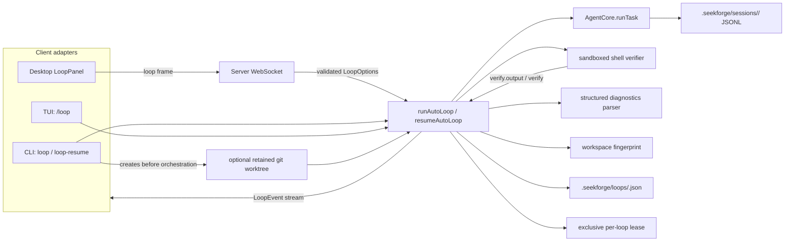
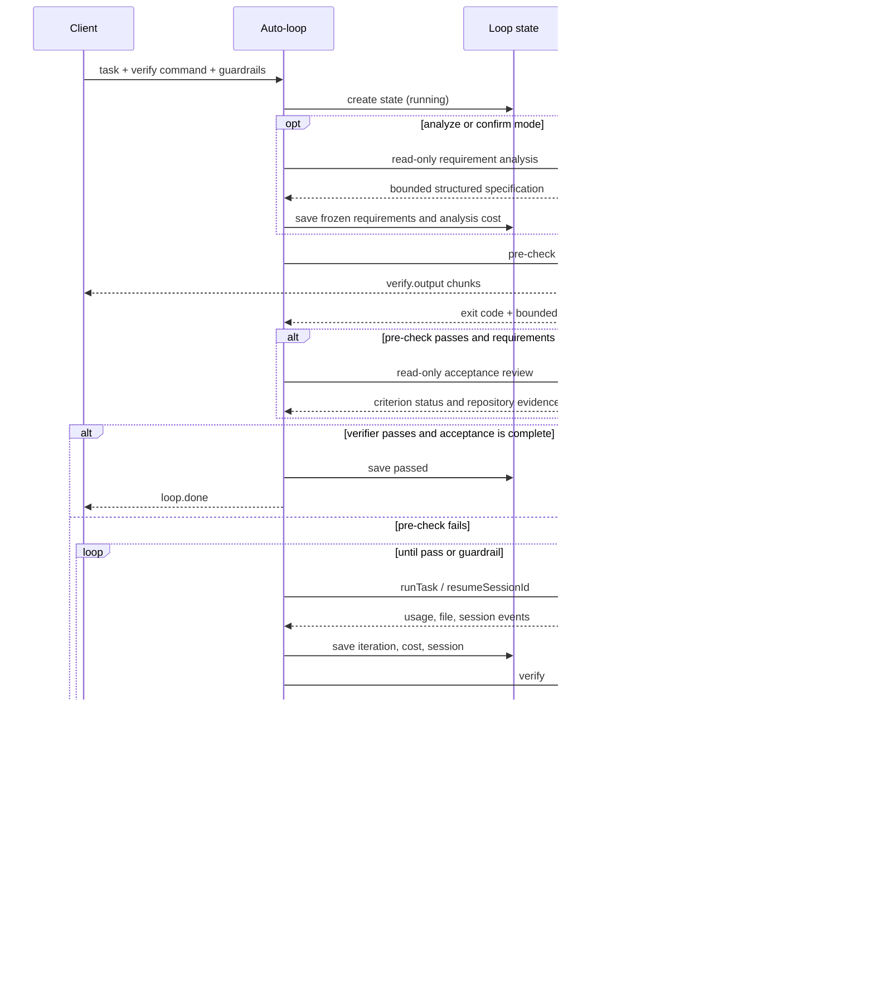
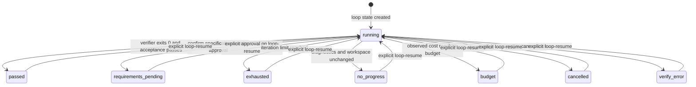

# Loop engineering (auto-loop)

> **English** | [简体中文](loop-engineering.zh-CN.md)

Drive **one** task to completion across multiple agent runs:
`analyze → run → verify → accept → continue`, stopping when the fixed verifier
passes and required acceptance criteria are met, or a guardrail trips. The
default `quick` mode preserves verifier-only completion. This is a layer *above* a single run — the in-run
tool loop (`packages/core/src/agent/loop.ts`) is unchanged.

## Architecture

Loop is an orchestration layer around the existing agent core. Clients collect
options and render events; they do not implement iteration, verification,
budget, or convergence policy.


```mermaid
flowchart LR
  subgraph Clients["Client adapters"]
    CLI["CLI: loop / loop-resume"]
    TUI["TUI: /loop"]
    Desktop["Desktop LoopPanel"]
  end

  Desktop -->|"loop frame"| WS["Server WebSocket"]
  WS -->|"validated LoopOptions"| Orchestrator
  CLI --> Orchestrator["runAutoLoop / resumeAutoLoop"]
  TUI --> Orchestrator

  Orchestrator --> Agent["AgentCore.runTask"]
  Orchestrator --> Verify["sandboxed shell verifier"]
  Orchestrator --> Diagnostics["structured diagnostics parser"]
  Orchestrator --> Fingerprint["workspace fingerprint"]
  Orchestrator --> State[".seekforge/loops/<id>.json"]
  Orchestrator --> Lease["exclusive per-loop lease"]
  Agent --> Trace[".seekforge/sessions/<id>/ JSONL"]
  Verify -->|"verify.output / verify"| Orchestrator
  Orchestrator -->|"LoopEvent stream"| Clients

  Worktree["optional retained git worktree"] --> Orchestrator
  CLI -->|"creates before orchestration"| Worktree
```

The two persisted stores have different ownership:

- Loop JSON stores orchestration state: task, verifier, frozen requirements,
  acceptance review, approval, limits, iteration, cumulative cost, session id,
  last verification, and terminal status.
- Session JSONL remains the source of truth for the agent conversation and tool
  trace. Loop state points to that session; it does not duplicate the trace.

The implementation keeps these boundaries explicit:

- `loop-state` owns the validated state codec and atomic store, while
  `loop-history`, `loop-lease`, and `loop-state-paths` own JSONL replay,
  lifecycle coordination, and path identity respectively.
- `loop-managed-worktree` is the single branch/path binding layer shared by DAG
  and speculative execution. Budget forecasts, verification selection, and
  model-facing tool-result shaping are pure policy modules. Verification
  manifest detectors are separate from plan composition.
- CLI JSON decoding and process lifecycle setup live outside command handlers;
  REST DAG/speculation routes and Desktop list/detail/resource views are split by
  domain. Server/Desktop Loop response types come from `@seekforge/shared`
  instead of client-side mirrors.
- Evidence construction, integrity comparison, and JSON/SARIF/JUnit formatting
  are separate so adding an export format cannot change the signed report.

### Run sequence


```mermaid
sequenceDiagram
  participant C as Client
  participant L as Auto-loop
  participant S as Loop state
  participant A as AgentCore
  participant V as Verifier

  C->>L: task + verify command + guardrails
  L->>S: create state (running)
  opt analyze or confirm mode
    L->>A: read-only requirement analysis
    A-->>L: bounded structured specification
    L->>S: save frozen requirements and analysis cost
  end
  L->>V: pre-check
  V-->>C: verify.output chunks
  V-->>L: exit code + bounded output tail
  alt pre-check passes and requirements exist
    L->>A: read-only acceptance review
    A-->>L: criterion status and repository evidence
  end
  alt verifier passes and acceptance is complete
    L->>S: save passed
    L-->>C: loop.done
  else pre-check fails
    loop until pass or guardrail
      L->>A: runTask / resumeSessionId
      A-->>L: usage, file, session events
      L->>S: save iteration, cost, session
      L->>V: verify
      V-->>C: verify.output chunks
      V-->>L: exit code + bounded output tail
      L->>L: parse diagnostics + fingerprint workspace
      L->>S: atomically save latest result
      L-->>C: verify event
    end
    L->>S: save terminal status
    L-->>C: loop.done
  end
```

State is written atomically after observable progress. Live output is bounded
per verification; the final verification event still carries the normal output
tail used for diagnostics and continuation prompts.

Each completed iteration also records bounded observability fields: elapsed
milliseconds, cost and token deltas, changed relative paths, rollback state, and
a normalized failure category. Stuck/cycle recovery selects only from the
category-safe strategy set (test isolation, compiler/lint repair, environment
validation, scope reduction, or replanning). A bounded workspace history records
whether each strategy produced diagnostic progress; two or more observations may
change the preference, but never permissions, approval, verification, or budgets.

The session id and cumulative provider usage are checkpointed as their events
arrive. The iteration counter advances only after the agent run completes, so a
crash resumes an interrupted iteration without consuming an iteration slot while
still reusing the session and accounting for already observed spend.

Every iteration reconstructs task-scoped prompt state, including automatic
skill selection, even when it resumes the same session. The provider may call
only tools advertised in that exact request after context-budget trimming;
fabricated calls to known-but-omitted tools fail before dispatch. Successful
write/dangerous tools, executable commands, mutating MCP calls, and editing
subagents all invalidate prior verify/lint evidence even when no single changed
path is available.

Convergence fingerprints run asynchronously with a five-second, 20,000-file,
64-MiB budget. Git repositories hash HEAD, status, and dirty/untracked content;
non-Git workspaces use an ignore-aware traversal. If a safe fingerprint cannot
be produced within the limits, that sample is `null` and Loop skips the
unchanged-workspace conclusion instead of blocking the event loop or declaring
false `no_progress`.

Only one process may own a persisted Loop at a time. A token-protected lock next
to the state file records the owner's process identity as well as its PID, rejects
concurrent runs, and recovers locks after process exit or PID reuse. Fresh
malformed locks fail closed for a short grace period so a partially written lock
cannot be stolen. A persistence write failure is reported once as `loop.warning`
and does not replace the verification result.

### Resume and worktree lifecycle


```mermaid
stateDiagram-v2
  [*] --> running: loop state created
  running --> passed: verifier exits 0 and acceptance passes
  running --> requirements_pending: confirm specification awaits approval
  requirements_pending --> running: explicit approval on loop-resume
  running --> exhausted: iteration limit reached
  running --> no_progress: diagnostics and workspace unchanged
  running --> budget: observed cost reaches budget
  running --> cancelled: abort signal
  running --> verify_error: verifier cannot start
  passed --> running: explicit loop-resume
  exhausted --> running: explicit loop-resume
  no_progress --> running: explicit loop-resume
  budget --> running: explicit loop-resume
  cancelled --> running: explicit loop-resume
  verify_error --> running: explicit loop-resume
```

`resumeAutoLoop` loads state only from the supplied workspace and preserves the
original task, verifier, maximum iterations, cumulative cost, and session id. It
runs a fresh pre-check before spending another agent iteration. A terminal loop
whose iteration or cost limit is already exhausted can only pass that pre-check;
otherwise the same guardrail stops it without additional agent work.

Resume may add `additionalIterations` and `additionalCostBudgetUsd`. Iterations
are added to the saved maximum and capped at 100. Added budget extends the saved
total; without a prior budget it starts from cost already incurred, so historical
spend is never reset. The resulting budget must remain finite; numeric overflow
is rejected rather than interpreted as an absent limit.

`--worktree` is a CLI adapter concern: the CLI creates a branch and worktree,
then passes that directory as the Loop workspace. State and session traces are
therefore stored inside the worktree. Worktrees are retained for inspection and
are never automatically removed; resume from that directory and clean it up
with `seekforge loop-cleanup <name>` when finished. Loop-owned branches use the
`seekforge/loop-*` prefix; cleanup refuses dirty worktrees unless `--force` is
explicit.

Loop management invoked from the base checkout discovers state in retained Loop
worktrees. A duplicate Loop id across workspaces is rejected as ambiguous rather
than selecting one implicitly. Cleanup is blocked while any live lease exists,
including with `--force`.

Loop management also works outside Git repositories. Existing workspace paths,
including values stored by older versions, are canonicalized to their physical
path so symlink aliases and platform path aliases resolve to the same persisted
state.

## CLI

```
seekforge loop "<task>" (--verify "<cmd>" | --auto-verify) [--requirements quick|analyze|confirm] [--max-iters <n>] [--budget <usd>] [--worktree [name]] [-y] [-m <model>]
```

- `--verify <cmd>`: success = the command exits 0.
- `--auto-verify`: discovers recognized root stages from `package.json`,
  `Cargo.toml`, `go.mod`, or pytest configuration. It freezes fixed commands or
  named scripts in Loop state and never interpolates manifest script bodies
  into a generated shell command. For `apps/*` and `packages/*` workspaces it
  also adds path-scoped package test stages even when the root package has no
  recognized script. The combined plan is capped at 16 while retaining root and
  ecosystem gates. A successful incremental stage may be reused only by the
  same immediate full fallback while a complete workspace fingerprint is unchanged.
- `--requirements quick|analyze|confirm`: `quick` keeps verifier-only behavior;
  `analyze` performs read-only repository analysis and acceptance review;
  `confirm` persists the specification and stops with `requirements_pending`
  until it is explicitly approved. Approval applies only to a specification
  loaded from persisted state; a specification generated in the current call
  is always returned for inspection first.
- `--max-iters <n>`: cap on run iterations (default 8, hard maximum 100).
- `--worktree [name]`: create and run in an isolated retained git worktree.
  An optional name selects the branch suffix; without one a unique name is used.
- `--budget <usd>`: observed cumulative-cost stopping line across iterations.
  Usage is checked after each provider usage update and prevents further work,
  but an already in-flight request can make the final billed amount slightly
  exceed the configured value.
- `--adaptive-budget`: uses the largest recent iteration sample to stop before
  starting work that is predicted not to fit inside a configured cost, token,
  or duration hard cap. It never raises a cap.
- The loop is inherently autonomous — every run uses `approvalMode: "acceptEdits"`
  (file edits auto-approved; dangerous commands still refused by the denylist).
  `-y` just silences the "auto-approves edits" note.
- `Ctrl-C` stops cooperatively (status `cancelled`). Loop orchestration state is
  saved under `.seekforge/loops/<loop-id>.json`; continue it with
  `seekforge loop-resume <loop-id>`. Session-level `resume` and `rewind` remain
  available for manual intervention.
- Exit code 0 only when the verifier passed and, in analyzed modes, every
  required acceptance criterion was evidenced as met. File evidence must include
  a verified content anchor such as `path:src/feature.ts#symbol` or `#L10-L20`;
  path existence alone is not accepted.

```bash
seekforge loop-resume <loop-id> [--approve-requirements] [--add-iters <n>] [--add-budget <usd>]
seekforge loop-list
seekforge loop-show <loop-id>
seekforge loop-pause <loop-id>
seekforge loop-continue <loop-id>
seekforge loop-steer <loop-id> "<guidance>"
seekforge loop-priority <loop-id> <-10..10>
seekforge loop-deliver <loop-id> [--mode checkpoint|merge|patch|pr] [--wait-ci] [--ci-repairs N]
seekforge loop-prune [--older-than-days N] [--keep-last N] [--worktrees] [--dry-run]
seekforge loop-delete <loop-id>
seekforge loop-cleanup <worktree-name> [--force]
```

### Loop v2 controls

- Repeat `--verify-stage <id[@path,...]=command>` for an ordered verification
  pipeline. Path-scoped stages are selected by changed relative path prefixes
  during edit iterations. Auto-discovery computes the transitive internal package
  dependency closure, so a library edit also selects tests for its dependents.
  Stage results identify full, direct, dependency, or cache selection and retain
  the bounded matching paths. Any incremental pass is followed by a full pipeline
  before success, so selection can reduce work but cannot weaken the final gate.
  Cached incremental evidence is scoped to that immediate transition and
  invalidated by any observed workspace change.
  Required stages stop the pipeline; Core API stages may set `required: false`.
- `--flaky-retries 0..5` reruns a failed stage before editing and records a
  `verify.flaky` event when it later passes. `--stable-passes 1..5` requires
  consecutive full-pipeline passes.
- `--stuck-recoveries 0..5` performs bounded re-diagnosis with a different
  strategy before returning `no_progress`. `--rollback-regressions` rewinds a
  regression only inside a retained Loop worktree, then reruns verification and
  replaces the convergence baseline with the restored result.
- `loop-history <id> [--after N] [--limit N]` replays the rotated JSONL event
  history. `loop-recover` marks orphaned `running` or `paused` records as `interrupted`;
  embedders can call `autoResumeInterruptedLoops` to continue them. Existing
  `interrupted` records remain resumable so a transient recovery failure can be
  retried; a record whose Loop lease is still live is never offered for recovery.
- Automatic recovery uses `--priority -10..10`/`loop-priority`, processes at
  most three candidates per workspace tick, and isolates each failure with
  exponential retry backoff (30 seconds to one hour). A foreground run requests
  preemption of idle recovery and waits for its guard to yield.
- `seekforge serve --loop-auto-resume` opts into lifecycle-owned background
  recovery. It reserves the physical repository queue, takes a cross-process
  idle guard, skips rather than waits when work is active, and keeps that guard
  for the complete recovery while explicitly authorizing only the recovery's
  own Agent sessions. Workspaces are processed sequentially, ticks cannot
  overlap, and shutdown aborts the current recovery. A lifecycle abort is
  persisted as `interrupted`, not user `cancelled`, so the next server can
  resume it. `--loop-auto-prune` uses the same idle guard to remove only old
  terminal records; resumable states and unfinished delivery transactions are
  retained. Both schedulers are disabled by default. `loop-prune` exposes the
  same retention rules and can optionally remove clean, finalized-merge Loop
  worktrees. Whole-worktree cleanup is revalidated while holding the workspace
  guard and removes the checkout before its tracked state, so cleanup is atomic.
- `loop-evidence <id>` and `GET /api/loops/:id/evidence` produce one bounded
  requirement → acceptance evidence → verifier → iteration → delivery report.
  It includes a SHA-256 integrity digest, a Core verification helper, and immutable delivery revision/hash/URL.
  CLI export supports JSON, SARIF, and JUnit, while `--compare` reports changes
  between two persisted runs.
- `loop-dag <file>` durably checkpoints a JSON dependency graph. `--resume` and
  `--dag-id` restore completed nodes; ready nodes receive weighted shares of the
  remaining cost/token budgets and support priorities, bounded retries, and
  `skip_dependents`/`continue`/`stop` failure policies. Nodes may branch on a
  dependency outcome with nested `all`/`any`/`not` conditions, require explicit
  approval with durable actor/reason audit, lock named exclusive resources, and
  consume bounded structured dependency outputs. Declared `outputPaths` must be
  regular files inside the node workspace and are published as artifact metadata.
  An approval is checkpointed as `approved` before node execution begins, so a
  crash resumes the authorized node without asking again or losing the audit.
  Completion-driven scheduling immediately fills a free slot instead of waiting
  for an unrelated slow batch peer. `--rerun` invalidates a
  selected node and all descendants; `--approve` crosses a declared gate.
  Parallel graphs require distinct physical workspaces. `--managed-worktrees`
  creates and retains one Git worktree/branch per node, checkpoints passing
  changes, and merges passed dependency branches into downstream node worktrees.
  A top-level `fanIn` object (`verifyCommand`, optional `maxIterations`) merges
  successful sink branches (or every node when dependency integration is disabled)
  into a retained integration worktree and runs a final bounded Loop gate over the
  combined tree. Managed paths are physically rebound and all resolved workspace identities are part of
  the durable graph fingerprint, so `--resume` rejects a remapped node instead
  of reusing work completed in another checkout.
  `--predictive-budget` learns bounded historical resource demand, while
  `--worktree-limit` caps retained managed worktrees. `loop-dag-resources`
  inspects disk use and explicitly archives, promotes, or prunes completed graphs;
  pruning always retains worktrees with uncommitted changes.
- `loop-speculate` and the Core `runSpeculativeLoop` helper run exactly two or three repair strategies
  under one mandatory cost cap in isolated workspaces and selects the lowest-cost
  passing result. Runs and winners are resumable; `loop-speculation-promote` is the
  separate explicit merge step. REST and Desktop expose persisted runs and resource operations.
- `--deliver checkpoint|merge|patch|pr` performs an explicit post-pass delivery
  from a retained Loop worktree. `pr` pushes the Loop branch and creates a draft
  pull request through `gh`. Delivery records its mode, status, attempt count,
  error, and final artifact in Loop state. If delivery fails after verification
  passed, retry it without rerunning the agent via `loop-deliver <id>`; the prior
  mode is reused unless this is the first attempt. Run, delivery, and deletion
  share one lifecycle lease, so resume cannot enter while delivery is acting.
  Delivery persists `prepared → action_completed → finalized` with branch,
  revision, patch hash, or PR URL evidence. The primary side effect and final
  publication are independently retryable; retries validate evidence and repair
  legacy premature-success records before returning success. Delivery reruns
  the complete persisted verification pipeline against the checkpointed tree,
  rejects changes left by verification or finalization hooks, and publishes
  merge/PR delivery through an immutable checked revision. A branch or its
  working tree may advance past the evidenced revision only through the exact
  Loop state file; any other committed, staged, modified, or untracked path is
  treated as unverified and blocks delivery. Worktree cleanup takes the same
  workspace guard, so it cannot remove an active delivery, and non-force cleanup
  preserves branches with commits not reachable from the base checkout.
- `--deliver pr --wait-ci` keeps delivery in `action_completed` while required
  PR checks run. `--ci-repairs 1..3` may feed one bounded failed-step log to a
  non-persisted, two-iteration repair Loop with its own cost cap, rerun the frozen
  local pipeline, checkpoint and push the immutable revision, and wait again.
  The CI policy, repair count, checked revision, and failure are durable; a later
  `loop-deliver --wait-ci` resumes the same policy, while retrying without CI
  closure is rejected. Check waits and repair pushes are cooperatively cancellable.
  Check waiting and failed-log retrieval use a provider-neutral CI adapter; the
  CLI ships GitHub `gh` and GitLab `glab` adapters. Agent credentials, workspace authorization, and MCP repair tools are initialized
  only after a failed check actually requires a repair; green checks need none of them.
- REST Loop listing supports `status`, `q`, `limit`, and `after`; active Loops
  accept `POST /api/loops/:id/control`, and `/api/loop-dags` exposes durable graph
  state. Prometheus output includes aggregate Loop count, activity, cost, tokens,
  and verifier runs. Desktop adds filtering, polling, history paging, CI state,
  verifier selection/duration, acceptance evidence, iteration timelines, fan-in
  and DAG node status, plus safe-boundary controls; late filter or history responses are
  discarded when their query or selected Loop is no longer current.
- Verification discovery preserves authoritative root gates while adding safe
  path-scoped pnpm workspace, nested Cargo, Go, and Python stages. Recovery ranking
  applies recency, framework/stage context, diagnostic improvement, cost, and duration.
  Eval fault injection supports event occurrence boundaries and reports Loop lifecycle,
  verify, recovery, resume, and p95 duration metrics.
- WebSocket clients can send `loop.pause`, `loop.control.resume`, and
  `loop.steer`; controls take effect only at safe iteration boundaries.
- The top-level `loop-pause`, `loop-continue`, and `loop-steer` CLI commands can
  control a Loop owned by another live SeekForge process. Commands use a bounded,
  serialized mailbox under `.seekforge/loops/` and are scoped to the current run,
  so a command racing with completion cannot leak into a later resume.
- TUI users have the equivalent `/loop-pause`, `/loop-continue`, and
  `/loop-steer <guidance>` commands scoped to the active tab's Loop.

Iteration snapshots persist compact stage outcomes, normalized diagnostic/workspace
fingerprints, parsed failure counts, per-iteration time/cost/tokens/changed paths,
failure categories, rollback flags, recovery attempts, and pass streaks. Repeated
commands and output remain only in the latest result/history log so the state stays
inside its reader's 1 MiB limit; oversized replacements fail before the last readable
state is touched. Loop
success performs memory extraction once and records selected-skill effectiveness
once for the whole Loop rather than once per internal agent iteration.

Edit iterations reuse **one worker session**. Requirement analysis and acceptance
review reuse a separate reviewer session recorded in Loop state, keeping evaluator
context out of the worker conversation while preserving both auditable traces.

Worktrees are deliberately retained for inspection. Run `loop-resume` from the
worktree directory when the original loop used `--worktree`.

## Core API

`runAutoLoop(deps, opts)` from `@seekforge/core`:

```ts
type LoopOptions = {
  task: string;
  workspace: string;
  verifyCommand: string;        // fixed verifier; analyzed modes also require acceptance
  autoVerificationPlan?: boolean; // discover and freeze a root plan on a new Loop
  verificationPlan?: Array<{ id: string; command: string; required?: boolean; timeoutMs?: number }>;
  stablePasses?: number; flakyRetries?: number;
  maxNoProgressRecoveries?: number; rollbackOnRegression?: boolean;
  requirementMode?: "quick" | "analyze" | "confirm"; // default quick
  approveRequirements?: boolean; // resume a confirm-mode loop
  maxIterations?: number;       // default 8
  costBudgetUsd?: number;       // stop after observed cumulative usage reaches it
  tokenBudget?: number;         // cumulative prompt + completion tokens
  maxDurationMs?: number;       // cumulative wall-clock budget, resume-aware
  maxVerifyRuns?: number;       // includes the initial pre-check
  verifyTimeoutMs?: number;     // default 120 seconds per verifier
  agentTimeoutMs?: number;      // default 30 minutes per attempt
  maxAgentRetries?: number;     // transient failures; default 1
  approvalMode?: ApprovalMode;  // default "acceptEdits"
  model?: string; planModel?: string; escalateOnFailure?: boolean;
  signal?: AbortSignal;         // cooperative stop
  control?: LoopControl;        // safe-boundary pause/resume/steer
  onEvent?: (e: LoopEvent) => void;
  loopId?: string; persist?: boolean; // persistence defaults on
  verify?: (workspace, command, signal, onOutput) => Promise<{ code; output }>;
};
type LoopResult = {
  status: "passed" | "exhausted" | "no_progress" | "budget" | "cancelled" | "verify_error" | "agent_error" | "interrupted" | "requirements_pending";
  iterations: number; costUsd: number; sessionId: string;
  finalVerify: { code: number; output: string };
  loopId?: string; requirements?: LoopRequirementSpec;
  acceptanceReview?: LoopAcceptanceReview; budgetReason?: "cost" | "tokens" | "duration" | "verify_runs";
  agentError?: AgentError;
  stageResults?: LoopStageResult[]; flaky?: boolean; passStreak?: number;
  recoveryAttempts?: number;
  failureCategory?: LoopFailureCategory;
};
```

`resumeAutoLoop` also accepts additive cost, token, duration, verifier-run, and
iteration capacity. It restores cumulative elapsed time, tokens, verifier count,
worker/reviewer sessions, command, and frozen requirements.

## Guardrails (all on by default)

Checked before spending another iteration, in order:

1. `signal.aborted` → `cancelled`
2. any configured cost, token, duration, or verifier-run limit is reached →
   cancel active work and return `budget` with `budgetReason`
3. normalized structured diagnostics unchanged **and** the workspace content
   fingerprint unchanged → `no_progress` (stuck)
4. reached `maxIterations` → `exhausted`

A `verify_error` is returned when the verify command cannot start, reaches its
per-stage timeout, or otherwise fails at the executor boundary. Only an independently
configured total duration deadline produces `budget: duration`. Final output includes bounded
stdout/stderr diagnostics when available.

An edit-agent failure is never sent blindly into the verifier. Network, timeout,
and rate-limit failures retry up to `maxAgentRetries`; an unrecovered failure
returns `agent_error` with the original `AgentError`.

## Verification

`opts.verify` is injectable (used by tests). The default executes the command in
the workspace through the shared shell executor and configured OS sandbox, with
a 120 s timeout and a cooperative abort signal, and captures a ~4 KB tail of
stdout+stderr. Cancelling during verification stops the command and returns
`cancelled`. On failure the output tail is fed back into the next run's prompt
("`<verifyCommand>` still fails: …, fix the root cause").

Vitest/Jest, Pytest, and Cargo failures are parsed into bounded test names and
source locations. Timing and formatting noise is removed from the convergence
fingerprint. Parsing scans a bounded aggregate while retaining all parsed failure
identities within that bound. The workspace fingerprint hashes the full content
of changed, staged, and untracked files in Git repositories, and all files in a
non-Git workspace, while excluding SeekForge runtime state. Symbolic links are
hashed as links and are never followed outside the workspace. Verification
stdout/stderr is streamed through `verify.output` events while the command runs;
each verification caps event count and chunk size, while the final `verify` event
retains the normal output tail.

## Desktop

A collapsible **Loop panel** at the top of the chat window (`LoopPanel`):
explanation line, task + verify-command inputs, max-iterations + budget, and a
Run/Stop button. Progress streams live (one row per iteration: run cost + live
verification output + pass/fail; a status summary and loop id on `loop.done`).

Wire: a `loop` WS client frame `{type:"loop", task, verifyCommand, maxIterations?,
budget?, ws?, model?, thinking?, reasoningEffort?}` — the model/thinking
overrides from the run-toolbar ride along, same as a normal run. The server runs
`runAutoLoop` (acceptEdits) and streams `{type:"loop.event", event}` back, ending
with `idle`. `cancel` stops it. Permission/question prompts during the loop's
runs use the existing modals.

Resume uses `{type:"loop.resume", loopId, addedIterations?, addedBudget?, ws?,
...overrides}` and returns the same event stream. Invalid numeric fields and Loop
IDs are rejected at the protocol boundary.

If the Desktop connection drops during a run, the operation is marked
interrupted, prompts are cleared, and requests queued for the failed connection
are discarded rather than replayed after reconnect.

Server errors that prove no operation exists (such as `not_running`) also clear
the running state and stale prompts. Errors for a concurrent operation or stale
prompt response remain non-terminal because the active server run may continue.

## TUI

`/loop` uses a multi-line command: the first line contains loop options and the
verification command; following lines are the task.

```text
/loop --requirements analyze --max-iterations 12 --budget 1.50 pnpm test
Fix the failing parser tests without weakening assertions.
```

All options are optional. `--requirements` accepts `quick|analyze|confirm`;
`--max-iterations` accepts `1-100`; `--budget` must
be a finite positive USD value and overrides `costBudgetUsd` from config. Without
an explicit budget, the TUI inherits the configured value. The default iteration
limit is 8.

Resume from the TUI with `/loop-resume [--approve-requirements] [--add-iterations N] [--add-budget USD]
<loop-id>`. Desktop exposes the same additive controls beside a completed Loop.

## Relation to existing features

Reuses `runTask` + session resume and the agent permission model; verification
uses the same shell executor and OS sandbox as `run_command`. It also reuses
`escalateOnFailure` (hand failing runs to `planModel`). Distinct from **Evolution**
(which proposes rule/skill changes for a human to accept) — auto-loop just drives
one task to green. Surfaced in CLI, desktop, and TUI (`/loop`).
