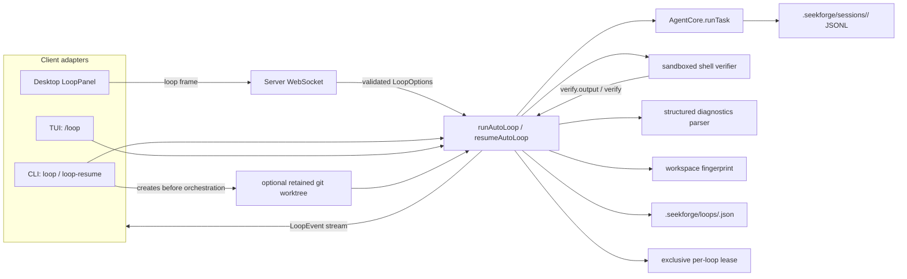
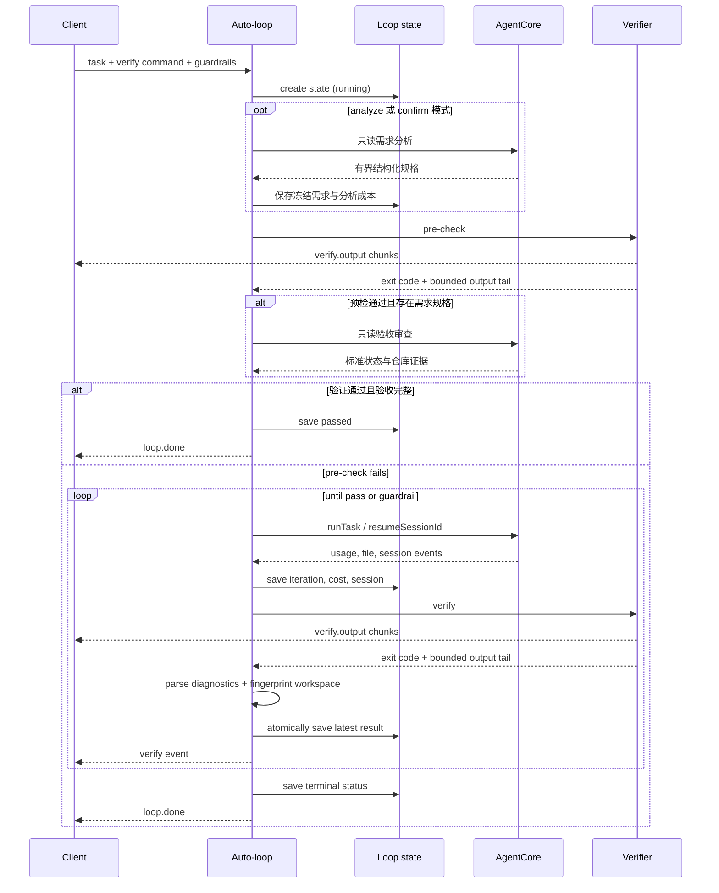
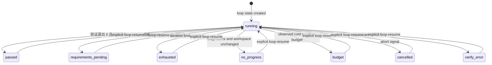

# Loop 工程（auto-loop）

> [English](loop-engineering.md) | **简体中文**

跨越多次 agent 运行，把**一个**任务推进到完整交付：
`分析 → 运行 → 验证 → 验收 → 继续`。固定验证命令通过且必需验收标准满足时才完成，
或在护栏触发时停止。默认 `quick` 模式保留仅依据验证命令的兼容行为。
这是位于单次运行*之上*的一层 —— 运行内部的工具循环
（`packages/core/src/agent/loop.ts`）保持不变。

## 架构

Loop 是包裹既有 agent core 的一层编排。各客户端只负责收集选项和渲染事件；
它们不实现迭代、验证、预算或收敛策略。



两个持久化存储的归属不同：

- Loop JSON 存储编排状态：任务、验证器、冻结需求、验收结果、批准状态、限额、
  迭代次数、累计成本、会话 id、最近一次验证结果和终态。
- 会话 JSONL 仍然是 agent 对话和工具 trace 的事实来源（source of truth）。
  Loop 状态指向该会话；它不重复存储 trace。

### 运行时序



状态在可观测的进展之后原子写入。每次验证的实时输出有上限；最终的验证事件
仍携带用于诊断和续跑提示的常规输出尾部。

会话 id 和累计的 provider 用量在其事件到达时即做检查点。迭代计数器只在
agent 运行完成后才前进，因此崩溃后可以恢复被中断的迭代而不消耗迭代额度，
同时复用会话并把已观测到的开销计入账目。

同一时刻只允许一个进程持有一个持久化的 Loop。状态文件旁边有一个受 token
保护的锁，记录持有者的进程身份及其 PID，拒绝并发运行，并在进程退出或 PID
复用后回收锁。新写入的畸形锁在一小段宽限期内按关闭失败（fail closed）处理，
以防止一个只写了一半的锁被夺走。持久化写入失败只会作为 `loop.warning`
报告一次，不会顶替验证结果。

### Resume 与 worktree 生命周期



`resumeAutoLoop` 只从传入的工作区加载状态，并保留原始任务、验证器、
最大迭代数、累计成本和会话 id。它在花费下一次 agent 迭代之前先做一次全新的
预检（pre-check）。一个迭代或成本限额已耗尽的终态 loop 只可能通过该预检；
否则同一条护栏会在不产生额外 agent 工作的情况下将其拦停。

Resume 可以追加 `additionalIterations` 和 `additionalCostBudgetUsd`。
迭代数累加到已保存的最大值上，上限 100。追加预算扩展已保存的总额；
若之前没有预算，则从已发生的成本起算，因此历史开销永远不会被清零。
最终预算必须保持有限；数值溢出会被拒绝，而不是被解释为无限额。

`--worktree` 是 CLI 适配层的事：CLI 先创建分支和 worktree，
再把该目录作为 Loop 的工作区传入。因此状态和会话 trace 都存储在 worktree
内部。worktree 会被保留以供检查，绝不会自动删除；从该目录继续（resume），
完成后用 `seekforge loop-cleanup <name>` 清理。Loop 拥有的分支使用
`seekforge/loop-*` 前缀；除非显式指定 `--force`，清理会拒绝有未提交改动的
worktree。

从基础检出（base checkout）发起的 Loop 管理操作会在保留的 Loop worktree 中
发现状态。同一个 Loop id 出现在多个工作区时会作为歧义被拒绝，
而不是隐式选择其中一个。只要存在任何存活的 lease，清理就会被阻止，
即使加了 `--force` 也一样。

Loop 管理在 Git 仓库之外同样可用。已存在的工作区路径（包括旧版本存储的值）
会被规范化为其物理路径，因此符号链接别名和平台路径别名都会解析到同一份
持久化状态。

## CLI

```
seekforge loop "<task>" --verify "<cmd>" [--requirements quick|analyze|confirm] [--max-iters <n>] [--budget <usd>] [--worktree [name]] [-y] [-m <model>]
```

- `--verify <cmd>`（必需）：成功 = 该命令以 0 退出。
- `--requirements quick|analyze|confirm`：`quick` 保留仅验证命令的行为；
  `analyze` 先只读分析仓库并做验收；`confirm` 会持久化规格并以
  `requirements_pending` 暂停，等待显式批准。批准只作用于从持久化状态加载的
  规格；当前调用中新生成的规格一定会先返回供检查，不能在同一次调用中预先批准。
- `--max-iters <n>`：运行迭代上限（默认 8，硬上限 100）。
- `--worktree [name]`：创建并运行在一个隔离的、保留的 git worktree 中。
  可选的 name 用作分支后缀；不提供时使用一个唯一名称。
- `--budget <usd>`：跨迭代的观测累计成本停止线。用量在每次 provider 用量
  更新后检查，可阻止后续工作，但已在途的请求可能使最终账单略微超出配置值。
- Loop 本质上是自主运行的 —— 每次运行都使用 `approvalMode: "acceptEdits"`
  （文件编辑自动批准；危险命令仍会被 denylist 拒绝）。
  `-y` 只是不再显示「自动批准编辑」的提示。
- `Ctrl-C` 协作式停止（状态为 `cancelled`）。Loop 编排状态保存在
  `.seekforge/loops/<loop-id>.json`；用 `seekforge loop-resume <loop-id>`
  继续。会话级的 `resume` 和 `rewind` 仍然可用于人工干预。
- 只有验证命令通过，且分析模式下全部必需验收标准都有证据满足时，退出码才为 0。

```bash
seekforge loop-resume <loop-id> [--approve-requirements] [--add-iters <n>] [--add-budget <usd>]
seekforge loop-list
seekforge loop-show <loop-id>
seekforge loop-delete <loop-id>
seekforge loop-cleanup <worktree-name> [--force]
```

整个 loop 是**一个会话**（每次迭代都恢复该会话），因此它是一条可审计的
完整 trace。

worktree 被有意保留以供检查。若原始 loop 使用了 `--worktree`，
请在该 worktree 目录中运行 `loop-resume`。

## 核心 API

来自 `@seekforge/core` 的 `runAutoLoop(deps, opts)`：

```ts
type LoopOptions = {
  task: string;
  workspace: string;
  verifyCommand: string;        // 固定验证器；分析模式还要求验收通过
  requirementMode?: "quick" | "analyze" | "confirm"; // 默认 quick
  approveRequirements?: boolean; // 恢复 confirm 模式
  maxIterations?: number;       // default 8
  costBudgetUsd?: number;       // stop after observed cumulative usage reaches it
  approvalMode?: ApprovalMode;  // default "acceptEdits"
  model?: string; planModel?: string; escalateOnFailure?: boolean;
  signal?: AbortSignal;         // cooperative stop
  onEvent?: (e: LoopEvent) => void;
  loopId?: string; persist?: boolean; // persistence defaults on
  verify?: (workspace, command, signal, onOutput) => Promise<{ code; output }>;
};
type LoopResult = {
  status: "passed" | "exhausted" | "no_progress" | "budget" | "cancelled" | "verify_error" | "requirements_pending";
  iterations: number; costUsd: number; sessionId: string;
  finalVerify: { code: number; output: string };
  loopId?: string; requirements?: LoopRequirementSpec;
  acceptanceReview?: LoopAcceptanceReview;
};
```

`resumeAutoLoop(deps, loopId, { workspace, approveRequirements?, additionalIterations?,
additionalCostBudgetUsd? })` 恢复冻结需求、迭代计数、成本、会话、命令和护栏，
然后应用可选的追加限额。

## 护栏（默认全部开启）

在花费下一次迭代之前按以下顺序检查：

1. `signal.aborted` → `cancelled`
2. 观测累计成本 ≥ `costBudgetUsd` → 取消进行中的运行，在验证后返回 `budget`
3. 归一化的结构化诊断未变**且**工作区内容 fingerprint 未变 →
   `no_progress`（卡住）
4. 达到 `maxIterations` → `exhausted`

当验证命令无法启动、超时或在执行器边界以其他方式失败时，返回 `verify_error`。
可用时，其最终输出包含有界的 stdout/stderr 诊断信息。

## 验证

`opts.verify` 可注入（用于测试）。默认实现通过共享的 shell 执行器和已配置的
OS 沙箱在工作区中执行命令，超时 120 秒并带有协作式中止信号，
捕获 stdout+stderr 约 4 KB 的尾部。验证期间取消会停止命令并返回 `cancelled`。
失败时，输出尾部会被回填到下一次运行的提示中
（「`<verifyCommand>` still fails: …, fix the root cause」）。

Vitest/Jest、Pytest 和 Cargo 的失败会被解析成有界的测试名和源码位置。
时间与格式噪声会从收敛 fingerprint 中剔除。解析扫描一个有界的聚合输出，
同时保留该范围内所有已解析的失败标识。工作区 fingerprint 在 Git 仓库中
对已变更、已暂存和未跟踪文件的完整内容做哈希，在非 Git 工作区中对所有文件
做哈希，同时排除 SeekForge 的运行时状态。符号链接按链接本身哈希，
绝不会跟随到工作区之外。验证的 stdout/stderr 在命令运行期间通过
`verify.output` 事件流式输出；每次验证都限制事件数量和分块大小，
而最终的 `verify` 事件仍保留常规输出尾部。

## 桌面端

聊天窗口顶部有一个可折叠的 **Loop 面板**（`LoopPanel`）：一行说明文字、
任务 + 验证命令输入框、最大迭代数 + 预算，以及一个 Run/Stop 按钮。
进度实时流式显示（每次迭代一行：运行成本 + 实时验证输出 + 通过/失败；
`loop.done` 时显示状态摘要和 loop id）。

连线方式：一个 `loop` WS 客户端帧 `{type:"loop", task, verifyCommand,
maxIterations?, budget?, ws?, model?, thinking?, reasoningEffort?}` ——
运行工具栏中的模型/thinking 覆盖项随帧一起传递，与普通运行相同。
服务器运行 `runAutoLoop`（acceptEdits）并把 `{type:"loop.event", event}`
流式返回，以 `idle` 结束。`cancel` 停止它。loop 运行期间的权限/提问弹窗
复用既有模态框。

Resume 使用 `{type:"loop.resume", loopId, addedIterations?, addedBudget?, ws?,
...overrides}`，返回相同的事件流。无效的数值字段和 Loop ID 会在协议边界被拒绝。

如果桌面端连接在运行期间断开，该操作会被标记为已中断、清除各种提示，
且为失败连接排队的请求会被丢弃，而不是在重连后重放。

能证明操作不存在的服务器错误（如 `not_running`）同样会清除运行状态和
过期提示。针对并发操作或过期提示回应的错误保持非终止性，
因为服务器上活跃的运行可能仍在继续。

## TUI

`/loop` 使用多行命令：第一行是 loop 选项和验证命令；后续行是任务内容。

```text
/loop --requirements analyze --max-iterations 12 --budget 1.50 pnpm test
Fix the failing parser tests without weakening assertions.
```

这些选项都可选。`--requirements` 接受 `quick|analyze|confirm`；
`--max-iterations` 接受 `1-100`；`--budget` 必须是有限的
正 USD 值，并覆盖配置中的 `costBudgetUsd`。未显式指定预算时，
TUI 继承配置值。默认迭代上限为 8。

在 TUI 中用 `/loop-resume [--approve-requirements] [--add-iterations N] [--add-budget USD] <loop-id>`
继续。桌面端在已完成的 Loop 旁提供同样的追加控件。

## 与既有功能的关系

复用 `runTask` + 会话恢复以及 agent 权限模型；验证使用与 `run_command`
相同的 shell 执行器和 OS 沙箱。它还复用 `escalateOnFailure`
（把失败的运行交给 `planModel`）。与 **Evolution** 不同
（后者提出规则/技能变更供人类接受）—— auto-loop 只负责把一个任务推到绿。
在 CLI、桌面端和 TUI（`/loop`）中均有入口。
