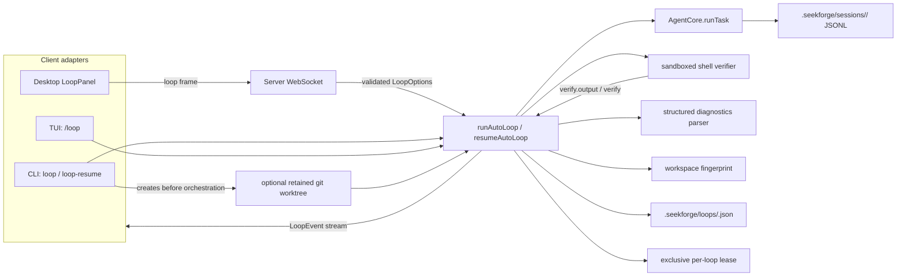
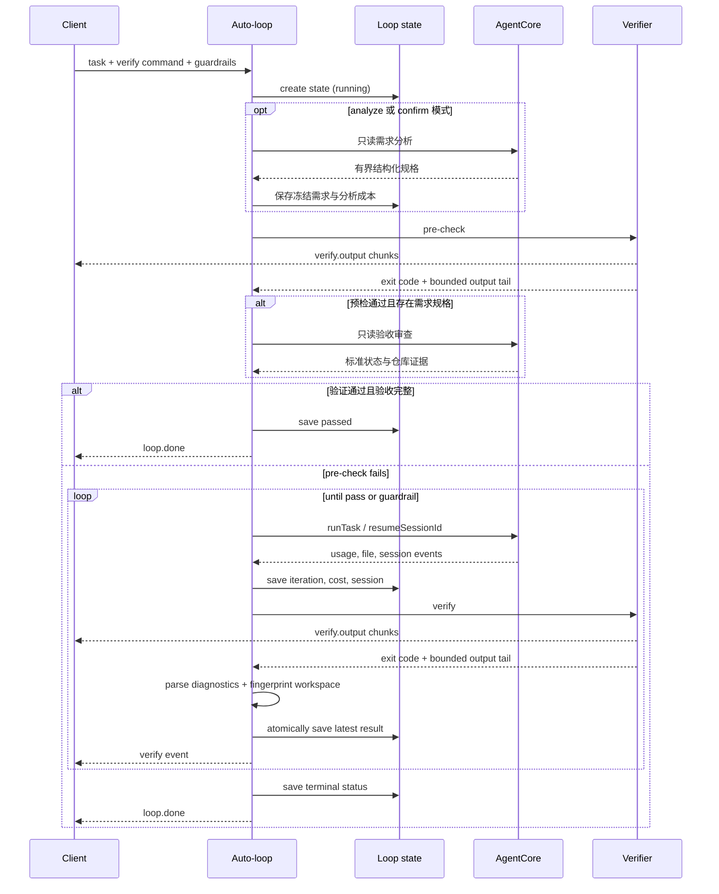
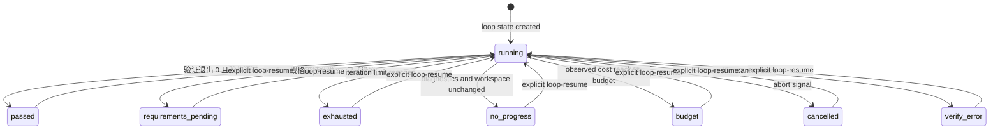

# Loop 工程（auto-loop）

> [English](loop-engineering.md) | **简体中文**

跨越多次 agent 运行，把**一个**任务推进到完整交付：
`分析 → 运行 → 验证 → 验收 → 继续`。固定验证命令通过且必需验收标准满足时才完成，
或在护栏触发时停止。默认 `quick` 模式保留仅依据验证命令的兼容行为。
这是位于单次运行*之上*的一层 —— 运行内部的工具循环
（`packages/core/src/agent/loop.ts`）保持不变。

## 架构

Loop 是包裹既有 agent core 的一层编排。各客户端只负责收集选项和渲染事件；
它们不实现迭代、验证、预算或收敛策略。


```mermaid
flowchart LR
  subgraph Clients["Client adapters"]
    CLI["CLI: loop / loop-resume"]
    TUI["TUI: /loop"]
    Desktop["Desktop LoopPanel"]
  end

  Desktop -->|"loop frame"| WS["Server WebSocket"]
  WS -->|"validated LoopOptions"| Orchestrator
  CLI --> Orchestrator["runAutoLoop / resumeAutoLoop"]
  TUI --> Orchestrator

  Orchestrator --> Agent["AgentCore.runTask"]
  Orchestrator --> Verify["sandboxed shell verifier"]
  Orchestrator --> Diagnostics["structured diagnostics parser"]
  Orchestrator --> Fingerprint["workspace fingerprint"]
  Orchestrator --> State[".seekforge/loops/<id>.json"]
  Orchestrator --> Lease["exclusive per-loop lease"]
  Agent --> Trace[".seekforge/sessions/<id>/ JSONL"]
  Verify -->|"verify.output / verify"| Orchestrator
  Orchestrator -->|"LoopEvent stream"| Clients

  Worktree["optional retained git worktree"] --> Orchestrator
  CLI -->|"creates before orchestration"| Worktree
```

两个持久化存储的归属不同：

- Loop JSON 存储编排状态：任务、验证器、冻结需求、验收结果、批准状态、限额、
  迭代次数、累计成本、会话 id、最近一次验证结果和终态。
- 会话 JSONL 仍然是 agent 对话和工具 trace 的事实来源（source of truth）。
  Loop 状态指向该会话；它不重复存储 trace。

实现层明确保持以下边界：

- `loop-state` 负责已验证的状态编解码与原子存储；`loop-history`、`loop-lease`、
  `loop-state-paths` 分别负责 JSONL 回放、生命周期协调与路径身份。
- `loop-managed-worktree` 是 DAG 与推演执行共享的唯一分支/路径绑定层。预算预测、验证选择与
  面向模型的工具结果整形均为纯策略模块；验证清单检测器也与计划组合逻辑分离。
- `loop-dag-validation` 是 DAG id、相对产物路径、条件、依赖关系与无环拓扑的唯一纯契约。
  CLI JSON 解码只保留传输结构，随后在 Loop lease、checkpoint、provider 或 worktree 出现前
  调用同一校验器。
- CLI JSON 解码和进程生命周期设置位于命令处理器之外；REST 的 DAG/推演路由和 Desktop 的
  列表/详情/资源视图按领域拆分。Server/Desktop 的 Loop 响应类型统一来自
  `@seekforge/shared`，不再由客户端手工镜像。
- 证据构建、完整性比较与 JSON/SARIF/JUnit 格式化彼此独立，新增导出格式不会改变已签名报告。
  持久状态、交付和证据 DTO 只在 `@seekforge/shared` 定义一次；Core 直接使用同一类型，不再维护镜像。

### 运行时序


```mermaid
sequenceDiagram
  participant C as Client
  participant L as Auto-loop
  participant S as Loop state
  participant A as AgentCore
  participant V as Verifier

  C->>L: task + verify command + guardrails
  L->>S: create state (running)
  opt analyze 或 confirm 模式
    L->>A: 只读需求分析
    A-->>L: 有界结构化规格
    L->>S: 保存冻结需求与分析成本
  end
  L->>V: pre-check
  V-->>C: verify.output chunks
  V-->>L: exit code + bounded output tail
  alt 预检通过且存在需求规格
    L->>A: 只读验收审查
    A-->>L: 标准状态与仓库证据
  end
  alt 验证通过且验收完整
    L->>S: save passed
    L-->>C: loop.done
  else pre-check fails
    loop until pass or guardrail
      L->>A: runTask / resumeSessionId
      A-->>L: usage, file, session events
      L->>S: save iteration, cost, session
      L->>V: verify
      V-->>C: verify.output chunks
      V-->>L: exit code + bounded output tail
      L->>L: parse diagnostics + fingerprint workspace
      L->>S: atomically save latest result
      L-->>C: verify event
    end
    L->>S: save terminal status
    L-->>C: loop.done
  end
```

状态在可观测的进展之后原子写入。每次验证的实时输出有上限；最终的验证事件
仍携带用于诊断和续跑提示的常规输出尾部。

每次验证都会发出有界的 `verify.impact` 决策集，说明每个阶段是因为直接路径、传递 workspace 依赖、完整门禁而运行，还是因不受影响而跳过。增量验证成功后，完成前仍会执行权威完整流水线；缓存复用仍绑定到整个工作区指纹未变化。

验证阶段可以通过 `dependsOn` 组成无环 DAG，默认仍按顺序执行。阶段只有显式设置 `parallel: true` 并声明逻辑 `resources` 后才可并发；同时就绪且资源不重叠的阶段才会一起运行。点号分隔的资源具有层级语义，父级预留会与子级冲突；Auto Loop、Loop DAG 和 Graph 共用同一个确定性 ready queue 实现。必需阶段失败会阻止后续波次，同时等待已经启动的同波阶段结算。恢复历史只用于排列显式并发节点的优先顺序，不会跳过必需门禁，也不会改变最终权威完整验证。

每次完成的迭代还会记录有界可观测字段：耗时、成本与 Token 增量、变更的相对路径、回滚状态和
标准化失败类别。卡住/循环恢复只会从该类别的安全策略集合中选择（隔离测试、修复编译或 lint、
修复 SARIF/代码审查发现、验证环境、缩小范围或重新规划）。工作区内会有界记录每种策略是否带来诊断进展；至少积累两条
观察后才可调整偏好，而且绝不会影响权限、审批、验证或预算。恢复轮次会获得一份有界且明确标为不可信数据的上下文，其中包含失败测试、带位置诊断、失败阶段和变更路径；SARIF 修复指令禁止压制规则或降低规则级别。

会话 id 和累计的 provider 用量在其事件到达时即做检查点。迭代计数器只在
agent 运行完成后才前进，因此崩溃后可以恢复被中断的迭代而不消耗迭代额度，
同时复用会话并把已观测到的开销计入账目。

即使继续同一个会话，每轮也会重建任务级 prompt 状态，包括重新进行自动技能选择。
Provider 只能调用该次请求在上下文预算裁剪后实际声明的工具；伪造一个「已知但本轮未声明」
的工具调用会在进入 dispatcher 前失败。成功的 write/dangerous 工具、可执行命令、可变更
MCP 调用和编辑型子代理都会使之前的 verify/lint 证据失效，即使无法给出单个 changed path。

收敛指纹以异步方式运行，限制为 5 秒、20,000 个文件和 64 MiB。Git 仓库会摘要 HEAD、
状态及 dirty/untracked 内容；非 Git 工作区使用带忽略规则的遍历。若无法在限制内安全生成
指纹，该样本记为 `null`，Loop 会跳过「工作区未变化」结论，而不会阻塞事件循环或错误地
判定 `no_progress`。

同一时刻只允许一个进程持有一个持久化的 Loop。状态文件旁边有一个受 token
保护的锁，记录持有者的进程身份及其 PID，拒绝并发运行，并在进程退出或 PID
复用后回收锁。新写入的畸形锁在一小段宽限期内按关闭失败（fail closed）处理，
以防止一个只写了一半的锁被夺走。持久化写入失败只会作为 `loop.warning`
报告一次，不会顶替验证结果。

### Resume 与 worktree 生命周期


```mermaid
stateDiagram-v2
  [*] --> running: loop state created
  running --> passed: 验证退出 0 且验收通过
  running --> requirements_pending: confirm 规格等待批准
  requirements_pending --> running: loop-resume 显式批准
  running --> exhausted: iteration limit reached
  running --> no_progress: diagnostics and workspace unchanged
  running --> budget: observed cost reaches budget
  running --> cancelled: abort signal
  running --> verify_error: verifier cannot start
  passed --> running: explicit loop-resume
  exhausted --> running: explicit loop-resume
  no_progress --> running: explicit loop-resume
  budget --> running: explicit loop-resume
  cancelled --> running: explicit loop-resume
  verify_error --> running: explicit loop-resume
```

`resumeAutoLoop` 只从传入的工作区加载状态，并保留原始任务、验证器、
最大迭代数、累计成本和会话 id。它在花费下一次 agent 迭代之前先做一次全新的
预检（pre-check）。一个迭代或成本限额已耗尽的终态 loop 只可能通过该预检；
否则同一条护栏会在不产生额外 agent 工作的情况下将其拦停。

Resume 可以追加 `additionalIterations` 和 `additionalCostBudgetUsd`。
迭代数累加到已保存的最大值上，上限 100。追加预算扩展已保存的总额；
若之前没有预算，则从已发生的成本起算，因此历史开销永远不会被清零。
最终预算必须保持有限；数值溢出会被拒绝，而不是被解释为无限额。

`--worktree` 是 CLI 适配层的事：CLI 先创建分支和 worktree，
再把该目录作为 Loop 的工作区传入。因此状态和会话 trace 都存储在 worktree
内部。worktree 会被保留以供检查，绝不会自动删除；从该目录继续（resume），
完成后用 `seekforge loop-cleanup <name>` 清理。Loop 拥有的分支使用
`seekforge/loop-*` 前缀；除非显式指定 `--force`，清理会拒绝有未提交改动的
worktree。

从基础检出（base checkout）发起的 Loop 管理操作会在保留的 Loop worktree 中
发现状态。同一个 Loop id 出现在多个工作区时会作为歧义被拒绝，
而不是隐式选择其中一个。只要存在任何存活的 lease，清理就会被阻止，
即使加了 `--force` 也一样。

Loop 管理在 Git 仓库之外同样可用。已存在的工作区路径（包括旧版本存储的值）
会被规范化为其物理路径，因此符号链接别名和平台路径别名都会解析到同一份
持久化状态。

## CLI

```
seekforge loop "<task>" (--verify "<cmd>" | --auto-verify) [--requirements quick|analyze|confirm] [--max-iters <n>] [--budget <usd>] [--worktree [name]] [-y] [-m <model>]
```

- `--verify <cmd>`：成功 = 该命令以 0 退出。
- `--auto-verify`：从根目录 `package.json`、`Cargo.toml`、`go.mod` 或 pytest 配置发现
  已识别阶段。它只选择固定命令或具名脚本，把结果冻结进 Loop 状态，不把清单脚本文本插值成
  生成的 shell 命令。对于 `apps/*` 与 `packages/*` 工作区，即使根 package 没有已识别脚本也会
  加入按路径选择的包测试阶段。合并后的计划最多 16 个阶段，并保留根目录与生态门禁。增量阶段的
  成功结果只允许在紧接着的完整回退验证中复用，且完整工作区指纹必须保持不变。
- `--requirements quick|analyze|confirm`：`quick` 保留仅验证命令的行为；
  `analyze` 先只读分析仓库并做验收；`confirm` 会持久化规格并以
  `requirements_pending` 暂停，等待显式批准。批准只作用于从持久化状态加载的
  规格；当前调用中新生成的规格一定会先返回供检查，不能在同一次调用中预先批准。
- `--max-iters <n>`：运行迭代上限（默认 8，硬上限 100）。
- `--worktree [name]`：创建并运行在一个隔离的、保留的 git worktree 中。
  可选的 name 用作分支后缀；不提供时使用一个唯一名称。
- `--budget <usd>`：跨迭代的观测累计成本停止线。用量在每次 provider 用量
  更新后检查，可阻止后续工作，但已在途的请求可能使最终账单略微超出配置值。
- `--adaptive-budget`：用最近迭代中的最大用量样本预测下一轮；若预计无法装入已配置的成本、
  Token 或时长硬上限，则在开始前停止。它绝不会提高任何上限。
- Loop 本质上是自主运行的 —— 每次运行都使用 `approvalMode: "acceptEdits"`
  （文件编辑自动批准；危险命令仍会被 denylist 拒绝）。
  `-y` 只是不再显示「自动批准编辑」的提示。
- `Ctrl-C` 协作式停止（状态为 `cancelled`）。Loop 编排状态保存在
  `.seekforge/loops/<loop-id>.json`；用 `seekforge loop-resume <loop-id>`
  继续。会话级的 `resume` 和 `rewind` 仍然可用于人工干预。
- 只有验证命令通过，且分析模式下全部必需验收标准都有证据满足时，退出码才为 0。文件证据必须
  带有 `path:src/feature.ts#symbol` 或 `#L10-L20` 这样的已核验内容锚点；仅路径存在不算证据。

```bash
seekforge loop-resume <loop-id> [--approve-requirements] [--add-iters <n>] [--add-budget <usd>]
seekforge loop-list
seekforge loop-show <loop-id>
seekforge loop-pause <loop-id>
seekforge loop-continue <loop-id>
seekforge loop-steer <loop-id> "<引导>"
seekforge loop-priority <loop-id> <-10..10>
seekforge loop-deliver <loop-id> [--mode checkpoint|merge|patch|pr] [--wait-ci] [--ci-repairs N]
seekforge loop-prune [--older-than-days N] [--keep-last N] [--worktrees] [--dry-run]
seekforge loop-delete <loop-id>
seekforge loop-cleanup <worktree-name> [--force]
```

### Loop v2 控制

- 重复传入 `--verify-stage <id[@路径,...]=命令>` 可组成有序验证流水线。编辑轮次会按
  变更的相对路径前缀选择阶段；增量结果通过后仍会执行完整流水线，因而只能降低中间成本，
  不会削弱最终门禁。缓存的增量证据只在这次紧接的转换内有效，任何可观察工作区变化都会使其失效。
  必需阶段失败会停止流水线；Core API 阶段可设置 `required: false`。
- 自动发现验证计划会计算内部 package 的传递依赖闭包，因此修改共享库也会选中依赖方测试。
  阶段结果会标记完整、直接、依赖或缓存选择，并保留有界命中路径；任何增量通过仍必须随后执行
  完整流水线，不能削弱最终门禁。
- `--flaky-retries 0..5` 会在编辑前重跑失败阶段，之后通过时记录 `verify.flaky`；
  `--stable-passes 1..5` 要求完整流水线连续通过。
- `--stuck-recoveries 0..5` 会在返回 `no_progress` 前做有界的重新诊断并改用不同策略；
  `--rollback-regressions` 只允许在保留的 Loop worktree 中回滚退化迭代；回滚后会重新验证，
  并用恢复后的结果替换收敛基线。
- `loop-history <id> [--after N] [--limit N]` 回放轮转后的 JSONL 事件历史；
  `loop-recover` 把失去 owner 的 `running` 或 `paused` 记录标为 `interrupted`，嵌入方可调用
  `autoResumeInterruptedLoops` 自动继续。已有的 `interrupted` 记录仍可恢复，因此瞬时恢复失败
  能在之后重试；但只要 Loop 租约仍存活，该记录就绝不会进入恢复候选。
- 自动恢复通过 `--priority -10..10` / `loop-priority` 排序，每个工作区每次最多处理三个候选；
  单个失败会隔离，并按 30 秒到 1 小时的指数退避重试。前台运行会请求抢占空闲恢复并等待 guard 让出。
- `seekforge serve --loop-auto-resume` 显式开启由服务生命周期托管的后台恢复。它先占用物理仓库
  队列，再取得跨进程空闲 guard；有工作时直接跳过而非等待，并在整个恢复期间持有 guard，
  仅显式放行该恢复自身的 Agent 会话。多个工作区顺序处理，定时检查不会重叠，关闭服务会
  中止当前恢复。空闲内存维护与 Loop 恢复共用同一个周期定时器内核，统一延迟校验、防重入、重调度、取消和观察器隔离，同时仍保留各自的跨进程租约。生命周期中止会持久化为 `interrupted`，而不是用户 `cancelled`，所以下次
  启动仍可继续。`--loop-auto-prune` 在同一空闲 guard 下只删除旧的终态记录；可恢复状态和未完成
  的交付事务会保留。两种调度器都默认关闭。`loop-prune` 暴露同样的保留规则，并可选择删除干净、
  已完成 merge 交付的 Loop worktree。整棵 worktree 的清理会在持有工作区 guard 时重新核验，
  并先删除 checkout 而不是先删除已跟踪状态，从而保持原子性。
- `loop-evidence <id>` 与 `GET /api/loops/:id/evidence` 会生成一份有界的
  「需求 → 验收证据 → 验证器 → 迭代 → 交付」报告；报告带 SHA-256 完整性摘要与 Core 校验函数，发生交付后还会包含不可变 revision、hash 或 URL。
  CLI 可导出 JSON、SARIF、JUnit，`--compare` 可比较两次持久运行的变化。
- `loop-dag <file>` 会持久化 JSON 依赖图检查点；`--resume` 与 `--dag-id` 可恢复已完成节点。
  就绪节点按权重分配剩余成本/Token 预算，并支持优先级、有界重试及
  `skip_dependents` / `continue` / `stop` 失败策略。节点可通过嵌套 `all` / `any` / `not`
  条件按依赖结果分支，要求带持久 actor/reason 审计的显式审批，锁定具名独占资源，并消费有界
  结构化依赖输出。声明的 `outputPaths` 必须是节点工作区内的普通文件，并作为产物元数据发布。
  审批会在节点执行开始前以 `approved` 状态写入检查点，因此崩溃恢复不会重复询问，也不会丢失审计。
  完成驱动调度会在任一槽位空闲时立即补位，无需等待无关的慢节点。`--rerun` 会让选中节点及全部下游失效，
  `--approve` 可通过声明的审批门。并行图要求不同的物理工作区；`--managed-worktrees` 会为每个
  节点创建并保留独立 Git worktree/分支，checkpoint 通过节点的修改，并把已通过依赖分支合入下游
  节点工作区。顶层 `fanIn` 对象（`verifyCommand` 与可选 `maxIterations`）会把成功的汇点分支（关闭依赖
  集成时则为全部节点）合入保留的集成 worktree，再对组合后的代码树执行最终有界 Loop 门禁。
  托管路径会重新核验物理绑定，且解析后的全部工作区
  身份会进入持久 DAG 指纹，因此节点改换 checkout 后 `--resume` 会拒绝旧结果，而不会错误复用。
  `--predictive-budget` 会根据有界历史资源需求调整调度权重，`--worktree-limit` 限制保留的托管 worktree 数量；
  `loop-dag-resources` 可查看磁盘占用，并显式归档、提升或清理已完成依赖图；清理始终保留有未提交修改的 worktree。
- `loop-speculate` 与 Core 的 `runSpeculativeLoop` 只允许运行两个或三个修复策略，共享一个必填成本上限并使用隔离工作区，
  最终选择成本最低的通过候选。运行与胜出结果可恢复，`loop-speculation-promote` 是独立的显式合并步骤；REST 与 Desktop
  也暴露持久运行和资源操作。
- `--deliver checkpoint|merge|patch|pr` 在通过后从保留 worktree 显式交付；`pr` 会推送
  Loop 分支，并通过 `gh` 创建草稿 PR。交付模式、状态、尝试次数、错误和最终产物都会写入
  Loop 状态。若验证通过后交付失败，可用 `loop-deliver <id>` 直接重试而无需重新运行 Agent；
  除首次尝试外会复用原模式。运行、交付和删除共用一把生命周期租约，因此交付执行时恢复
  无法进入。交付会持久化 `prepared → action_completed → finalized`，并记录分支、revision、
  patch hash 或 PR URL 证据。主要副作用和最终状态发布可分别重试；重试会核验证据，并修复旧版本
  过早写入的成功记录。交付会针对 checkpoint 后的树重新运行完整持久验证流水线，拒绝验证命令或
  finalization hook 留下的修改，并通过固定且已检查的 revision 发布 merge/PR。分支及其工作区在
  证据 revision 之后只能变更该 Loop 的精确状态文件；任何其他已提交、已暂存、已修改或未跟踪路径
  都视为未经验证并阻止交付。worktree 清理会取得同一工作区 guard，因此不能删除正在交付的任务；
  非 force 清理还会保留包含基线不可达提交的分支。
- `--deliver pr --wait-ci` 会让交付停留在 `action_completed`，直到必需的 PR checks 完成。
  `--ci-repairs 1..3` 可把一份有界失败步骤日志交给独立成本上限、最多两轮且不持久化的修复 Loop，
  重新运行冻结的本地流水线，checkpoint 并推送不可变 revision，然后再次等待 CI。
  CI 策略、修复次数、已检查 revision 与失败都会持久化；之后的 `loop-deliver --wait-ci` 会续接
  同一策略，不带 CI 闭环的重试会被拒绝。检查等待与修复推送都支持协作式取消。
  checks 等待与失败日志获取已使用 provider 中立的 CI 适配器；CLI 提供 GitHub `gh` 与 GitLab `glab` 实现。
  只有 checks 真实失败且需要修复后，才会初始化 Agent 凭据、工作区授权与 MCP 修复工具；绿色 checks
  不需要这些依赖。
- REST Loop 列表支持 `status`、`q`、`limit` 与 `after`；活跃 Loop 可接受
  `POST /api/loops/:id/control`，`/api/loop-dags` 暴露持久图状态。Prometheus 输出增加 Loop 总数、
  活跃数、成本、Token 与验证次数聚合。Desktop 增加筛选、轮询、历史分页、CI 状态、验证选择/耗时、
  验收证据、迭代时间线、fan-in 与 DAG 节点状态，以及安全边界控制；
  当查询或所选 Loop 已变化时，会丢弃迟到的筛选与历史响应。
- 验证发现会保留权威根门禁，同时加入安全的路径级 pnpm workspace、嵌套 Cargo、Go 与 Python 阶段。
  恢复排序综合衰减时间、框架/阶段上下文、诊断改善、成本与耗时。评测故障注入支持指定事件出现次数，
  并报告 Loop 生命周期事件、验证、恢复、续跑及 p95 耗时指标。
- WebSocket 客户端可发送 `loop.pause`、`loop.control.resume` 与 `loop.steer`；控制只在安全
  的迭代边界生效。
- 顶层 CLI 的 `loop-pause`、`loop-continue` 与 `loop-steer` 可以控制另一个仍存活的
  SeekForge 进程所拥有的 Loop。命令通过 `.seekforge/loops/` 下有界且串行化的邮箱传递，
  并绑定当前运行实例，因此与完成动作竞态的命令不会泄漏到之后的恢复运行。
- TUI 提供等价的 `/loop-pause`、`/loop-continue` 与 `/loop-steer <引导>` 命令，且只控制
  当前标签页中的 Loop。

每轮快照会持久化精简阶段结果、标准化后的诊断/工作区指纹、解析出的失败数、单轮耗时/成本/
Token/变更路径、失败类别、回滚标记、恢复次数和连续
通过次数。重复的命令和输出只保留在最新结果/历史日志中，使状态保持在 reader 的 1 MiB 上限内；
超限替换会在触碰最后一份可读状态前失败。Loop 成功后只抽取一次记忆，并对整个 Loop 只记录一次已选技能效果，而不会按内部
Agent 迭代重复记账。

编辑迭代复用**一个 worker 会话**；需求分析和验收复用状态中记录的独立 reviewer
会话。这样评审上下文不会进入编辑对话，同时两条 trace 都可审计。

worktree 被有意保留以供检查。若原始 loop 使用了 `--worktree`，
请在该 worktree 目录中运行 `loop-resume`。

## 核心 API

来自 `@seekforge/core` 的 `runAutoLoop(deps, opts)`：

```ts
type LoopOptions = {
  task: string;
  workspace: string;
  verifyCommand: string;        // 固定验证器；分析模式还要求验收通过
  autoVerificationPlan?: boolean; // 新 Loop 自动发现并冻结根目录验证计划
  verificationPlan?: Array<{ id: string; command: string; required?: boolean; timeoutMs?: number }>;
  stablePasses?: number; flakyRetries?: number;
  maxNoProgressRecoveries?: number; rollbackOnRegression?: boolean;
  requirementMode?: "quick" | "analyze" | "confirm"; // 默认 quick
  approveRequirements?: boolean; // 恢复 confirm 模式
  maxIterations?: number;       // default 8
  costBudgetUsd?: number;       // stop after observed cumulative usage reaches it
  tokenBudget?: number;         // 累计 prompt + completion Token
  maxDurationMs?: number;       // 可跨恢复累计的墙钟时间
  maxVerifyRuns?: number;       // 包含首次预检查
  verifyTimeoutMs?: number;     // 单次校验默认 120 秒
  agentTimeoutMs?: number;      // 单次 Agent 尝试默认 30 分钟
  maxAgentRetries?: number;     // 瞬时错误默认重试 1 次
  approvalMode?: ApprovalMode;  // default "acceptEdits"
  model?: string; planModel?: string; escalateOnFailure?: boolean;
  signal?: AbortSignal;         // cooperative stop
  control?: LoopControl;        // 在安全边界暂停/继续/引导
  onEvent?: (e: LoopEvent) => void;
  loopId?: string; persist?: boolean; // persistence defaults on
  verify?: (workspace, command, signal, onOutput) => Promise<{ code; output }>;
};
type LoopResult = {
  status: "passed" | "exhausted" | "no_progress" | "budget" | "cancelled" | "verify_error" | "agent_error" | "interrupted" | "requirements_pending";
  iterations: number; costUsd: number; sessionId: string;
  finalVerify: { code: number; output: string };
  loopId?: string; requirements?: LoopRequirementSpec;
  acceptanceReview?: LoopAcceptanceReview; budgetReason?: "cost" | "tokens" | "duration" | "verify_runs";
  agentError?: AgentError;
  stageResults?: LoopStageResult[]; flaky?: boolean; passStreak?: number;
  recoveryAttempts?: number;
  failureCategory?: LoopFailureCategory;
};
```

`resumeAutoLoop` 可追加迭代、成本、Token、时长和校验次数，并恢复累计时长、Token、
校验次数、worker/reviewer 会话、命令与冻结需求。编辑迭代复用一个 worker 会话；
需求分析和验收复用另一个 reviewer 会话，避免评审上下文污染编辑对话。

## 护栏（默认全部开启）

在花费下一次迭代之前按以下顺序检查：

1. `signal.aborted` → `cancelled`
2. 任一成本、Token、时长或校验次数护栏达到上限 → 取消进行中的工作并返回带
   `budgetReason` 的 `budget`
3. 归一化的结构化诊断未变**且**工作区内容 fingerprint 未变 →
   `no_progress`（卡住）
4. 达到 `maxIterations` → `exhausted`

当验证命令无法启动、达到阶段超时或在执行器边界以其他方式失败时，返回 `verify_error`；只有
单独配置的总时长截止线才会产生 `budget: duration`。
可用时，其最终输出包含有界的 stdout/stderr 诊断信息。

编辑 Agent 失败后不会再盲目运行校验。网络、超时和限流错误最多按
`maxAgentRetries` 重试；仍失败则返回保留原始错误的 `agent_error`。

## 验证

`opts.verify` 可注入（用于测试）。默认实现通过共享的 shell 执行器和已配置的
OS 沙箱在工作区中执行命令，超时 120 秒并带有协作式中止信号，
捕获 stdout+stderr 约 4 KB 的尾部。验证期间取消会停止命令并返回 `cancelled`。
失败时，输出尾部会被回填到下一次运行的提示中
（「`<verifyCommand>` still fails: …, fix the root cause」）。

Vitest/Jest、Pytest 和 Cargo 的失败会被解析成有界的测试名和源码位置。
时间与格式噪声会从收敛 fingerprint 中剔除。解析扫描一个有界的聚合输出，
同时保留该范围内所有已解析的失败标识。工作区 fingerprint 在 Git 仓库中
对已变更、已暂存和未跟踪文件的完整内容做哈希，在非 Git 工作区中对所有文件
做哈希，同时排除 SeekForge 的运行时状态。符号链接按链接本身哈希，
绝不会跟随到工作区之外。验证的 stdout/stderr 在命令运行期间通过
`verify.output` 事件流式输出；每次验证都限制事件数量和分块大小，
而最终的 `verify` 事件仍保留常规输出尾部。

## 桌面端

聊天窗口顶部有一个可折叠的 **Loop 面板**（`LoopPanel`）：一行说明文字、
任务 + 验证命令输入框、最大迭代数 + 预算，以及一个 Run/Stop 按钮。
进度实时流式显示（每次迭代一行：运行成本 + 实时验证输出 + 通过/失败；
`loop.done` 时显示状态摘要和 loop id）。

连线方式：一个 `loop` WS 客户端帧 `{type:"loop", task, verifyCommand,
maxIterations?, budget?, ws?, model?, thinking?, reasoningEffort?}` ——
运行工具栏中的模型/thinking 覆盖项随帧一起传递，与普通运行相同。
服务器运行 `runAutoLoop`（acceptEdits）并把 `{type:"loop.event", event}`
流式返回，以 `idle` 结束。`cancel` 停止它。loop 运行期间的权限/提问弹窗
复用既有模态框。

Resume 使用 `{type:"loop.resume", loopId, addedIterations?, addedBudget?, ws?,
...overrides}`，返回相同的事件流。无效的数值字段和 Loop ID 会在协议边界被拒绝。

如果桌面端连接在运行期间断开，该操作会被标记为已中断、清除各种提示，
且为失败连接排队的请求会被丢弃，而不是在重连后重放。

能证明操作不存在的服务器错误（如 `not_running`）同样会清除运行状态和
过期提示。针对并发操作或过期提示回应的错误保持非终止性，
因为服务器上活跃的运行可能仍在继续。

## TUI

`/loop` 使用多行命令：第一行是 loop 选项和验证命令；后续行是任务内容。

```text
/loop --requirements analyze --max-iterations 12 --budget 1.50 pnpm test
Fix the failing parser tests without weakening assertions.
```

这些选项都可选。`--requirements` 接受 `quick|analyze|confirm`；
`--max-iterations` 接受 `1-100`；`--budget` 必须是有限的
正 USD 值，并覆盖配置中的 `costBudgetUsd`。未显式指定预算时，
TUI 继承配置值。默认迭代上限为 8。

在 TUI 中用 `/loop-resume [--approve-requirements] [--add-iterations N] [--add-budget USD] <loop-id>`
继续。桌面端在已完成的 Loop 旁提供同样的追加控件。

## 与既有功能的关系

复用 `runTask` + 会话恢复以及 agent 权限模型；验证使用与 `run_command`
相同的 shell 执行器和 OS 沙箱。它还复用 `escalateOnFailure`
（把失败的运行交给 `planModel`）。与 **Evolution** 不同
（后者提出规则/技能变更供人类接受）—— auto-loop 只负责把一个任务推到绿。
在 CLI、桌面端和 TUI（`/loop`）中均有入口。
